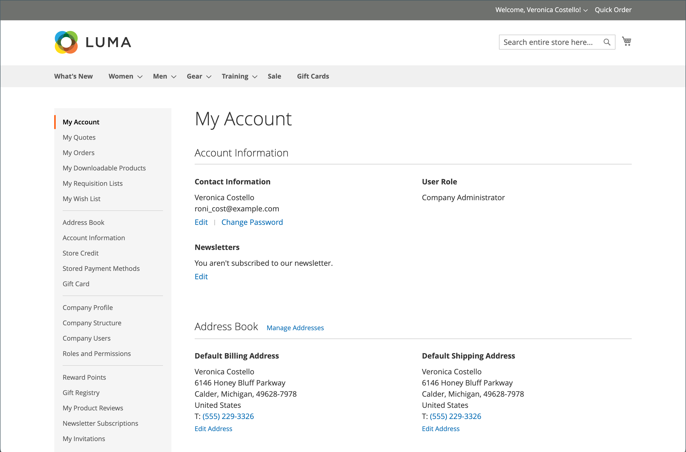

# 客戶帳戶儀表板

客戶可以從其帳戶控制面板管理及監視自己的資訊和活動。 客戶可以重新排序、追蹤訂單、管理送貨地址和付款方法、產品評論、電子報訂閱等。

{width="700" zoomable="yes"}

>[!NOTE]
>
> 在安裝及啟用Adobe Commerce B2B後，即可使用公司專屬的功能個人化購買體驗。 您可以為與公司有關聯的客戶啟用B2B帳戶儀表板選項（採購單、請購單清單及議價報價）的完整範圍。 如需B2B功能的詳細資訊，請參閱 [Adobe Commerce B2B使用手冊](../b2b/introduction.md).

{width="700" zoomable="yes"}

## 帳戶儀表板側邊導覽

下表包含客戶帳戶控制面板左側導覽中所有區段的相關資訊。

| 章節 | 說明 |
|------------------------------------------------------------------------------------------------------------------------------------------------------|----------------------------------------------------------------------------------------------------------------------------------------------------------------------------------------------------------------------------------------------------------------------------------------------------------------------------------------------------------------|
| [**[!UICONTROL My Account]**](../customers/account-dashboard-my-account.md) | 顯示您帳戶的彙總資訊，包括連絡人資訊、通訊錄中的預設地址以及最近的訂單。 |
| [**[!UICONTROL My Orders]**](../stores-purchase/orders-storefront.md#view-recently-ordered-products) | 顯示所有客戶訂單的清單，並附上每個訂單的連結。 如果在設定中啟用，只要按一下「重新排序」連結即可重新排序任何訂單。 |
| [**[!UICONTROL My Downloadable Products]**](../catalog/product-create-downloadable.md#storefront-experience) | 列出客戶已購買的所有可下載產品，並提供每個產品的連結。 |
| [**[!UICONTROL My Wish List]**](../stores-purchase/wishlist-storefront.md) | 管理您的願望清單，並從願望清單專案下訂單。 |
| [**[!UICONTROL Address Book]**](../customers/account-dashboard-address-book.md) | 客戶通訊錄包含預設帳單與送貨地址，以及其他地址專案。 |
| [**[!UICONTROL Account Information]**](../customers/account-dashboard-account-information.md) | 客戶可更新其帳戶資訊，並視需要變更密碼。 商店管理員也可以更新客戶帳戶並存取資訊，以提供購物協助。 |
| [**[!UICONTROL Billing Agreements]**](../stores-purchase/paypal-billing-agreements.md#storefront-experience) | 顯示任何客戶帳單協定的清單。 |
| [**[!UICONTROL My Product Reviews]**](../merchandising-promotions/product-reviews.md#product-reviews-on-the-storefront) | 顯示客戶提交的所有產品評論清單，每個產品評論都有一個連結。 |
| [**[!UICONTROL Newsletter Subscriptions]**](../merchandising-promotions/newsletters.md) | 列出所有可用的電子報，在客戶訂閱的專案旁邊加上核取標籤。 |
|  [**[!UICONTROL Order by SKU]**](../stores-purchase/order-by-sku.md#order-by-sku-from-a-customer-account) | 可讓您透過SKU將個別專案新增到購物車，或匯入要從CSV檔案訂購的產品清單。 |
|  [**[!UICONTROL Store Credit]**](../customers/account-dashboard-store-credit.md) | 顯示可套用至購買專案的退貨、退款及兌換禮品卡的目前商店點數金額。 |
| [**[!UICONTROL Stored Payment Methods]**](../stores-purchase/stored-payment-methods.md) | 列出客戶用來儲存信用卡資訊之具有安全儲存庫的任何付款方法。 |
|  [**[!UICONTROL Gift Card]**](../catalog/product-gift-card-create.md) | 允許客戶檢查可用禮品卡上的目前餘額，以及兌換禮品卡以取得商店信貸。 |
|  [**[!UICONTROL Reward Points]**](../merchandising-promotions/rewards-loyalty.md) | 列出客戶已取得且適用於購買的所有獎勵積分。 |
|  [**[!UICONTROL Gift Registry]**](../merchandising-promotions/gift-registries.md) | 用於列出及維護禮品登記簿，以及新增禮品登記簿。 |
|  [**[!UICONTROL My Invitations]**](../merchandising-promotions/invitations.md) | 列出客戶針對排程活動建立和傳送的所有邀請。 |
|  [**[!UICONTROL My Purchase Orders]**](../b2b/account-dashboard-my-purchase-orders.md) | （僅限公司）列出客戶提交或控制的所有採購單，並附有詳細資訊的連結。 |
|  [**[!UICONTROL My Quotes]**](../b2b/account-dashboard-my-quotes.md) | （僅限公司）列出客戶提交的所有報價單，並附有詳細資訊的連結。 |
|  [**[!UICONTROL My Requisition Lists]**](../b2b/account-dashboard-requisition-lists-manage.md) | （僅限公司）維護客戶建立的所有請購單清單。 |
|  [**[!UICONTROL Company Profile]**](../b2b/account-company-manage.md#update-a-company-profile) | （僅限公司）指定的公司管理員可以管理公司資訊，包括公司名稱和地址、公司管理員聯絡資訊以及付款資訊。 |
|  [**[!UICONTROL Company Credit]**](../b2b/credit-company.md#storefront-credit-information) | （僅限公司）顯示目前未結餘額、可用貸方及配置給科目的貸方限制，後面接著未結商業發票清單。 「公司業績」區段僅在下列情況下才會出現在控制面板中 [分期付款](../b2b/enable-basic-features.md#configure-payment-on-account) 在設定中啟用。 |
|  [**[!UICONTROL Company Structure]**](../b2b/account-company-structure.md) | （僅限公司）由公司管理員用來定義公司的業務結構。 |
|  [**[!UICONTROL Company Users]**](../b2b/account-company-users.md) | （僅限公司）由公司管理員用來建立公司購買者的使用者帳戶。 |
|  [**[!UICONTROL Roles and Permissions]**](../b2b/account-company-roles-permissions.md) | （僅限公司）由公司管理員用來定義具有各種許可權層級之公司使用者的角色。 |
|  [**[!UICONTROL Approval Rules]**](../b2b/account-dashboard-approval-rules.md) | （僅限公司）用於定義採購單的核准規則。 |

{style="table-layout:auto"}
