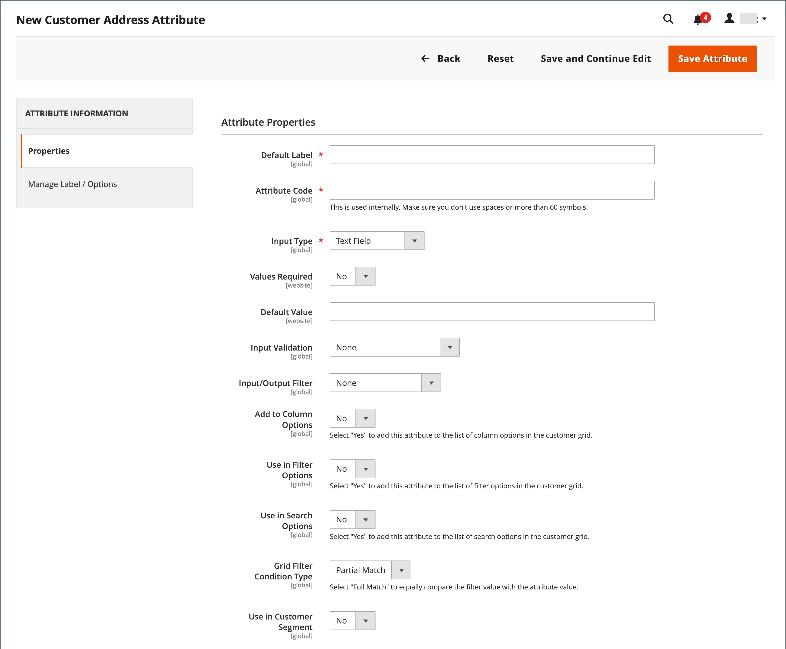

# 客戶地址屬性

{{ee-feature}}

「客戶地址」屬性集會決定輸入至 [通訊錄](account-dashboard-address-book.md) 來自客戶帳戶或期間 [簽出](../stores-purchase/checkout-process.md).

可設定自訂地址屬性以提供其他資訊，例如選用的電子郵件地址、Skype帳戶、備用電話號碼、建築物或縣。 然後，可以將自訂屬性併入 [地址範本](address-templates.md) 用來產生銷售檔案的檔案。 建立自訂位址屬性的程式幾乎與建立 [客戶屬性](attribute-properties.md).

客戶地址屬性用於以下表單：

- [客戶地址註冊](account-create.md)
- [客戶帳戶地址](account-dashboard-address-book.md)

{width="700" zoomable="yes"}

## 步驟1：完成屬性特性

1. 在 _管理員_ 側欄，前往 **[!UICONTROL Stores]** > _[!UICONTROL Attributes]_>**[!UICONTROL Customer Address]**.

1. 在右上角，按一下 **[!UICONTROL Add New Attribute]**.

   {width="600" zoomable="yes"}

1. 在 **[!UICONTROL Attribute Properties]** 區段，請執行下列動作：

   - 輸入 **[!UICONTROL Default Label]** 在資料輸入期間識別屬性的資訊。

   - 輸入 **[!UICONTROL Attribute Code]** 用來識別系統內的屬性。

     屬性程式碼必須以字母開頭，可包含小寫字母(a-z)和數字(0-9)的任何組合。 程式碼的長度必須少於30個字元，而且不能包含特殊字元或空格。 底線字元(_)可用來表示空格。

     >[!TIP]
     >
     >**_捷徑：_** 若只要完成必填欄位，請向下捲動至 [!UICONTROL Storefront Properties]，輸入 [!UICONTROL Sort Order]，並儲存。

1. 若要判斷用於資料輸入的輸入控制項型別，請設定 **[!UICONTROL Input Type]** 變更為下列其中一項：

   - `Text Field`  — 單行文字欄位。
   - `Text Area`  — 多行文字區域。
   - `Multiple Line`  — 為屬性建立多個文字行，類似於多行街道地址。 個別資料輸入行的數量可以是2到20。 使用 `Default Value` 以指定欄位的初始值。
   - `Date`  — 以快顯行事曆顯示日期欄位。 其他屬性：使用 `Default Value` 以指定欄位的初始值。  使用 `Minimal Value` 以指定可輸入的最早日期。  使用 `Maximum Value` 指定可以輸入的最新日期。
   - `Dropdown`  — 僅接受選取一個值的下拉式清單。
   - `Multiple Select`  — 接受多個選取值的下拉式清單。
   - `Yes/No`  — 此欄位僅提供以下選項： `Yes` 或 `No` 值。
   - `File (attachment)`  — 允許檔案上傳並與客戶屬性產生關聯的欄位，以作為附件。
   - `Image File`  — 允許將影像上傳至相簿並與客戶屬性關聯的欄位。

1. 如果客戶必須在欄位中輸入值，請設定 **[!UICONTROL Values Required]** 至 `Yes`.

1. 若要指派初始值給欄位，請輸入 **[!UICONTROL Default Value]**.

1. 若要在儲存記錄之前檢查輸入到欄位中的資料是否準確，請設定 **[!UICONTROL Input Validation]** 至欄位中允許的資料型別。 可用的值取決於 _[!UICONTROL Input Type]_已指定。

   - `None`  — 欄位在資料輸入期間沒有輸入驗證。
   - `Alphanumeric`  — 在資料輸入期間接受數字(0-9)和字母字元(a-z、A-Z)的任意組合。 若要包含特殊字元，請參閱 [!UICONTROL Escape HTML Entities] 在下一個步驟中。
   - `Alphanumeric with Space`  — 在資料輸入期間接受數字(0-9)、字母字元(a-z、A-Z)和空格的任意組合。
   - `Numeric Only`  — 在資料輸入期間僅接受數字(0-9)。
   - `Alpha Only`  — 在資料輸入期間僅接受字母字元(a-z、A-Z)。
   - `URL`  — 在資料輸入期間只接受URL。
   - `Email`  — 在資料輸入期間僅接受電子郵件地址。
   - `Length Only`  — 根據在欄位中輸入的資料長度來驗證輸入。

1. 若要將前置處理篩選套用至在文字欄位、文字區域或多行輸入型別中輸入的值，請設定 **[!UICONTROL Input/Output Filter]** 變更為下列其中一項：

   - `None`  — 不要將篩選器套用至在欄位中輸入的文字。
   - `Strip HTML Tags`  — 從文字中移除HTML標籤。 此篩選器可協助清除從包含HTML標籤的其他來源貼入欄位中的資料。
   - `Escape  HTML Entities`   — 將文字中發現的特殊字元轉換為有效的HTML逸出序列，例如 `&;`. 逸出序列會括在&amp;符號和分號之間，常用於印刷體的智慧型引號、版權和商標符號。 逸出序列也可用來識別字元，例如小於(`<`)和大於(`>`)符號，以及程式碼中也使用的&amp;字元。 此篩選器可協助清除有時從文書處理器貼到資料庫欄位的特殊字元。

1. 完成客戶格線和區段屬性：

   - 若要在客戶格線中包含欄，請設定 **[!UICONTROL Add to Column Options]** 至 `Yes`.

   - 若要依此屬性篩選「客戶」格線，請設定 **[!UICONTROL Use in Filter Options]** 至 `Yes`.

   - 若要依具有不同篩選比對條件的文字屬性來篩選「客戶」格線，請設定 **[!UICONTROL Grid Filter Condition Type]** 至 `Partial Match`， `Prefix Match`，或 `Full Match`. 它不會影響 _依關鍵字搜尋_ 格線的欄位。

   - 若要依此屬性搜尋「客戶」格線，請設定 **[!UICONTROL Use in Search Options]** 至 `Yes`.

   - 若要讓此屬性可用於 [客戶區段](customer-segments.md)，設定 **[!UICONTROL Use in Customer Segment]** 至 `Yes`.

## 步驟2：完成店面屬性

1. 向下捲動至 **[!UICONTROL Storefront Properties]** 區段。

   {width="600" zoomable="yes"}

1. 若要讓客戶看到屬性，請設定 **[!UICONTROL Show on Storefront]** 至 `Yes`.

1. 在 **[!UICONTROL Sort Order]** 欄位，當與其他屬性一起列出時，此欄位會決定其外觀順序。

1. 設定 **[!UICONTROL Forms to Use]** 至每個要包含屬性的表單。

   若要選擇這兩個選項，請在按一下每個表單時按住Ctrl鍵(PC)或Command鍵(Mac)。

   - [客戶地址註冊](account-create.md)
   - [客戶帳戶地址](account-dashboard-address-book.md)

## 步驟3：完成標籤並儲存

1. 在左側的面板中，選擇 **[!UICONTROL Manage Labels/Options]**.

1. 在 **[!UICONTROL Manage Titles]**，輸入標籤以識別每個欄位的屬性 [存放區檢視](../getting-started/websites-stores-views.md).

1. 完成後，按一下 **[!UICONTROL Save Attribute]**.

   {width="600" zoomable="yes"}

## 欄位說明

### [!UICONTROL Attribute Properties]

| 欄位 | 說明 |
|--- |--- |
| [!UICONTROL Default Label] | 在管理員和店面中識別屬性的預設標籤。 |
| [!UICONTROL Attribute Code] | 識別系統內屬性的唯一代碼。 程式碼的長度最多可為21個字元，且不可包含空格或特殊字元。 可以使用底線符號，而非空格。 |
| [!UICONTROL Input Type] | 決定 [輸入控制項](../catalog/attributes-input-types.md) 用於資料輸入。 選項：  **`Text Field`**— 單行文字欄位。 **`Text Area`**  — 多行文字區域。  **`Multiple Line`**— 為屬性建立多個文字行，類似於多行街道地址。 個別資料輸入行的數量可以是2到20。 **`Date`**  — 以快顯行事曆顯示日期欄位。 **`Dropdown`**— 僅接受選取一個值的下拉式清單。 **`Multiple Select`**  — 接受多個選取值的下拉式清單。  **`Yes/No`**— 此欄位僅提供以下選項： `Yes` 或 `No` 值。 **`File (attachment)`**  — 允許檔案上傳並與客戶屬性產生關聯的欄位，以作為附件。  **`Image File`**— 允許將影像上傳至相簿並與客戶屬性關聯的欄位。 |
| [!UICONTROL Values Required] | 決定是否必須在欄位中輸入值。 選項： `Yes` / `No` |
| [!UICONTROL Default Value] | 指定屬性的初始值。 |
| [!UICONTROL Input Validation] | 選項的選取由輸入型別決定。 選項：  **`None`**— 欄位在資料輸入期間沒有輸入驗證。 **`Alphanumeric`**  — 在資料輸入期間接受數字(0-9)和字母字元(a-z、A-Z)的任意組合。  **`Alphanumeric with Space`**— 允許街道位址中的空格符合電信業者的最大長度要求。 結帳時，客戶可在收件者和寄件者的街道地址中，輸入數字(0-9)、字母字元(a-z、A-Z)和空格的任意組合。 儲存地址時，會裁剪任何額外的空格。 **`Numeric Only`**  — 在資料輸入期間僅接受數字(0-9)。  **`Alpha Only`**— 在資料輸入期間僅接受字母字元(a-z、A-Z)。 ** URL **— 在資料輸入期間只接受URL。 **`Email`**  — 在資料輸入期間僅接受電子郵件地址。  **`Length Only`**— 根據在欄位中輸入的資料長度來驗證輸入。 |
| [!UICONTROL Input/Output Filter] | 在儲存記錄之前，將前置處理篩選套用至在文字欄位、文字區域或多行輸入型別中輸入的值。 選項：  **`None`**— 不要將篩選器套用至在欄位中輸入的文字。 **`Strip HTML Tags`**  — 從文字中移除HTML標籤。 此篩選器可協助清除從包含HTML標籤的其他來源貼入欄位中的資料。  **`Escape HTML Entities`**— 將文字中發現的特殊字元轉換為有效的HTML逸出序列，例如 `amp;`. 逸出序列會括在&amp;符號和分號之間，常用於印刷體製作者的智慧型引號、版權符號和商標符號。 逸出序列也可用來識別字元，例如小於(`<`)和大於(`>`)符號，以及程式碼中也使用的&amp;字元。 此篩選器可協助清除有時從文書處理器貼到資料庫欄位的特殊字元。 |
| [!UICONTROL Add to Column Options] | 指定屬性是否包含在 [客戶](./customers-all.md) 格線。 選項： `Yes` / `No` |
| 在篩選選項中使用 | 指定屬性是否可用作網格搜尋作業的篩選。 選項： `Yes` / `No` |
| [!UICONTROL Grid Filter Condition Type] | 指定從格線搜尋作業中屬性的篩選比對條件。 它不會影響 _[!UICONTROL Search by keyword]_格線的欄位。 選項： `Partial Match` / `Prefix Match` / `Full Match` |
| [!UICONTROL Use in Search Options] | 指定屬性值是否可以在搜尋作業中作為關鍵字。 選項： `Yes` / `No` |
| [!UICONTROL Use in Customer Segment] | 決定屬性是否包含在 [客戶區段](./customer-segments.md) 條件。 選項： `Yes` / `No` |

### [!UICONTROL Storefront Properties]

| 欄位 | 說明 |
|--- |--- |
| [!UICONTROL Show on Storefront] | 決定屬性是否顯示為店面客戶資訊中的欄位。 選項： `Yes` / `No` |
| [!UICONTROL Sort Order] | 指定此屬性與其他客戶屬性相關的排序順序。 排序順序決定了使用鍵盤導覽時，欄位在資料輸入期間接收焦點的順序。 |
| [!UICONTROL Forms to Use in] | 決定具有資料輸入表單的頁面，其中屬性會顯示。 選項：  [`Customer Address Registration`](account-create.md)  [`Customer Account Address`](account-dashboard-address-book.md) |
