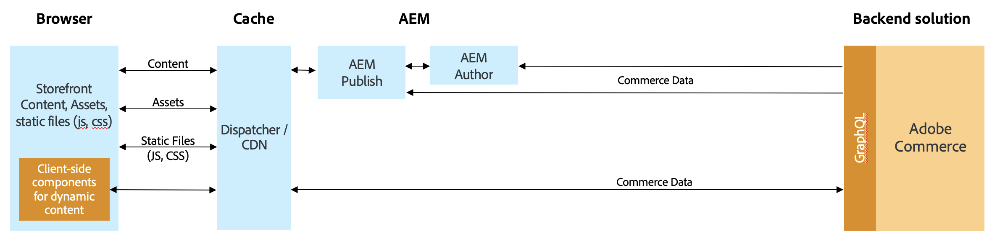

# [!DNL Audience Activation]

[!DNL Audience Activation]擴充功能可讓您在Adobe Commerce中啟用Real-Time CDP對象，以在購物車中建立唯一優惠方案。 這些優惠和獎勵包括常見的電子商務銷售技巧，例如&#x200B;_購買2獲得1免費_、針對該客戶的主圖橫幅，以及通過各種優惠修改產品價格。 在Real-Time CDP中建立的受眾是以來自各種企業系統的資料為基礎，例如企業資源規劃(ERP)、客戶關係管理(CRM)、銷售點和行銷系統。 由於客戶區段資訊會持續更新，因此當客戶在您的商店購物時，他們可能會與區段建立關聯或解除關聯。

您可以在Luma店面或[Headless](#headless-support)店面中啟用對象。 在Luma店面中，對象資訊（區段會籍）會儲存在Commerce側的Cookie中。 在Headless店面中，受眾資訊會作為引數傳遞到GraphQL API標題，名稱為： `aep-segments-membership`。

## 發行說明

本節包含Audience Activation擴充功能更新的相關資訊，並包含：

 — 新功能
 — 修正和改良
 — 已知問題

請參閱[即將發行的版本](https://experienceleague.adobe.com/docs/commerce-operations/release/planning/schedule.html)，瞭解發行排程和支援。

請參閱開發人員檔案以[瞭解產品相容性](https://experienceleague.adobe.com/docs/commerce-operations/release/product-availability.html)。

## 支援的服務更新

以下發行說明說明Audience Activation所使用的擴充功能相關功能變更和修正。

+++支援的服務更新

_2023年8月15日_

 — 已更新[Real-Time CDP Audiences儀表板](#real-time-cdp-audiences-dashboard)以簡化篩選。

_2023年6月27日_

 — 已在`magento/module-data-services-graphql`封裝中新增對PHP 8.2的支援。

_2023年5月30日_

 — 已更新[Real-Time CDP對象儀表板](#real-time-cdp-audiences-dashboard)，以包含排序、搜尋和篩選Adobe Commerce執行個體中作用中對象的能力。

+++

### 2.4.0

[!BADGE 相容性]{type=Informative tooltip="相容性"} Adobe Commerce 2.4.4或更新版本

_2025年3月24日_

 — 新增PHP 8.4支援。

### 2.3.1

[!BADGE 相容性]{type=Informative tooltip="相容性"} Adobe Commerce 2.4.4或更新版本

_2024年11月12日_

 — 修正篩選可供選擇的Real-Time CDP對象時的問題。

### 2.3.0

[!BADGE 相容性]{type=Informative tooltip="相容性"} Adobe Commerce 2.4.4或更新版本

_2024年7月29日_

 — 新增命令列語法，因此您可以[測試認證](#validate-the-connection)以判斷是否需要更新認證以從Adobe Experience Platform提取對象資料。

### 2.2.0

[!BADGE 相容性]{type=Informative tooltip="相容性"} Adobe Commerce 2.4.4或更新版本

_2024年6月12日_

受眾通知的 - [相關產品規則](../merchandising-promotions/product-related-rule-create.md)的GA版本。

### 2.1.1

[!BADGE 相容性]{type=Informative tooltip="相容性"} Adobe Commerce 2.4.4或更新版本

_2024年4月4日_

 — 已新增對PHP 8.3的支援。

### 2.2.0-beta1

[!BADGE 相容性]{type=Informative tooltip="相容性"} Adobe Commerce 2.4.4或更新版本

_2024年2月16日_

 — 如果您正在參與Beta版，請確定您的`composer.json`檔案在根層級有下列專案： ` "minimum-stability": "beta"`。
 - (**Beta**)已新增從受眾通知建立[相關產品規則](../merchandising-promotions/product-related-rule-create.md)的功能。

### 2.1.0

[!BADGE 相容性]{type=Informative tooltip="相容性"} Adobe Commerce 2.4.4或更新版本

_2024年1月24日_

 — 更新[Real-Time CDP對象儀表板](#real-time-cdp-audiences-dashboard)，以納入包含對象的網站，並指定哪些動態區塊和購物車價格規則設定為使用這些對象。

### 2.0.1

[!BADGE 相容性]{type=Informative tooltip="相容性"} Adobe Commerce 2.4.4或更新版本

_2023年11月16日_

 — 改善穩定性。

### 2.0.0

[!BADGE 相容性]{type=Informative tooltip="相容性"} Adobe Commerce 2.4.4或更新版本

_2023年10月10日_

 — 當您[設定](#configure-the-extension) Audience Activation擴充功能時，已新增對OAuth 2.0的支援。
 — 改善穩定性。

### 1.2.0

[!BADGE 相容性]{type=Informative tooltip="相容性"} Adobe Commerce 2.4.4或更新版本

_2023年8月15日_

 — 已更新UI元件版本。

### 1.1.0

_2023年5月30日_

[!BADGE 相容性]{type=Informative tooltip="相容性"} Adobe Commerce 2.4.4或更新版本

 — 已在Headless店面中新增對[動態區塊](#headless-support)的支援。

### 1.0.1

_2023年5月11日_

[!BADGE 相容性]{type=Informative tooltip="相容性"} Adobe Commerce 2.4.4或更新版本

 — 修正動態區塊或購物車價格規則未套用至店面的問題。
 — 修正當商家嘗試建立或更新動態區塊時，未設定的Audience Activation擴充功能安裝導致錯誤的問題。

### 1.0.0

_2023年3月31日_

[!BADGE 相容性]{type=Informative tooltip="相容性"} Adobe Commerce 2.4.4或更新版本

 — 一般可用性版本

## 實施

以下工作同時適用於Luma和Headless店面實施。 若要在Adobe Commerce中啟用對象，您必須：

- 安裝Adobe Commerce 2.4.4版或更高版本
- 在Real-Time CDP中[啟動](https://experienceleague.adobe.com/docs/experience-platform/destinations/catalog/personalization/adobe-commerce.html) Adobe Commerce作為目的地
- 在Admin中[安裝](#install-the-extension) [!DNL Audience Activation]擴充功能
- 在Admin中[設定](#configure-the-extension) [!DNL Audience Activation]擴充功能

### 安裝擴充功能

從[!DNL Audience Activation]市集[安裝](https://commercemarketplace.adobe.com/magento-audiences.html)擴充功能，或執行以下命令：

```bash
composer require magento/audiences
```

### 設定擴充功能

安裝[!DNL Audience Activation]擴充功能後，您必須登入Commerce管理員並完成下列作業：

1. 在&#x200B;_管理員_&#x200B;側邊欄上，移至&#x200B;**[!UICONTROL System]** > _[!UICONTROL Services]_>**[!UICONTROL Commerce Services Connector]**。

1. [登入](https://experienceleague.adobe.com/docs/commerce/user-guides/integration-services/saas.html#organizationid)您的Adobe帳戶並選取您的組織ID。

1. 在&#x200B;_管理員_&#x200B;側邊欄上，移至&#x200B;**[!UICONTROL System]** > _[!UICONTROL Services]_>**[!UICONTROL [!DNL Data Connection]]**。

1. 在&#x200B;**[!UICONTROL Datastream ID]**&#x200B;欄位中，貼上您[啟用](https://experienceleague.adobe.com/docs/experience-platform/destinations/catalog/personalization/adobe-commerce.html#parameters) Adobe Commerce時建立的資料串流識別碼，作為Real-Time CDP中的目的地。

   此資料流會將資料從您的Commerce網站傳送至Real-Time CDP，以判斷購物者是否屬於受眾。 如果您尚未建立資料流，請在Experience Platform中[建立](https://experienceleague.adobe.com/docs/experience-platform/datastreams/configure.html#create)資料流，[將其新增至Real-Time CDP中的Commerce目的地，以及在Admin中的](https://experienceleague.adobe.com/docs/experience-platform/destinations/catalog/personalization/adobe-commerce.html)[[!DNL Data Connection]擴充功能。](https://experienceleague.adobe.com/docs/commerce/data-connection/fundamentals/connect-data.html#data-collection)

   >[!NOTE]
   >
   >當您指定資料串流ID時，就會[將其與](https://experienceleague.adobe.com/docs/commerce/data-connection/fundamentals/connect-data.html#data-collection)擴充功能中的特定網站[!DNL Data Connection]建立關聯。 如果您的Commerce商店有多個網站，請在Real-Time CDP中為每個網站[建立目的地](https://experienceleague.adobe.com/docs/experience-platform/destinations/ui/connect-destination.html)，並為每個網站使用不同的資料串流ID。

1. 在&#x200B;_管理員_&#x200B;側邊欄上，移至&#x200B;**[!UICONTROL Stores]** > _[!UICONTROL Settings]_>**[!UICONTROL Configuration]**。

1. 展開&#x200B;**[!UICONTROL Services]**&#x200B;並選取&#x200B;**[!UICONTROL [!DNL Data Connection]]**。

1. [新增](https://experienceleague.adobe.com/docs/commerce/data-connection/fundamentals/connect-data.html#add-service-account-and-credential-details)服務帳戶與認證詳細資料。

## 在Commerce中的何處使用Real-Time CDP受眾

啟用[!DNL Audience Activation]擴充功能後，您可以：

- [建立受眾通知的購物車價格規則](../merchandising-promotions/price-rules-cart-create.md#set-a-condition-using-real-time-cdp-audiences)
- [建立受眾通知的動態區塊](../content-design/dynamic-blocks.md#use-real-time-cdp-audiences-in-dynamic-blocks)
- [建立受眾通知的相關產品規則](../merchandising-promotions/product-related-rule-create.md)

>[!TIP]
>
>如需有關如何將[!DNL Commerce]資料匯出至Real-Time CDP、建立對象，然後將該對象啟用至[!DNL Commerce]的完整端對端使用案例，請參閱[使用 [!DNL Commerce] 事件資料在Real-Time CDP中建立對象](https://experienceleague.adobe.com/en/docs/commerce/data-connection/use-cases/create-audience)。

## Real-Time CDP受眾控制面板

您可以使用[Real-Time CDP Audiences](https://experienceleague.adobe.com/docs/experience-platform/destinations/ui/activate/activate-edge-personalization-destinations.html)儀表板，檢視可在Adobe Commerce執行個體中個人化的所有&#x200B;**作用中**&#x200B;對象。

若要存取&#x200B;**Real-Time CDP Audiences**&#x200B;儀表板，請前往&#x200B;_管理員_&#x200B;側邊欄，然後前往&#x200B;**[!UICONTROL Customers]** > **[!UICONTROL Real-time CDP Audience]**。

{width="700" zoomable="yes"}

儀表板包含下列欄位：

| 欄 | 說明 |
|--- |--- |
| `Hide filters` | 可讓您顯示或隱藏可套用至控制面板的任何篩選器。 目前您只能套用`Last updated`個篩選器。 此篩選器可讓您根據上次更新對象的時間來選取對象的日期範圍。 |
| `Search` | 可讓您在Commerce例項中搜尋作用中對象。 |
| `Name` | 在Real-Time CDP中提供給對象的名稱。 |
| `Origin` | 指出對象的來源，例如`Experience Platform`。 |
| `Websites` | 指出哪些網站已設定為可使用對象。 |
| `Dynamic Blocks` | 指出哪些動態區塊已設定為可使用對象。 |
| `Cart Price Rules` | 指出哪些購物車價格規則已設定為使用對象。 |
| `Related Product Rules` | 指出哪些相關產品規則已設定為使用對象。 |
| `Last updated` | 表示對象在Real-Time CDP中的修改時間。 |
| `Sync now` | 從Real-Time CDP擷取新的或更新對象。 |
| `Customize table` | 可讓您顯示或隱藏`Origin`、`Websites`、`Dynamic Blocks`、`Cart Price Rules`和`Last updated`欄。 |

{style="table-layout:auto"}

## Headless支援

您可以在Headless Adobe Commerce例項(例如AEM和PWA)中啟用對象，以根據對象顯示購物車價格規則、相關產品規則或動態區塊。

### 購物車價格規則和相關產品規則

針對購物車價格規則和相關產品規則，Headless店面會透過[Commerce integration framework (CIF)](https://experienceleague.adobe.com/docs/experience-manager-cloud-service/content/content-and-commerce/integrations/magento.html)與Experience Platform通訊。 此架構提供使用GraphQL實作的伺服器端API。 對象資訊（例如購物者的區段）會透過名為`aep-segments-membership`的GraphQL標題引數傳遞至Commerce。

整體架構如下：

{width="700" zoomable="yes"}

在您[安裝](#install-the-extension)並[設定](#configure-the-extension)擴充功能後，Experience Platform Web SDK會以區段會籍的形式包含對象資訊。

若要從SDK擷取這些區段會籍，請參閱此[程式碼片段](https://experienceleague.adobe.com/docs/experience-platform/destinations/catalog/personalization/custom-personalization.html#example-response-for-custom-personalization-with-attributes)。

擷取區段後，您可以在GraphQL標題中將這些區段傳遞至Commerce。 例如：

```bash
curl 'http://magento.config/graphql' -H 'Authorization: Bearer abc123' -H 'aep-segments-membership: urlencoded_list_of_segments' -H 'Content-Type: application/json' --data-binary '{"query":"query {\ncustomer {\nfirstname\nlastname\nemail\n}\n}"}'
```

### 動態區塊

對於動態區塊，GraphQL `dynamicBlocks`查詢可以包含`audience_id`輸入屬性。 如果您在`audience_id`查詢中指定一或多個`dynamicBlocks`值，它會傳回指派給這些對象的動態區塊清單。

#### 使用範例

下列查詢會傳回與多個對象ID相關聯的所有動態區塊。

**要求：**

```graphql
{
  dynamicBlocks(input:
  {
    type: SPECIFIED
    audience_id: {
      in: [
        "cd29a789-9be8-40ad-a1ef-640c33b3742e"
        "92c3e14d-c72b-40d0-96b7-b96801dcc135"
      ]
    }
  })
  {
    items {
      uid
      audience_id
      content {
        html
      }
    }
    page_info {
      current_page
      page_size
      total_pages
    }
    total_count
  }
}
```

**回應：**

```json
{
  "data": {
    "dynamicBlocks": {
      "items": [
        {
          "uid": "MQ==",
          "audience_id": [
            "cd29a789-9be8-40ad-a1ef-640c33b3742e"
          ],
          "content": {
            "html": "<h2><strong>SAVE 20%</strong></h2>\r\n<p>(some restrictions apply)</p>\r\n<p>&nbsp;</p>"
          }
        },
        {
          "uid": "Mg==",
          "audience_id": [
            "cd29a789-9be8-40ad-a1ef-640c33b3742e",
            "92c3e14d-c72b-40d0-96b7-b96801dcc135"
          ],
          "content": {
            "html": "<p></p>"
          }
        }
      ],
      "page_info": {
        "current_page": 1,
        "page_size": 20,
        "total_pages": 1
      },
      "total_count": 2
    }
  }
}
```

在`dynamicBlocks`開發人員檔案[中進一步瞭解](https://developer.adobe.com/commerce/webapi/graphql/schema/store/queries/dynamic-blocks/) GraphQL查詢。

## 使用Adobe Experience Platform Mobile SDK擷取對象

您可以使用Adobe Experience Platform Mobile SDK擷取Real-Time CDP對象。

1. [安裝](#install-the-extension) Audience Activation擴充功能。
1. [為您的行動Commerce網站](https://experienceleague.adobe.com/docs/commerce/data-connection/fundamentals/mobile-sdk-epc.html)安裝並設定SDK。

>[!IMPORTANT]
>
>適用於iOS的Adobe Experience Platform Mobile SDK支援iOS 11或更新版本。

完成設定後，請使用行動SDK作業來擷取受眾資料。 例如：

```swift
Edge.sendEvent(experienceEvent: experienceEvent) { (handles: [EdgeEventHandle]) in
    for handle in handles {
        if handle.type == "activation:pull" {
        let payloadItems = handle.payload ?? []
            for payloadItem in payloadItems {
                if let segments = payloadItem["segments"] as? any Sequence {
                    var segmentsArr = [Any]()
                    for segment in segments {
                        let response = segment as AnyObject?
                        segmentsArr.append(response?.object(forKey: "id")! ?? "")
                    }
                    print("Saving segments ->  \(segments)")
                    storage.set(segmentsArr, forKey: "segments")
                    print("End saving segments")
                }
         
                // Show segments
                let rSegments = storage.object(forKey: "segments") ?? nil;
                print("Retrieving segments -> \(rSegments)")
            }
        }
    }
}
```

擷取資料後，您可以在Commerce應用程式中使用該資料建立對象知悉的[購物車價格規則](../merchandising-promotions/price-rules-cart-create.md#set-a-condition-using-real-time-cdp-audiences)、[動態區塊](../content-design/dynamic-blocks.md#use-real-time-cdp-audiences-in-dynamic-blocks)和[相關的產品規則](../merchandising-promotions/product-related-rule-create.md)。

## 對象不會顯示在Commerce中

如果Real-Time CDP對象未顯示在Commerce中，原因可能是：

- 無效的連線
- 在&#x200B;**資料連線**&#x200B;設定頁面中選取的驗證型別不正確
- 產生的權杖上的許可權不足

以下小節說明如何疑難排解這些問題。

### 驗證連線

若要驗證Adobe Experience Platform的認證和回應，請執行以下命令：

```bash
bin/magento audiences:config:status
```

此命令會傳回連線狀態。 新增`-v`旗標以提供額外的詳細資訊：

```
./bin/magento audiences:config:status -v  
```

例如：

```
+----------------------------------+---------------+---------------------------------------------+---------------------------------------------------------+--------------+
| Client ID                        | Client secret | Technical account ID                        | Technical account email                                 | Sandbox name |
+----------------------------------+---------------+---------------------------------------------+---------------------------------------------------------+--------------+
| 1234bd57fac8497d8933327c535347d8 | *****         | 12341E116638D6B00A495C80@techacct.adobe.com | 12345-b95b-4894-a41c-a4130d26bd80@techacct.adobe.com | dev          |
```

### 設定中選取的驗證型別不正確

1. 開啟您的Commerce執行個體。
1. 在&#x200B;_管理員_&#x200B;側邊欄上，移至&#x200B;**[!UICONTROL Stores]** > _[!UICONTROL Settings]_>**[!UICONTROL Configuration]**。
1. 展開&#x200B;**[!UICONTROL Services]**&#x200B;並選取&#x200B;**[!UICONTROL [!DNL Data Connection]]**。
1. 確定您在&#x200B;**[!UICONTROL Authentication Type]**&#x200B;欄位中指定的伺服器對伺服器授權方法正確。 Adobe建議使用&#x200B;**OAuth**。 已棄用JWT。 [了解更多](https://developer.adobe.com/developer-console/docs/guides/authentication/ServerToServerAuthentication/migration/)。

### 產生的權杖上的許可權不足

此問題可能是由於所產生Token的API許可權不足所導致。 若要確保權杖具有正確的許可權：

1. 識別組織中Adobe Experience Platform的系統管理員。
1. 尋找您將使用的專案和認證。
1. 識別技術帳戶電子郵件，例如： `fe3c9476-1234-1234-abcd-2a51a785009a@techacct.adobe.com`。
1. 請系統管理員啟動Adobe Experience Platform並移至&#x200B;**[!UICONTROL Permissions]** -> **[!UICONTROL Users]** -> **[!UICONTROL API credentials]**。
1. 使用上方的技術帳戶電子郵件，搜尋要修改的認證。
1. 開啟認證，然後選取&#x200B;**[!UICONTROL Roles]** -> **[!UICONTROL Add roles]**。
1. 新增包含&#x200B;**[!UICONTROL Manage destinations]**&#x200B;許可權的角色。
1. 按一下&#x200B;**[!UICONTROL Save]**。
1. [在主控台中重新產生](https://experienceleague.adobe.com/docs/experience-platform/landing/platform-apis/api-authentication.html#generate-access-token)存取權杖。
1. 使用[Target連線API](https://developer.adobe.com/experience-platform-apis/references/destinations/#tag/Target-connections/operation/getTargetConnections)驗證Token是否提供有效的回應。
