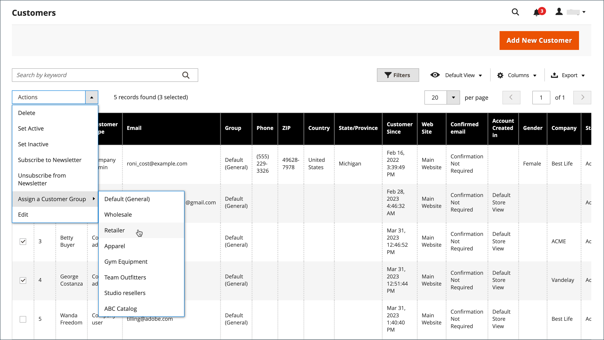

# 客戶群組

客戶群組決定可用的折扣，以及與群組相關聯的稅捐類別。 預設客戶群組為 `General`， `Not Logged In`、和 `Wholesale`.

{width="700" zoomable="yes"}

## 篩選 [!UICONTROL Customer Groups] 清單

1. 在 _管理員_ 側欄，前往 **[!UICONTROL Customers]** > **[!UICONTROL Customer Groups]**.

1. 按一下 **[!UICONTROL Filters]**.

1. 輸入搜尋群組的條件，包括識別碼、群組或稅捐類別的範圍。

   {width="600" zoomable="yes"}

1. 完成後，按一下 **[!UICONTROL Apply Filters]**.

## 建立客戶群組

1. 在 _管理員_ 側欄，前往 **[!UICONTROL Customers]** > **[!UICONTROL Customer Groups]**.

1. 按一下 **[!UICONTROL Add New Customer Group]**.

1. 的 [!DNL **Group Name]**輸入少於32個字元的唯一名稱來識別群組。

1. 選取 **[!UICONTROL Tax Class]** 適用於群組的屬性。

   {width="600" zoomable="yes"}

1. 選取 **[!UICONTROL Excluded Website(s)]** 要從群組排除的專案。

   >[!IMPORTANT]
   >
   >排除網站可能會降低產品價格和目錄規則索引時間，因為排除的網站不會索引。 使用新增的網站排除專案儲存客戶群組時，產品價格、目錄規則和目錄搜尋索引會失效。 如果您有許多產品、網站和客戶群組，建議您暫停重新索引程式，直到您將網站從客戶群組排除為止。

   預設不會排除任何網站。 若要選取多個值，請按住 _Ctrl_ 金鑰(PC)或 _命令_ 鍵(Mac)並點選每個選項。

1. 完成後，按一下 **[!UICONTROL Save Customer Group]**.

## 編輯客戶群組

1. 在 _管理員_ 側欄，前往 **[!UICONTROL Customers]** > **[!UICONTROL Customer Groups]**.

1. 以編輯模式開啟記錄。

1. 進行必要的變更。

1. 完成後，按一下 **[!UICONTROL Save Customer Group]**.

## 將客戶指派至其他群組

1. 在 _管理員_ 側欄，前往 **[!UICONTROL Customers]** > **[!UICONTROL All Customers]**.

1. 在清單中尋找客戶，並選取第一欄中的核取方塊。

1. 設定 **動作** 控制項至 `Assign a Customer Group` 並從功能表中選擇群組。

   {width="600" zoomable="yes"}

1. 提示確認時，按一下 **確定**.

## 將客戶群組與特定折扣建立關聯

1. 在 _管理員_ 側欄，前往 **[!UICONTROL Marketing]** > _促銷活動_ > **[!UICONTROL Cart Price Rules]**.

1. 選取您要為套用的折扣建立群組關聯的購物車價格規則，或 [建立價格規則](../merchandising-promotions/price-rules-catalog.md).

1. 選取規則套用的客戶群組。

   {width="600" zoomable="yes"}

1. 按一下 **[!UICONTROL Save]**.

>[!NOTE]
>
> 您也可以使用「進階訂價」，將產品折扣套用至客戶群組。 另請參閱 [進階定價](../catalog/product-price-group.md).

## 刪除客戶群組

1. 在 _管理員_ 側欄，前往 **[!UICONTROL Customers]** > **[!UICONTROL Customer Groups]**.

1. 以編輯模式開啟記錄。

1. 在按鈕列中，按一下 **[!UICONTROL Delete Customer Group]**.

1. 提示確認時，按一下 **確定**.

## 客戶群組示範

透過觀看此示範以瞭解如何建立客戶群組：

>[!VIDEO](https://video.tv.adobe.com/v/343660/?quality=12)
