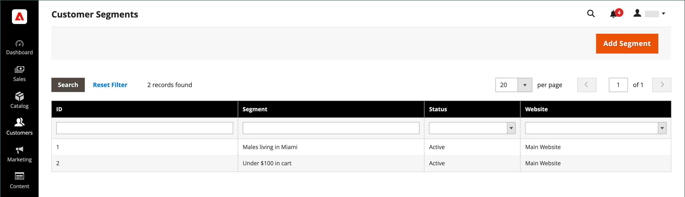
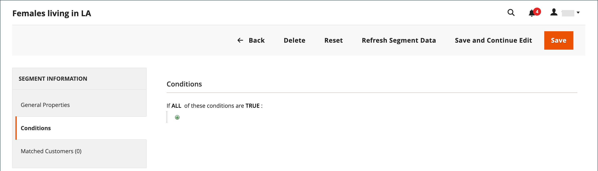

# 建立和刪除客戶區段

{{ee-feature}}

建立客戶區段與建立客戶區段類似 [購物車價格規則](../merchandising-promotions/price-rules-cart.md)，但選項包括 [客戶區段特定屬性](../customers/customer-segments.md).

{width="700" zoomable="yes"}

_**[!UICONTROL Customer Segments]格線&#x200B;**_

| 欄 | 說明 |
|--- |--- |
| **[!UICONTROL ID]** | 客戶區段的唯一ID。 |
| **[!UICONTROL Segment]** | 客戶區段的名稱。 |
| **[!UICONTROL Status]** | 指出客戶區段是否為 _[!UICONTROL Active]_或_[!UICONTROL Inactive]_. |
| **[!UICONTROL Website]** | 指出客戶區段所屬的網站。 |

{style="table-layout:auto"}

## 先決條件：啟用客戶區段

1. 在 _管理員_ 側欄，前往 **[!UICONTROL Stores]**  > _[!UICONTROL Settings]_>**[!UICONTROL Configuration]**.

1. 在左側面板中，展開 **[!UICONTROL Customers]** 並選擇 **[!UICONTROL Customer Configuration]**.

1. 展開 **[!UICONTROL Customer Segments]** 區段。

1. 確認 **[!UICONTROL Enable Customer Segment Functionality]** 設為 `Yes`.

   {width="600" zoomable="yes"}

1. （選用）若要停用客戶區段的即時驗證，請設定 **[!UICONTROL Real-time Check if Customer is Matched by Segment]** 至 `No`.

   當您停用即時驗證時，客戶區段會由單一合併條件SQL查詢來驗證。 如果系統中有許多客戶區段，停用此函式可改善區段驗證的效能。 但是，分割資料庫或沒有註冊客戶時，驗證無法運作。

1. 完成後，按一下 **[!UICONTROL Save Config]**.

## 建立區段

下列步驟以建立客戶區段的範例為例，其目標是洛杉磯的女性客戶。

### 步驟1：新增客戶區段

1. 在 _管理員_ 側欄，前往 **[!UICONTROL Customers]** > **[!UICONTROL Segments]**.

1. 在右上角，按一下 **[!UICONTROL Add Segment]**.

1. 輸入 **[!UICONTROL Segment Name]** 在Admin中工作時，可識別客戶區段的資訊。

1. 輸入簡報 **[!UICONTROL Description]** 說明區段的用途。

1. 設定 **[!UICONTROL Assigned to Website]** 移至可使用客戶區段的網站。

1. 設定 **[!UICONTROL Status]** 至 _作用中_ 或 _非使用中_.

1. 若要識別您要用於套用區段的客戶型別，請設定 **[!UICONTROL Apply to]** 變更為下列其中一項：

   - `Visitors and Registered Customers`  — 包含所有購物者，無論他們是否已登入帳戶。
   - `Registered Customers`  — 僅包含已登入帳戶的購物者。
   - `Visitors`  — 僅包含未登入帳戶的購物者。

   >[!TIP]
   >
   >如果您是根據儲存在客戶帳戶中的客戶屬性來建立區段，最佳作法是僅將區段套用至註冊客戶。

   >[!NOTE]
   >
   > 如果區段套用至 `Visitors and Registered Customers`，則 [!UICONTROL Matched Customers] 僅顯示 `Registered Customers`. 即使可依據適用於訪客的條件鎖定訪客，亦會如此。 的 `Visitors` 僅限區段，否 `Matched Customers` 標籤隨即顯示。

1. 按一下 **[!UICONTROL Save and Continue Edit]**.

   儲存區段後 _[!UICONTROL General Properties]_，左側面板中會顯示其他選項。

   {width="600" zoomable="yes"}

**_[!UICONTROL General Properties]_**

| 欄位 | 說明 |
|--- |---|
| **[!UICONTROL Segment Name]** | 可識別供內部參照之區段的名稱。 |
| **[!UICONTROL Description]** | 說明區段用途以供內部參考的簡短說明。 |
| **[!UICONTROL Assigned to Website]** | 可使用區段的單一網站。 |
| **[!UICONTROL Status]** | 啟用和停用區段。 區段停用時，所有相關的價格規則和橫幅都會停用。 選項： `Active` / `Inactive` |
| **[!UICONTROL Apply to]** | 定義套用區段的客戶型別。 選取範圍會影響可用於建立區段的條件集。 區段儲存後，便無法變更設定。 |

{style="table-layout:auto"}

### 步驟2：定義條件

>[!NOTE]
>
> 對於訪客，僅適用於下列條件：購物車條件（購物車小計金額、購物車明細專案和購物車產品數量）、產品規則（在購物車和產品歷史記錄中找到的產品）以及這些專案的組合。 如果區段應同時套用至訪客和註冊客戶，則只會根據列出的條件來追蹤訪客。

1. 在左窗格中，按一下 **[!UICONTROL Conditions]**.

   預設條件開頭為 _[!UICONTROL If ALL of these conditions are TRUE:]_在頁面上。

   {width="600" zoomable="yes"}

1. 建立以女性客戶為目標的條件：

   - 按一下 **[!UICONTROL Add]** 圖示以顯示條件清單並選取 `Gender`.

   - 保留預設值 **是** 條件控制選項。

   - 按一下 **...** 並選取 `female`.

   {width="600" zoomable="yes"}

1. 建立另一個以洛杉磯居民為目標的條件：

   - 在下一行，按一下 **[!UICONTROL Add]** 圖示並選取 `Customer Address`.

     此動作會建立父條件，您可在其中定義一或多個要比對的位址列位。

   - 按一下 **[!UICONTROL Add]** 圖示以顯示位址列位清單並選取 `City`.

   - 按一下 **是** 顯示條件控制選項並選取 `contains`.

   - 按一下 **...** 並輸入 `Los Angeles`.

   - 在下一行，按一下 **[!UICONTROL Add]** 圖示並選取 `State/Province`.

   - 保留預設值 **是** 條件控制選項。

   - 按一下 **...** 並選取 `United States > California`.

   {width="600" zoomable="yes"}

1. 按一下 **[!UICONTROL Save and Continue Edit]**.

### 步驟3：檢閱相符客戶的清單

1. 在左窗格中，按一下 **[!UICONTROL Matched Customers]** 以顯示符合條件的所有客戶。

   {width="600" zoomable="yes"}

1. 如果客戶清單符合您的目標，請按一下 **[!UICONTROL Save]** 以完成客戶區段。

1. 客戶區段現在可用於目標定位促銷活動、內容和郵件。

_**[!UICONTROL Matched Customers]格線&#x200B;**_

| 欄 | 說明 |
|--- |--- |
| **[!UICONTROL ID]** | 註冊客戶的客戶ID。 |
| **[!UICONTROL Name]** | 註冊客戶的名稱。 |
| **[!UICONTROL Email]** | 註冊客戶的電子郵件地址。 |
| **[!UICONTROL Group]** | 客戶被指派到的客戶群組。 |
| **[!UICONTROL Phone]** | 客戶的電話號碼。 |
| **[!UICONTROL ZIP]** | 客戶的郵遞區號。 |
| **[!UICONTROL Country]** | 客戶所在的國家/地區。 |
| **[!UICONTROL State / Province]** | 客戶所在的州或省。 |
| **[!UICONTROL Customer Since]** | 建立客戶帳戶的日期和時間。 |

{style="table-layout:auto"}

## 移除客戶區段

1. 在 _管理員_ 側欄，前往 **[!UICONTROL Customers]** > **[!UICONTROL Segments]**.

1. 找到要刪除的區段並加以選取。

1. 在功能表列中，按一下 **[!UICONTROL Delete]** 按鈕。

1. 若要確認動作，請按一下 **[!UICONTROL OK]**.

## 按鈕列

| 按鈕 | 說明 |
|--- |--- |
| **[!UICONTROL Back]** | 返回至 _[!UICONTROL Customer Segments]_頁面，而不儲存變更。 |
| **[!UICONTROL Delete]** | 刪除目前的客戶區段。 不會移除區段中與客戶相關聯的客戶或已完成的訂單。 |
| **[!UICONTROL Reset]** | 將客戶區段表單中未儲存的任何變更重設為先前的值。 |
| **[!UICONTROL Refresh Segment Data]** | 將區段資料重新整理為最近儲存的值。 如果任何區段資料無法使用或已過期，則為相關。 |
| **[!UICONTROL Save and Continue Edit]** | 儲存變更並保持客戶區段開啟。 |
| **[!UICONTROL Save]** | 儲存變更並關閉客戶區段。 |

{style="table-layout:auto"}

## 客戶區段示範

觀看此影片以示範如何建立客戶區段：

>[!VIDEO](https://video.tv.adobe.com/v/343659/?quality=12)
