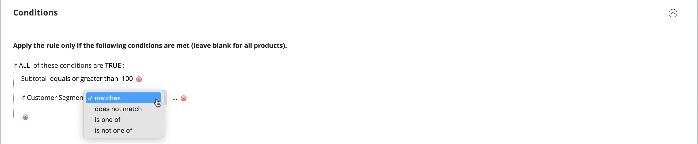

# 價格規則中的客戶區段

{{ee-feature}}

客戶區段可與建立關聯，以用於目標促銷活動。 [購物車價格規則](../merchandising-promotions/price-rules-cart.md).

{width="700" zoomable="yes"}

_**若要將區段與購物車價格規則產生關聯，請執行下列步驟：**_

1. 在 _管理員_ 側欄，前往 **[!UICONTROL Marketing]** > _促銷活動_ > **[!UICONTROL Cart Price Rules]**.

1. 開啟新的或現有的規則：

   * 若要使用新規則，請按一下 **[!UICONTROL Add New Rule]** 位於右上角。
   * 若要使用現有規則，請按一下清單中的規則，以編輯模式開啟該規則。

1. 向下捲動並展開 **[!UICONTROL Conditions]** 區段。

1. 新增條件。

   * 按一下 _新增_ ()圖示，其中顯示條件清單。 然後，選擇 **[!UICONTROL Customer Segment]**.

   {width="600" zoomable="yes"}

   依預設，條件設定為尋找符合條件。 如有需要，請按一下 **[!UICONTROL matches]** 連結運運算元，並將其變更為下列其中一項：

   * `does not match`
   * `is one of`
   * `is not one of`

   {width="600" zoomable="yes"}

1. 若要鎖定特定區段，請按一下 **...** 連結以顯示其他選項。 然後，按一下 _選擇器_ ()圖示來顯示客戶區段清單。

1. 在清單中，選取您要以條件定位之每個區段的核取方塊。

   {width="600" zoomable="yes"}

1. 按一下 **[!UICONTROL Select]** 將所選客戶區段放置到條件中。

1. 視需要完成其餘的價格規則。

1. 完成後，按一下 **[!UICONTROL Save]**.
