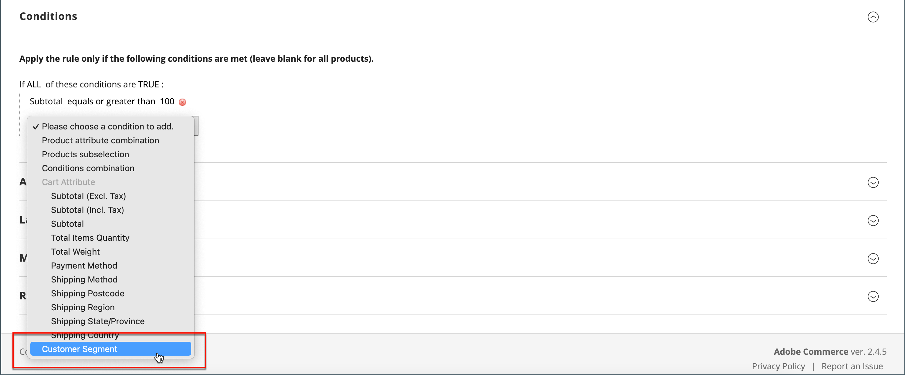
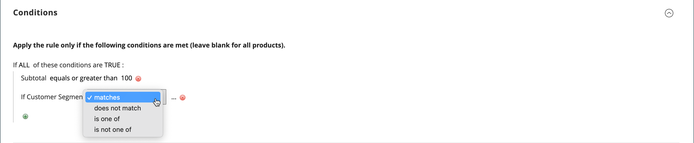

# 價格規則中的客戶區段

{{ee-feature}}

將客戶區段與[購物車價格規則](../merchandising-promotions/price-rules-cart.md)建立關聯，便可用於目標促銷活動。

{width="700" zoomable="yes"}

_&#x200B;**若要將區段與購物車價格規則建立關聯：**&#x200B;_

1. 在&#x200B;_管理員_&#x200B;側邊欄上，前往&#x200B;**[!UICONTROL Marketing]** > _促銷活動_ > **[!UICONTROL Cart Price Rules]**。

1. 開啟新的或現有的規則：

   * 若要使用新規則，請按一下右上角的&#x200B;**[!UICONTROL Add New Rule]**。
   * 若要使用現有規則，請按一下清單中的規則，以編輯模式開啟該規則。

1. 向下捲動並展開&#x200B;**[!UICONTROL Conditions]**&#x200B;區段。

1. 新增條件。

   * 按一下&#x200B;_新增_ （）圖示，其中會顯示條件清單。 然後選擇&#x200B;**[!UICONTROL Customer Segment]**。

   {width="600" zoomable="yes"}

   依預設，條件設定為尋找符合條件。 如有需要，請按一下&#x200B;**[!UICONTROL matches]**&#x200B;連結，並將運運算元變更為下列其中一項：

   * `does not match`
   * `is one of`
   * `is not one of`

   {width="600" zoomable="yes"}

1. 若要鎖定特定區段，請按一下[更多&#x200B;**...**]連結以顯示其他選項。 然後，按一下&#x200B;_選擇器_ （）圖示以顯示客戶區段清單。

1. 在清單中，選取您要以條件定位之每個區段的核取方塊。

   {width="600" zoomable="yes"}

1. 按一下「**[!UICONTROL Select]**」將選取的客戶區段放入條件中。

1. 視需要完成其餘的價格規則。

1. 完成時，按一下&#x200B;**[!UICONTROL Save]**。
