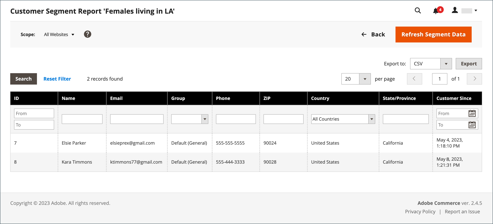

# 客戶區段報表

{{ee-feature}}

「客戶區段」報表提供有關每個區段中的客戶人數資訊。

{width="700" zoomable="yes"}

| 欄 | 說明 |
|--- |--- |
| **[!UICONTROL Select]** | 選取每個要接受動作之區段的核取方塊，或使用欄標題中的選取控制項。 選項： `Select All` / `Deselect All` / `Select Visible` / `Unselect Visible` |
| **[!UICONTROL ID]** | 指派給每個區段的唯一數值識別碼 |
| **[!UICONTROL Segment]** | 區段名稱 |
| **[!UICONTROL Status]** | 區段狀態。 選項： `Active` / `Inactive` |
| **[!UICONTROL Website]** | 區段已指派至的網站 |
| **[!UICONTROL Customers]** | 指派給區段的客戶數 |

{style="table-layout:auto"}

您可以向下展開至區段中的客戶清單，並匯出資料。

{width="600" zoomable="yes"}

為確保您擁有最新資料，必須重新整理區段資料。 如果區段資料無法使用或已過時，請按一下按鈕列中的&#x200B;**[!UICONTROL Refresh Segment Data]**&#x200B;進行更新。

1. 針對&#x200B;**[!UICONTROL Export to]**，選擇匯出格式：

   * CSV — 包含純文字資料的逗號分隔值檔案。
   * Excel XML — 以XML為基礎的試算表資料格式。

1. 按一下&#x200B;**[!UICONTROL Export]**。

   | 欄 | 說明 |
   |--- |--- |
   | **[!UICONTROL ID]** | 指派給每位使用者的唯一數值識別碼 |
   | **[!UICONTROL Name]** | 客戶名稱 |
   | **[!UICONTROL Email]** | 註冊客戶的電子郵件地址 |
   | **[!UICONTROL Group]** | 客戶被指派到的客戶群組 |
   | **[!UICONTROL Phone]** | 客戶的電話號碼 |
   | **[!UICONTROL ZIP]** | 客戶所在位置的郵遞區號 |
   | **[!UICONTROL Country]** | 客戶所在的國家/地區 |
   | **[!UICONTROL State/Province]** | 客戶所在的州或省 |
   | **[!UICONTROL Customer Since]** | 建立客戶帳戶的日期和時間 |

   {style="table-layout:auto"}

1. 產生的檔案會自動儲存到您的本機電腦。
