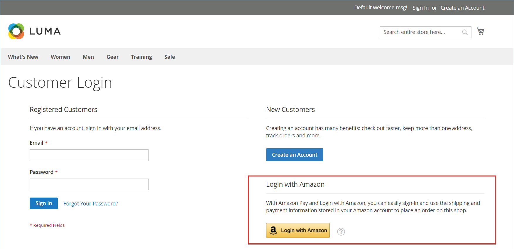

# 客戶登入

客戶可以從商店的每個頁面輕鬆存取其帳戶。 依據 [設定](../customers/account-options-new.md)，客戶可重新導向至其帳戶儀表板，或在登入帳戶後繼續購物。

如果 [驗證碼](../systems/security-captcha.md) 在設定中啟用，人員必須正確完成測試，驗證他們是否為人類，才能存取其帳戶。

當客戶忘記密碼時，系統會將重設連結傳送至與帳戶相關聯的電子郵件地址。 此 [密碼選項](../customers/password-options.md) 設定會控制客戶嘗試登入的體驗：

- 客戶可嘗試輸入密碼的次數
- 兩次嘗試之間的分鐘數
- 帳戶鎖定前的嘗試總數
- 鎖定長度

{width="700" zoomable="yes"}

## 登入客戶帳戶

1. 在商店的標題中，客戶按一下 **[!UICONTROL Sign in]**.

   {width="700" zoomable="yes"}

1. 輸入其 **[!UICONTROL Email]** 地址和 **[!UICONTROL Password]**.

1. 點擊數 **[!UICONTROL Sign in]**.

   >[!IMPORTANT]
   >
   >如果他們忘記密碼，客戶可以按一下 **[!UICONTROL Forgot Your Password?]** 並遵循 [指示](../customers/password-reset.md) 以重設密碼。

## 設定客戶登入後重新導向至帳戶儀表板

您可以設定商店，讓客戶在登入後重新導向至帳戶儀表板，或讓客戶繼續購物。

1. 在 _管理員_ 側欄，前往 **[!UICONTROL Stores]** > _[!UICONTROL Settings]_>**[!UICONTROL Configuration]**.

1. 在左側面板中，展開 **[!UICONTROL Customers]** 並選擇 **[!UICONTROL Customer Configuration]**.

1. 展開 **[!UICONTROL Login Options]** 區段。

1. 設定 **[!UICONTROL Redirect Customer to Account Dashboard after Logging in]** 變更為下列其中一項：

   - `Yes`  — 客戶登入帳戶時，帳戶儀表板會出現。
   - `No`  — 客戶登入帳戶後，可繼續購物。

1. 完成後，按一下 **[!UICONTROL Save Config]**.

## 使用Amazon登入

針對已設定的存放區 [!DNL Amazon Pay] 和 [!DNL Login with Amazon] 整合，客戶可登入其Amazon購買者帳戶。

1. 在商店的標題中，客戶按一下 **[!UICONTROL Sign in]**.

1. 點擊數 **[!UICONTROL Login with Amazon]**.

   {width="700" zoomable="yes"}

1. 提示登入時，客戶進入 **[!UICONTROL email address]** 和 **[!UICONTROL password]** 的Amazon購買者帳戶。

   {width="700" zoomable="yes"}

1. 若要授予Amazon許可權，以便在處理購買作業時從儲存區與其帳戶共用下列資訊，請按一下 **確定**.

   - 名稱
   - 電子郵件地址
   - 送貨地址

   {width="700" zoomable="yes"}

## 登出客戶帳戶

1. 在旁的右上角  _[!UICONTROL Welcome, Customer Name!]_，客戶按一下&#x200B;**[!UICONTROL v]**功能表選擇器。

1. 選擇 **[!UICONTROL Sign Out]**.

登出後，客戶會重新導向至首頁。
