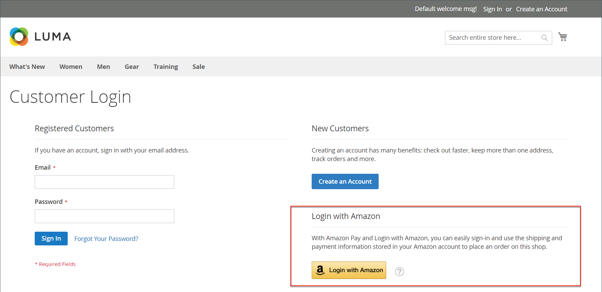
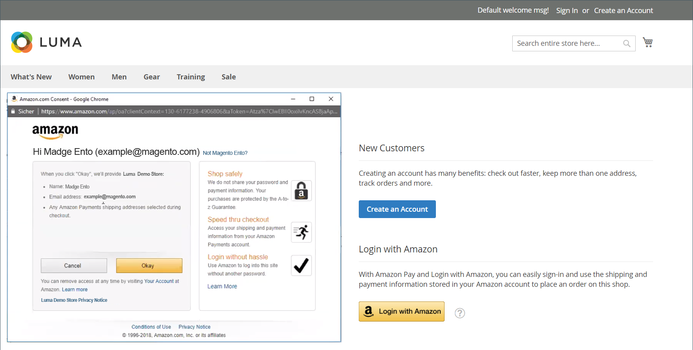

# 客戶登入

客戶可以從商店的每個頁面輕鬆存取其帳戶。 根據[設定](../customers/account-options-new.md)，客戶可以重新導向至其帳戶儀表板，或在登入帳戶後繼續購物。

如果組態中啟用了[CAPTCHA](../systems/security-captcha.md)，則人員必須先正確完成驗證其是否為人的測試，才能存取其帳戶。

當客戶忘記密碼時，系統會將重設連結傳送至與帳戶相關聯的電子郵件地址。 [密碼選項](../customers/password-options.md)設定會控制客戶嘗試登入的體驗：

- 客戶可嘗試輸入密碼的次數
- 兩次嘗試之間的分鐘數
- 帳戶鎖定前的嘗試總數
- 鎖定長度

{width="700" zoomable="yes"}

## 登入客戶帳戶

1. 在存放區的標頭中，客戶按一下&#x200B;**[!UICONTROL Sign in]**。

   {width="700" zoomable="yes"}

1. 輸入他們的&#x200B;**[!UICONTROL Email]**&#x200B;位址和&#x200B;**[!UICONTROL Password]**。

1. 按一下&#x200B;**[!UICONTROL Sign in]**。

   >[!IMPORTANT]
   >
   >如果他們無法記住密碼，客戶可以按一下&#x200B;**[!UICONTROL Forgot Your Password?]**&#x200B;並按照[指示](../customers/password-reset.md)重設密碼。

## 設定客戶登入後重新導向至帳戶儀表板

您可以設定商店，讓客戶在登入後重新導向至帳戶儀表板，或讓客戶繼續購物。

1. 在&#x200B;_管理員_&#x200B;側邊欄上，移至&#x200B;**[!UICONTROL Stores]** > _[!UICONTROL Settings]_>**[!UICONTROL Configuration]**。

1. 在左側面板中，展開&#x200B;**[!UICONTROL Customers]**&#x200B;並選擇&#x200B;**[!UICONTROL Customer Configuration]**。

1. 展開&#x200B;**[!UICONTROL Login Options]**&#x200B;區段。

1. 將&#x200B;**[!UICONTROL Redirect Customer to Account Dashboard after Logging in]**&#x200B;設定為下列其中一項：

   - `Yes` — 客戶登入帳戶時，帳戶儀表板會出現。
   - `No` — 客戶登入帳戶後，可以繼續購物。

1. 完成時，按一下&#x200B;**[!UICONTROL Save Config]**。

## 使用Amazon登入

對於已設定[!DNL Amazon Pay]與[!DNL Login with Amazon]整合的商店，客戶可以登入其Amazon購買者帳戶。

1. 在存放區的標頭中，客戶按一下&#x200B;**[!UICONTROL Sign in]**。

1. 按一下&#x200B;**[!UICONTROL Login with Amazon]**。

   {width="700" zoomable="yes"}

1. 當提示登入時，客戶輸入其Amazon購買者帳戶的&#x200B;**[!UICONTROL email address]**&#x200B;和&#x200B;**[!UICONTROL password]**。

   {width="700" zoomable="yes"}

1. 若要授予Amazon許可權，以便在處理購買時，從其帳戶與商店共用以下資訊，請按一下&#x200B;**確定**。

   - 名稱
   - 電子郵件地址
   - 送貨地址

   {width="700" zoomable="yes"}

## 登出客戶帳戶

1. 在&#x200B;_[!UICONTROL Welcome, Customer Name!]_&#x200B;旁的右上角，客戶按一下&#x200B;**[!UICONTROL v]**&#x200B;功能表選取器。

1. 選擇&#x200B;**[!UICONTROL Sign Out]**。

登出後，客戶會重新導向至首頁。
