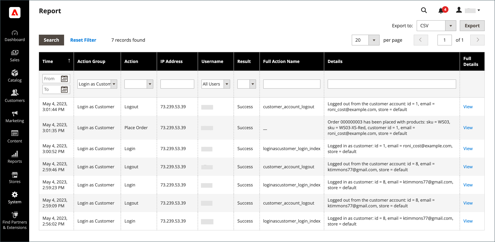

# 為購物者提供協助

有時候，客戶需要協助處理訂單。 存放區管理員可以使用&#x200B;_以客戶身分登入_，讓他們檢視客戶看到的內容並進行更新以協助他們。

以客戶身分登入時執行的任何動作會套用至實際客戶的帳戶。

>[!BEGINTABS]

>[!TAB Adobe Commerce]

僅[!BADGE 個PaaS]{type=Informative url="https://experienceleague.adobe.com/en/docs/commerce/user-guides/product-solutions" tooltip="僅適用於雲端專案（Adobe管理的PaaS基礎結構）和內部部署專案的Adobe Commerce 。"}

為&#x200B;_管理員_&#x200B;使用者啟用時，_[!UICONTROL Login as Customer]_按鈕會出現在多個頁面中：

* [客戶編輯頁面](../customers/update-account.md)
* [訂單檢視頁面](../stores-purchase/order-processing.md)
* [商業發票檢視頁面](../stores-purchase/invoices.md)
* [出貨檢視頁面](../stores-purchase/shipments.md)
* [銷退折讓單檢視頁面](../stores-purchase/credit-memo-create.md)

{width="600" zoomable="yes"}

>[!TAB Adobe Commerce as a Cloud Service]

僅[!BADGE SaaS]{type=Positive url="https://experienceleague.adobe.com/en/docs/commerce/user-guides/product-solutions" tooltip="僅適用於Adobe Commerce as a Cloud Service和Adobe Commerce Optimizer專案（Adobe管理的SaaS基礎結構）。"}

在Adobe Commerce as a Cloud Service中，「以客戶身分登入」功能會使用&#x200B;**一次性代碼(OTC)**&#x200B;工作流程，而非直接登入。 管理員會為客戶產生短暫的單次使用程式碼。 接著，您就可以透過GraphQL將此程式碼交換為客戶存取權杖，讓無密碼登入成為銷售商協助購物情境的客戶工作流程。

該功能包含下列元件：

* **管理員UI** — 在客戶編輯頁面上，管理員可以要求一次性代碼(OTC)，而非以客戶身分直接登入。
* **[REST API](https://developer.adobe.com/commerce/webapi/rest/saas-integrations/login-as-customer/)** - OTC產生的程式化端點，適用於管理指令碼和協力廠商整合。
* **GraphQL API** — 將OTC交換為店面或Headless商務流程的客戶存取權杖的變動。

>[!ENDTABS]

## 啟用客戶登入

啟用&#x200B;_以客戶身分登入_&#x200B;需要您在Commerce執行個體中啟用該功能，然後以使用者角色許可權為管理員使用者啟用存取權。

### 啟用功能

1. 在管理員側邊欄上，前往&#x200B;**[!UICONTROL Stores]** > _[!UICONTROL Settings]_>**[!UICONTROL Configuration]**。

1. 在左側面板中，展開&#x200B;**[!UICONTROL Customers]**&#x200B;並選擇&#x200B;**[!UICONTROL Login as Customer]**。

   {width="600" zoomable="yes"}

1. 將&#x200B;**[!UICONTROL Enable Login as Customer]**&#x200B;設為`Yes`。

1. _（選擇性）_&#x200B;將&#x200B;**[!UICONTROL Disable Page Cache for Admin User]**&#x200B;設為`No`以在管理員使用者以客戶身分登入時啟用頁面快取。

   >[!WARNING]
   >
   > 停用頁面快取（`Yes` — 預設）可確保使用者在客戶登入時取得最新且未快取的資料。

1. _（選擇性）_&#x200B;如果您有多網站及/或多重商店設定，且希望管理員使用者在登入時以客戶身分選取商店檢視，請將&#x200B;**[!UICONTROL Store View to Log in]**&#x200B;設為`Manual Selection`。

1. 完成時，按一下&#x200B;**[!UICONTROL Save Config]**。

### 為管理員使用者啟用存取權

1. 在&#x200B;_管理員_&#x200B;側邊欄上，移至&#x200B;**[!UICONTROL System]** > _許可權_ > **[!UICONTROL User Roles]**。

1. 按一下清單中的角色。

1. 在&#x200B;[!UICONTROL _角色資訊_]&#x200B;左側面板中，按一下&#x200B;**[!UICONTROL Role Resources]**。

1. 將頁面上的&#x200B;**[!UICONTROL Role Resources]**&#x200B;變更為`Custom`。

   >[!INFO]
   >
   > 選取此選項後，頁面中會顯示資源階層。

1. 捲動至&#x200B;**[!UICONTROL Customers]**&#x200B;父專案與下方的&#x200B;**[!UICONTROL Login as Customer]**&#x200B;專案。 然後，選取您要為角色啟用的資源：

   * **[!UICONTROL Allow Login as Customer]** — 允許管理員使用者使用&#x200B;_登入作為客戶_&#x200B;功能。
   * **[!UICONTROL View Login as Customer Log]** — 允許管理員使用者檢視&#x200B;_以客戶身分登入_&#x200B;記錄檔。

   {width="400" zoomable="yes"}

1. 按一下&#x200B;**[!UICONTROL Save Role]**。

## 遠端購物協助的客戶帳戶許可權

若要透過管理員為商店支援人員啟用帳戶存取權，客戶必須為其帳戶啟用此功能：

>[!BEGINTABS]

>[!TAB Adobe Commerce]

僅[!BADGE 個PaaS]{type=Informative url="https://experienceleague.adobe.com/en/docs/commerce/user-guides/product-solutions" tooltip="僅適用於雲端專案（Adobe管理的PaaS基礎結構）和內部部署專案的Adobe Commerce 。"}

1. 客戶前往&#x200B;**[!UICONTROL Account Information]**&#x200B;頁面。

1. 選取&#x200B;**[!UICONTROL Allow remote shopping assistance]**&#x200B;核取方塊。

1. 客戶按一下&#x200B;**[!UICONTROL Save]**。

{width="700" zoomable="yes"}

>[!TAB Adobe Commerce as a Cloud Service]

僅[!BADGE SaaS]{type=Positive url="https://experienceleague.adobe.com/en/docs/commerce/user-guides/product-solutions" tooltip="僅適用於Adobe Commerce as a Cloud Service和Adobe Commerce Optimizer專案（Adobe管理的SaaS基礎結構）。"}

客戶必須將`login_as_customer_assistance_allowed`擴充功能屬性設定為&#x200B;**2**。 這可以在Admin的&#x200B;**編輯客戶**&#x200B;頁面上設定，或是在建立或編輯客戶時透過GraphQL設定。

>[!WARNING]
>
>沒有此許可權，管理員使用者無法以此客戶身分登入。

{width="600" zoomable="yes"}

若要透過GraphQL為現有的客戶帳戶設定此許可權，請使用`allow_remote_shopping_assistance``true`或[`updateCustomerV2`](https://developer.adobe.com/commerce/webapi/graphql/schema/customer/mutations/update-v2/)變動將[`createCustomerV2`輸入設定為](https://developer.adobe.com/commerce/webapi/graphql/schema/customer/mutations/create-v2/)。

>[!ENDTABS]

## 從管理員以客戶身分登入

>[!BEGINTABS]

>[!TAB Adobe Commerce]

僅[!BADGE 個PaaS]{type=Informative url="https://experienceleague.adobe.com/en/docs/commerce/user-guides/product-solutions" tooltip="僅適用於雲端專案（Adobe管理的PaaS基礎結構）和內部部署專案的Adobe Commerce 。"}

1. 在&#x200B;_管理員_&#x200B;側邊欄上，移至&#x200B;**[!UICONTROL Customers]** > [!UICONTROL _所有客戶_]。

1. 在編輯模式中開啟使用者。

1. 在&#x200B;**[!UICONTROL Customer Information]**&#x200B;面板中，選擇&#x200B;**[!UICONTROL Account Information]**&#x200B;區段。

1. 將&#x200B;**[!UICONTROL Allow remote shopping assistance]**&#x200B;設為`Yes`。

   >[!INFO]
   >
   >管理員現在可以使用者身分登入，無需店面的許可權。

>[!TAB Adobe Commerce as a Cloud Service]

僅[!BADGE SaaS]{type=Positive url="https://experienceleague.adobe.com/en/docs/commerce/user-guides/product-solutions" tooltip="僅適用於Adobe Commerce as a Cloud Service和Adobe Commerce Optimizer專案（Adobe管理的SaaS基礎結構）。"}

>[!NOTE]
>
>如需使用REST實作此功能的指引，請參閱[以客戶身分登入](https://developer.adobe.com/commerce/webapi/rest/saas-integrations/login-as-customer/) REST API檔案。

### 向管理員要求一次性代碼(OTC)

1. 導覽至&#x200B;**[!UICONTROL Customers]**&#x200B;並選取要開啟編輯頁面的客戶。

1. 在[編輯客戶]頁面上，按一下&#x200B;**[!UICONTROL Get Customer Login OTC]**。

   在[編輯客戶]頁面上{width="600" zoomable="yes"}

1. 輸入&#x200B;**[!UICONTROL Reason]** （必要）並按一下&#x200B;**[!UICONTROL Request]**。

   {width="600" zoomable="yes"}的OTC要求模組

   >[!NOTE]
   >
   >**原因**&#x200B;欄位為必填。 它會傳遞給OTP產生流程，並保留用於即將推出的稽核和事件日誌功能。

1. 產生的OTC會顯示在強制回應視窗中。 使用此程式碼搭配`generateCustomerToken`或`exchangeOtpForCustomerToken` GraphQL突變以取得客戶授權。

   {width="300" zoomable="yes"}

>[!IMPORTANT]
>
>根據預設，所產生的一次性程式碼OTC的有效期限為30秒，且僅使用一次即可失效。 可透過提交[支援票證](https://experienceleague.adobe.com/home?support-tab=home#support)來設定TTL。

產生一次性程式碼後，您可以導覽至您的店面並使用以下憑證登入，以使用它：

* **電子郵件**：客戶的電子郵件地址
* **密碼**：產生的一次性代碼(OTC)

>[!ENDTABS]

## 以客戶身分使用登入

>[!INFO]
>
>若要使用&#x200B;_Login作為客戶_，請確定您的管理員已如前所述設定。

_以客戶身分登入_&#x200B;可讓您檢視網站，就像客戶一樣，並可讓您為客戶進行疑難排解和採取其他動作。 如果您有指派的使用者角色具有所需的許可權：

1. 您可以在上一節所列的頁面上按一下&#x200B;**[!UICONTROL Login as Customer]**。
1. 「動作報表」提供「以客戶身分登入」動作。

>[!WARNING]
>
>以客戶&#x200B;[!UICONTROL _身分登入_]&#x200B;時執行的任何動作（例如新增/移除產品）都會套用至實際客戶的訂單。 在店面，當您`logged in as customer_name`提供特殊狀態的提醒時，會顯示橫幅。

## 以客戶記錄身分登入

{{ee-feature}}

Adobe Commerce提供&#x200B;_以客戶_&#x200B;身分登入動作的記錄。 其中會列出管理員使用者存取功能的所有工作階段。 若要存取記錄的動作，請移至[管理動作報表](../systems/action-log-report.md)。

您可以篩選頁面頂端的報表設定&#x200B;**[!UICONTROL Action Group]**&#x200B;為`Login As Customer`，然後按一下&#x200B;**[!UICONTROL Search]**。

{width="700" zoomable="yes"}
