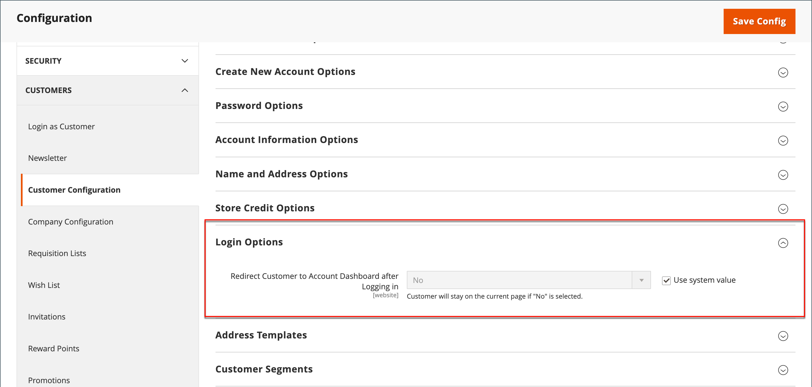

# 客戶登入登陸頁面

您可以設定商店，讓客戶在登入後重新導向至帳戶儀表板，或讓客戶繼續購物。

1. 在 _管理員_ 側欄，前往 **[!UICONTROL Stores]** > _[!UICONTROL Settings]_>**[!UICONTROL Configuration]**.

1. 在左側面板中，展開 **[!UICONTROL Customers]** 並選擇 **[!UICONTROL Customer Configuration]**.

1. 展開 **[!UICONTROL Login Options]** 區段。

   {width="600" zoomable="yes"}

1. 設定 **[!UICONTROL Redirect Customer to Account Dashboard after Logging in]** 變更為下列其中一項：

   - `Yes`  — 客戶登入帳戶時，帳戶儀表板會出現。
   - `No`  — 客戶登入帳戶後，可繼續購物。

   >[!INFO]
   >
   >如有必要，請清除 **[!UICONTROL User system value]** 核取方塊以進行變更。

1. 完成後，按一下 **[!UICONTROL Save Config]**.
