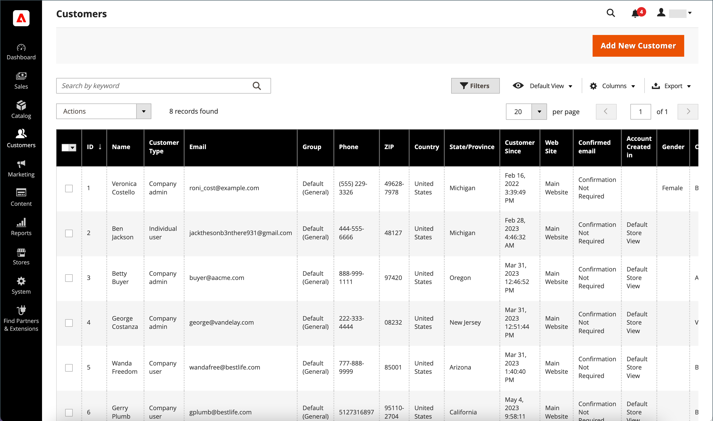

# 管理客戶帳戶

使用 _[!UICONTROL Customers]_格線以尋找任何客戶帳戶。 您可使用標準 [工作區控制項](../getting-started/admin-workspace.md) 若要篩選清單，請變更 [欄配置](../getting-started/admin-grid-controls.md)、儲存檢視和匯出資料。 此 [動作控制](../getting-started/admin-actions-control.md) 網格上方可用於將操作套用至多個客戶記錄。

{width="700" zoomable="yes"}

另請參閱 [更新客戶設定檔](update-account.md) 以取得有關手動更新客戶帳戶的資訊。

## 客戶帳戶動作

1. 在 _管理員_ 側欄，前往 **[!UICONTROL Customers]** > **[!UICONTROL All Customers]**.

1. 在網格的第一欄中，選取要更新的每個記錄的核取方塊。

1. 依照您要套用之動作的指示進行。

   >[!INFO]
   >
   >下列動作可套用至單一或多個記錄。

1. 完成後，按一下 **[!UICONTROL Save Config]**.

### 訂閱Newsletter

使用全域進行多商店和多網站設定 [客戶帳戶範圍](../customers/customer-account-scope.md)，客戶帳戶可以在多個網站或商店訂閱電子報。 如果您套用 _訂閱_ 對客戶帳戶執行的動作，它只會針對預設的網站/商店檢視啟用newsletter訂閱。

* 設定 **[!UICONTROL Actions]** 控制項至 `Subscribe to newsletter`.

另請參閱 [管理訂閱者](../merchandising-promotions/newsletter-subscribers.md) 以取得管理客戶電子報訂閱的詳細資訊。

### 取消訂閱Newsletter

使用全域進行多商店和多網站設定 [客戶帳戶範圍](customer-account-scope.md)，客戶帳戶可以訂閱多個網站/商店的商務通訊。 如果您套用 _取消訂閱_ 對客戶帳戶動作，所有作用中的訂閱都會取消訂閱。

1. 設定 **[!UICONTROL Actions]** 控制項至 `Unsubscribe to newsletter`.

1. 提示確認時，按一下 **確定**.

### 指派客戶群組

1. 設定 **[!UICONTROL Actions]** 控制項至 `Assign a customer group`.

1. 選擇要指定所有選取客戶記錄的客戶群組。

1. 提示確認時，按一下 **[!UICONTROL OK]**.

### 刪除客戶帳戶

已刪除的客戶帳戶無法還原。 有關客戶活動和交易的資訊會保留在系統中。

1. 設定 **[!UICONTROL Actions]** 控制項至 `Delete`.

1. 提示確認時，按一下 **[!UICONTROL OK]**.

## 匯出客戶帳戶

1. 在 _管理員_ 側欄，前往 **[!UICONTROL Customers]** > **[!UICONTROL All Customers]**.

1. 在「表格標題」功能表中，按一下 **[!UICONTROL Export]** 並選取所需的格式：

   * CSV
   * Excel XML

1. 按一下 **[!UICONTROL OK]**.

   檔案會移至您的預設下載資料夾。

上述指示會匯出所有客戶帳戶。 如果您要匯出一組受限制的帳戶，請選取要匯出的帳戶的核取方塊，或使用控制面板上的篩選器來選取客戶帳戶的範圍。

## 動作/控制項

| 選項 | 說明 |
|--- |--- |
| **[!UICONTROL Delete]** | 刪除選取的客戶帳戶。 如果客戶帳戶屬於B2B存放區的公司管理員，則必須先將其他公司使用者指派為管理員，才能刪除客戶帳戶。 |
| **[!UICONTROL Subscribe to Newsletter]** | 訂閱所選客戶的Newsletter。 |
| **[!UICONTROL Unsubscribe from Newsletter]** | 取消訂閱電子報中的選定客戶。 |
| **[!UICONTROL Assign a Customer Group]** | 將選取的客戶指派給客戶群組。 |
| **[!UICONTROL Edit]** | 允許從網格編輯單一選取客戶記錄的某些值。 預設情況下，下列值可供快速編輯：電子郵件、群組、電話、ZIP、網站、稅務VAT號碼和性別。 |

{style="table-layout:auto"}

## 欄

| 欄 | 說明 |
|--- |--- |
| **[!UICONTROL Select]** | 管理用於套用動作的客戶記錄的核取方塊選擇。 您也可以使用欄標題中的選取控制項來選取/取消選取全部。 |
| **[!UICONTROL ID]** | 建立客戶帳戶時指派的唯一數值識別碼。 |
| **[!UICONTROL Name]** | 客戶的名字和姓氏。 |
| **[!UICONTROL Email]** | 客戶的電子郵件地址。 |
| **[!UICONTROL Group]** | 客戶被指派到的客戶群組。 |
| **[!UICONTROL Phone]** | 客戶的電話號碼。 |
| **[!UICONTROL ZIP]** | 客戶的郵遞區號。 |
| **[!UICONTROL Country]** | 客戶所在的國家/地區。 |
| **[!UICONTROL State/Province]** | 客戶所在的州或省。 |
| **[!UICONTROL Customer Since]** | 建立客戶帳戶的日期和時間。 |
| **[!UICONTROL Web Site]** | 商店階層中與客戶帳戶相關聯的網站。 |
| **[!UICONTROL Confirmed Email]** | 表示是否需要確認電子郵件。 |
| **[!UICONTROL Account Created In]** | 表示建立客戶帳戶的來源商店檢視。 |
| **[!UICONTROL Date of Birth]** | 客戶的出生日期。 為了遵循目前的安全性和隱私權最佳實務，請注意任何與儲存客戶完整出生日期（月、日、年）和其他個人識別碼相關的潛在法律和安全風險。 建議您限制客戶完整出生日期的儲存量，並建議使用客戶出生年作為替代方法。 |
| **[!UICONTROL Tax / VAT Number]** | 如果適用，稅捐編號或 [加值稅](../stores-purchase/vat.md) 指派給客戶的編號。    此欄位與「VAT編號」不同。 |
| **[!UICONTROL Gender]** | 客戶的性別。 |
| **[!UICONTROL Action]** | 編輯 — 在編輯模式中開啟公司帳戶。 |

{style="table-layout:auto"}

### 其他欄

這些欄可透過變更 [欄配置](../getting-started/admin-grid-controls.md) 格線的。

| 欄 | 說明 |
|--- |--- |
| **[!UICONTROL Company]** | 客戶的公司名稱。 |
| **[!UICONTROL Street Address]** | 客戶的街道地址。 |
| **[!UICONTROL City]** | 客戶所在的城市。 |
| **[!UICONTROL Fax]** | 客戶的傳真號碼（如適用）。 |
| **[!UICONTROL Billing Firstname]** | 客戶帳單地址中的名字。 |
| **[!UICONTROL Billing Lastname]** | 客戶帳單地址中的姓氏。 |
| **[!UICONTROL Billing Address]** | 將傳送帳單資訊的地址。 |
| **[!UICONTROL Shipping Address]** | 訂單的送貨地址。 |
| **[!UICONTROL VAT Number]** | 與客戶地址相關聯的增值稅編號。 的 [數位商品](../stores-purchase/taxes.md) VAT在歐盟境內銷售，以客戶的帳單地址為基礎。    此欄位與「稅捐/VAT編號」不同。 |
| **[!UICONTROL Account Lock]** | 表示帳戶的狀態。 作為安全性測量，客戶帳戶可以 [已鎖定](../customers/password-options.md) 嘗試登入次數太多後。 值： `Locked` / `Unlocked` |
| **[!UICONTROL Status]** | 目前的使用者狀態。 選項： `Active` / `Inactive` |
| **[!UICONTROL Customer Type]** | 客戶分類。 選項： `Individual user` / `Company admin` / `Company user` |
| **[!UICONTROL Sales Representative]** | 被指派為公司帳戶聯絡人，並接收與公司相關的所有自動化電子郵件訊息的銷售代表。 |

{style="table-layout:auto"}
