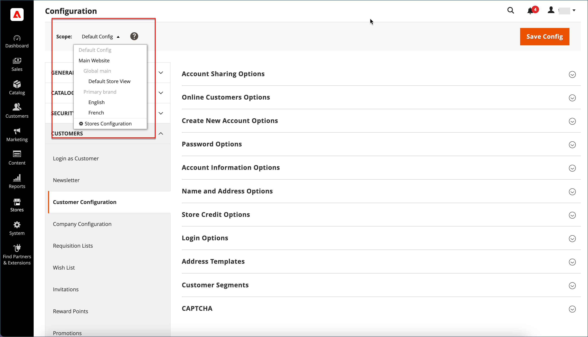

# 客戶名稱和地址選項

此 _名稱和地址選項_ 決定客戶建立時名稱和地址表單中包含的欄位 [帳戶](../customers/account-create.md) 與您的商店。

{width="500" zoomable="yes"}

Adobe Commerce和Magento Open Source的名稱和位址選項設定步驟不同。

## 設定Adobe Commerce的名稱和位址選項

您可以設定在店面向客戶建立帳戶時顯示的名稱和地址選項。

### 步驟1：設定設定的範圍

1. 在 _管理員_ 側欄，前往 **[!UICONTROL Stores]** > _[!UICONTROL Settings]_>**[!UICONTROL Configuration]**.

1. 在左側面板中，展開 **[!UICONTROL Customers]** 並選擇 **[!UICONTROL Customer Configuration]**.

1. 展開 **[!UICONTROL Name and Address Options]** 區段。

   >[!INFO]
   >
   >請注意，名稱和位址選項的範圍套用在 `website` 層級。

1. 向上捲動至頁面頂端，並將設定的範圍設定為下列其中一項：

   - `Default Config`
   - `Main Website` （或適用於多站台安裝的特定站台）

   >[!INFO]
   >
   >此 _[!UICONTROL Name and Address Options]_範圍設定為時，區段未出現 `Default Store View`.

   {width="700" zoomable="yes"}

### 步驟2：設定名稱和位址選項

1. 返回 [!UICONTROL _名稱和地址選項_] 「客戶設定」頁面的區段。

   >[!INFO]
   >
   > 如果您沒有使用 `Default config` 範圍設定，您必須清除 `Use Default` 核取方塊，再變更值。

   {width="600" zoomable="yes"}

1. 的 **[!UICONTROL Prefix Dropdown Options]**，請輸入您要在清單中顯示的每個首碼，以分號分隔。

   >[!IMPORTANT]
   >
   >在第一個值前放置分號，在清單頂端顯示空白值。

1. 的 **[!UICONTROL Suffix Dropdown Options]**，請輸入您要在清單中顯示的每個尾碼，以分號分隔。

1. 若要在客戶表單中包含下列欄位，請將每個欄位的值設為 `Optional` 或 `Required`，視需要。

   - **[!UICONTROL Show Telephone]**
   - **[!UICONTROL Show Company]**
   - **[!UICONTROL Show Fax]**

### 步驟3：儲存並重新整理

1. 完成後，按一下 **[!UICONTROL Save Config]**.

1. 在頁面頂端的訊息中，按一下 **[!UICONTROL Cache Management]** 和 [重新整理](../systems/cache-management.md) 每個無效快取。

## 設定Magento Open Source的名稱和位址選項

設定當客戶建立帳戶時，在店面向客戶顯示的名稱和地址選項。

{width="500" zoomable="yes"}

### 步驟1：設定設定的範圍

1. 在 _管理員_ 側欄，前往 **[!UICONTROL Stores]** > _[!UICONTROL Settings]_>**[!UICONTROL Configuration]**.

1. 在左側面板中，展開 **[!UICONTROL Customers]** 並選擇 **[!UICONTROL Customer Configuration]**.

1. 展開 **[!UICONTROL Name and Address Options]** 區段。

   >[!IMPORTANT]
   >
   > 請注意，名稱和位址選項的範圍套用在 `website` 層級。

   {width="600" zoomable="yes"}

1. 向上捲動至頁面頂端，並將設定的範圍設定為下列其中一項：

   - `Default Config`
   - `Main Website` （或適用於多站台安裝的特定站台）

   >[!NOTE]
   >
   >此 _名稱和地址選項_ 範圍設定為時，區段未出現 `Default Store View`.

   {width="600" zoomable="yes"}

### 步驟2：設定名稱和位址選項

1. 返回 [!UICONTROL _名稱和地址選項_] 「客戶設定」頁面的區段。

   >[!INFO]
   >
   >如果您沒有使用 `Default config` 範圍設定，您必須清除 `Use Default` 核取方塊，再變更值。

1. 的 **街道地址中的行數**，輸入從1到4的數字。

   >[!WARNING]
   >
   >依預設，街道地址是三行。

1. 若要在名稱中包含字首（例如Mr或Ms），請設定 **顯示前置詞** 至 `Yes`.

   {width="600" zoomable="yes"}

   >[!INFO]
   >
   >的 **首碼下拉式清單選項**，請輸入您要在清單中顯示的每個首碼，以分號分隔。 您可以在第一個值前面加上分號，在清單頂端顯示空白值。

1. 若要在客戶中間名或初始名稱中加入選用欄位，請設定 **[!UICONTROL Show Middle Name (initial)]** 至 `Yes`.

1. 包含尾碼(例如Jr. 或Sr.)，在客戶名稱后，設定 **[!UICONTROL Show Suffix]** 變更為下列其中一項：

   - `Optional`
   - `Required`

   >[!INFO]
   >
   >的 **尾碼下拉式清單選項**，請輸入您要在清單中顯示的每個尾碼，以分號分隔。 您可以在第一個值前面加上分號，在清單頂端顯示空白值。

1. 若要包含出生日期，請設定 **[!UICONTROL Show Date of Birth]** 變更為下列其中一項：

   - `Optional`
   - `Required`

   >[!INFO]
   >
   >為了遵循目前的安全性和隱私權最佳實務，請注意任何與儲存客戶完整出生日期（月、日、年）和其他個人識別碼相關的潛在法律和安全風險。 建議您限制客戶完整出生日期的儲存量，並建議使用客戶出生年作為替代方法。

   客戶可使用欄位後面的「行事曆」圖示，從快顯行事曆中選擇出生日期。

   {width="600" zoomable="yes"}

1. 若要允許客戶輸入稅捐或 [VAT](../stores-purchase/vat.md) 數字，設定 **[!UICONTROL Show Tax/VAT Number]** 變更為下列其中一項：

   - `Optional`
   - `Required`

1. 若要在客戶表單中包含性別欄位，請設定 **[!UICONTROL Show Gender]** 變更為下列其中一項：

   - `Optional`
   - `Required`

   {width="600" zoomable="yes"}

1. 若要在客戶表單中包含下列欄位，請將每個欄位的值設為 `Optional` 或 `Required`，視需要。

   - **[!UICONTROL Show Telephone]**
   - **[!UICONTROL Show Company]**
   - **[!UICONTROL Show Fax]**

### 步驟3：儲存並重新整理

1. 完成後，按一下 **[!UICONTROL Save Config]**.

1. 在頁面頂端的訊息中，按一下 **[!UICONTROL Cache Management]** 和 [重新整理](../systems/cache-management.md) 每個無效快取。
