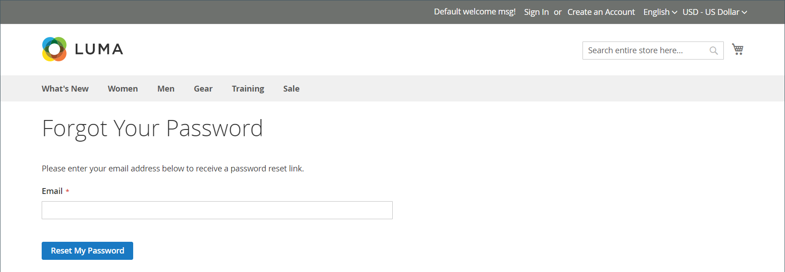

# 重設客戶密碼

客戶通常會按一下「 」，從店面重設密碼 _[!UICONTROL Forgot Your Password?]_. 不過，存放區管理員可以從管理員起始密碼重設或強制登入。

| 函式 | 說明 |
| --- | --- |
| 重設密碼 | 密碼重設電子郵件會直接傳送至客戶的電子郵件帳戶。 存放區管理員無法取得客戶密碼的存取權。 |
| 強制登入 | 撤銷與客戶帳戶相關聯的OAuth存取權杖。 這只能用於已指派OAuth權杖作為Web API一部分的客戶帳戶 [整合](../systems/integrations.md). 若要深入瞭解，請參閱 [OAuth型驗證](https://developer.adobe.com/commerce/webapi/get-started/authentication/gs-authentication-oauth/) 在開發人員檔案中。   從店面或管理員建立的標準客戶帳戶沒有OAuth權杖。 |

{style="table-layout:auto"}

## 從店面重設密碼

1. 在登入頁面上，客戶按一下 **[!UICONTROL Forgot Your Password?]**.

1. 出現提示時，輸入 **[!UICONTROL Email Address]** 與其帳戶和點按次數相關聯的資訊 **[!UICONTROL Reset My Password]**.

   {width="600" zoomable="yes"}

   >[!INFO]
   >
   >如果輸入的電子郵件地址與帳戶相關聯的地址相符，則客戶會收到「密碼重設確認」電子郵件，其中包含重設密碼的連結。

1. 當電子郵件到達時，客戶按一下 _重設密碼_ 連結並輸入其 **[!UICONTROL New Password]** 出現提示時。

1. 再次輸入以進行確認並按一下 **[!UICONTROL Reset Password]**.

   >[!IMPORTANT]
   >
   >新密碼的長度必須是6個或6個以上的字元，不含空格。 當他們收到密碼已更新的確認時，他們可以使用新密碼登入他們的帳戶。 根據預設， _重設密碼_ 連結的有效期限為24小時。

## 從管理員重設密碼

1. 在 _管理員_ 側欄，前往 **[!UICONTROL Customers]** > **[!UICONTROL All Customers]**.

1. 在格線中尋找客戶帳戶，然後按一下 **[!UICONTROL Edit]** 在 _動作_ 欄。

1. 在頁面頂端的選項集中，按一下 **[!UICONTROL Reset Password]**.

   一小時內允許的密碼重設要求數設定於 [設定](../configuration-reference/customers/customer-configuration.md) 主題。

## 撤銷客戶的OAuth權杖

>[!IMPORTANT]
>
>除非您完全瞭解API驗證，否則請勿繼續。

1. 在 _管理員_ 側欄，前往 **[!UICONTROL Customers]** > **[!UICONTROL All Customers]**.

1. 在格線中尋找客戶帳戶，然後按一下 **[!UICONTROL Edit]** 在 _動作_ 欄。

1. 在頁面頂端的選項集中，按一下 **[!UICONTROL Force Sign In]**.

1. 提示確認時，按一下 **確定**.
