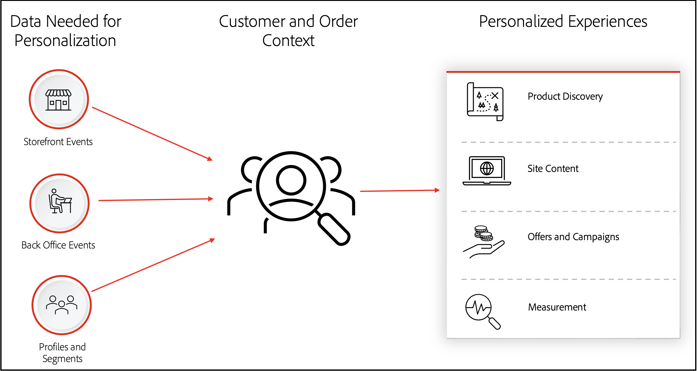

# 大規模個人化

大規模個人&#x200B;化可讓企業根據即時上下文和先前觀察到的行為，為每個客戶接觸點個人化購物體驗。 目標是每次都呈現最相關且個人化的體驗。

若要瞭解提供個人化購物體驗的優勢，請下載 [_大規模個人化快速入門_](https://business.adobe.com/resources/reports/getting-started-with-personalization-at-scale.html) 報告。

建立個人化的購物體驗需要您瞭解瞭解瞭解瞭解客戶內容所需的資料型別。 從那裡，您可以瞭解Adobe Commerce功能，這些功能會使用該資料來解鎖建立個人化購物體驗所需的客戶深入分析。

下圖說明個人化購物體驗的相關概念：

{width="700" zoomable="yes"}

本文會更詳細地討論上述每個概念。

## 如何個人化購物體驗

成功的個人化始於客戶內容。 在本節中，您將瞭解可用來協助您建置客戶內容的資料型別。

### 店面資料

店面資料（也稱為行為或瀏覽器資料）可揭示購物者如何與您的網站互動的深入分析。 例如：

- 我的購物者最感興趣的產品和類別為何？
- 我的購物者最常使用哪些搜尋查詢器？
- 我的購物者是否在購物車中加入產品並捨棄它？
- 我的購物者使用桌上型電腦或行動瀏覽器嗎？

下列店面事件會擷取可協助您回答這些問題的資料：

- [pageView](https://experienceleague.adobe.com/en/docs/commerce-merchant-services/data-connection/event-forwarding/events)
- [searchRequestSent](https://experienceleague.adobe.com/en/docs/commerce-merchant-services/data-connection/event-forwarding/events)
- [searchResponseReceived](https://experienceleague.adobe.com/en/docs/commerce-merchant-services/data-connection/event-forwarding/events)
- [productPageView](https://experienceleague.adobe.com/en/docs/commerce-merchant-services/data-connection/event-forwarding/events)
- [addToCart](https://experienceleague.adobe.com/en/docs/commerce-merchant-services/data-connection/event-forwarding/events)
- [openCart](https://experienceleague.adobe.com/en/docs/commerce-merchant-services/data-connection/event-forwarding/events)
- [登入](https://experienceleague.adobe.com/en/docs/commerce-merchant-services/data-connection/event-forwarding/events)
- [登出](https://experienceleague.adobe.com/en/docs/commerce-merchant-services/data-connection/event-forwarding/events)
- [startCheckout](https://experienceleague.adobe.com/en/docs/commerce-merchant-services/data-connection/event-forwarding/events)
- [completeCheckout](https://experienceleague.adobe.com/en/docs/commerce-merchant-services/data-connection/event-forwarding/events)
- [createRequisitionList](https://experienceleague.adobe.com/en/docs/commerce-merchant-services/data-connection/event-forwarding/events)
- [addToRequisitionList](https://experienceleague.adobe.com/en/docs/commerce-merchant-services/data-connection/event-forwarding/events)
- [removeFromRequisitionList](https://experienceleague.adobe.com/en/docs/commerce-merchant-services/data-connection/event-forwarding/events)

### 後台資料

後台資料（也稱為伺服器端資料）可揭示訂單生命週期的深入分析。 例如：

- 是否有可根據季節更頻繁購買的產品？
- 我的購物者會退貨嗎？
- 如何計算期限客戶值？

下列後台事件會擷取可協助您回答這些問題的資料：

- [orderPlaced](https://experienceleague.adobe.com/en/docs/commerce-merchant-services/data-connection/event-forwarding/events-backoffice)
- [orderItemsReturnedInitiated](https://experienceleague.adobe.com/en/docs/commerce-merchant-services/data-connection/event-forwarding/events-backoffice)
- [orderItemsShipped](https://experienceleague.adobe.com/en/docs/commerce-merchant-services/data-connection/event-forwarding/events-backoffice)
- [orderCanceled](https://experienceleague.adobe.com/en/docs/commerce-merchant-services/data-connection/event-forwarding/events-backoffice)

### 客戶設定檔和區段資料

客戶設定檔資料可揭示您購物者的身分，以及他們符合哪些區段的資格。 例如：

- 名稱
- 性別
- 地址
- 熟客狀態
- 電話號碼
- 電子郵件地址
- 熟客狀態
- 電話號碼
- 電子郵件地址
- 符合升級資格
- 跨頻道購物者
- 新產品的潛在客戶
- 金級、銀級或銅級忠誠會員

下列設定檔事件會擷取可協助您回答這些問題的資料：

- [設定檔記錄](https://experienceleague.adobe.com/en/docs/commerce-merchant-services/data-connection/event-forwarding/events-profilerecord)
- [accountCreated](https://experienceleague.adobe.com/en/docs/commerce-merchant-services/data-connection/event-forwarding/events-backoffice)
- [帳戶已更新](https://experienceleague.adobe.com/en/docs/commerce-merchant-services/data-connection/event-forwarding/events-backoffice)
- [accountDeleted](https://experienceleague.adobe.com/en/docs/commerce-merchant-services/data-connection/event-forwarding/events-backoffice)

店面、後台和設定檔資料構成了Commerce客戶和訂單內容的基礎，可幫助您瞭解客戶正在檢視哪些產品以及最終購買哪些產品。 接著，您就可以鎖定他們的興趣，並個人化他們的體驗。 在下一節中，您將瞭解可與購物者互動的個人化體驗型別。

## 個人化體驗的型別

Commerce中的客戶和訂單內容資料可促進下列型別的個人化體驗：

| 體驗 | 說明 |
|---|---|
| **產品探索** | 包含商品銷售服務 [部署為SaaS](https://experienceleague.adobe.com/en/docs/commerce-merchant-services/user-guides/integration-services/saas). 這些功能可讓您使用行為資料、產品屬性和詳細目錄層級，在搜尋結果、產品建議和瀏覽頁面間自動個人化產品探索。 這些功能都使用 [ADOBE SENSEI AI](https://business.adobe.com/products/sensei/adobe-sensei.html). |
| **網站內容** | 指根據目前客戶瀏覽您的網站來部署個人化動態內容區塊的能力。 |
| **優惠方案和行銷活動** | 可讓您根據區段資料部署個人化促銷內容。 |
| **測量** | 使用資料智慧更瞭解您的業務，包括收入、管道和商品績效、促銷活動等。 |

在接下來的兩個小節中，您將瞭解如何使用此資料在中建立個人化體驗 [Adobe Experience Platform](#using-commerce-data-in-adobe-experience-platform) 和 [原生Commerce功能](#using-commerce-data-in-native-commerce-features).

## 在Adobe Experience Platform中使用Commerce資料

若要跨所有管道為購物者建立個人化體驗，請使用將您的Commerce資料傳送至Experience PlatformEdge Network [[!DNL Data Connection]](https://experienceleague.adobe.com/en/docs/commerce-merchant-services/data-connection/overview) 副檔名。

{width="700" zoomable="yes"}

在上圖中，您的店面、後端辦公室和客戶設定檔資料會使用SDK、API和來源聯結器傳送至Experience Platform邊緣。 您不需要完全瞭解這些元件的運作方式，因為擴充功能可處理資料共用的複雜性。 當事件資料位於邊緣時，您可以將該資料提取到其他Experience Platform應用程式中。

下表重點說明部分可用的Experience Platform應用程式，以及這些應用程式如何使用您的Commerce資料。

| 體驗 | 應用 | 如何使用Commerce資料 |
|---|---|---|
| **網站內容** | [Adobe [!DNL Real-Time CDP]](https://experienceleague.adobe.com/en/docs/experience-platform/rtcdp/intro/rtcdp-intro/overview) | Adobe Commerce資料可強化統一的客戶個人檔案，而Real-Time CDP可將跨來源(ERP、CRM、CMS、POS)的資料拼接成單一個人檔案。 Real-Time CDP也可以建立規則型和AI型區段，然後用於您的行銷解決方案集。 您也可以使用Real-Time CDP受眾來個人化內容區塊、促銷活動和相關產品規則。 另請參閱 [[!DNL Audience Activation]](../customers/audience-activation.md) 以進一步瞭解。&#x200B; |
|  | [Adobe [!DNL Target]](https://experienceleague.adobe.com/en/docs/target/using/introduction/intro) | Adobe Commerce資料可在Adobe中啟動 [!DNL Target] 以進行測試、最佳化和建立動態登入頁面。 您可以根據傳送的Commerce資料，個人化內容在頁面上的顯示順序，例如說明、規格、審查和建議產品。 |
| **優惠方案和行銷活動** | [Adobe [!DNL Journey Optimizer]](https://experienceleague.adobe.com/en/docs/journey-optimizer/using/get-started/get-started) | Adobe Commerce行為和後台資料可做為個人化全頻道歷程的觸發因子，包括電子郵件行銷活動、簡訊、推播通知等&#x200B;。 |
| **測量** | [Adobe [!DNL Analytics]](https://experienceleague.adobe.com/en/docs/analytics/analyze/admin-overview/analytics-overview) 和 [客戶 [!DNL Journey Analytics]](https://experienceleague.adobe.com/en/docs/analytics-platform/using/cja-overview/cja-overview) | Commerce會將店面和後台資料傳送給客戶 [!DNL Journey Analytics] (且只要Adobe店面資料) [!DNL Analytics])，以允許更豐富的分析，而不僅限於Adobe Commerce Intelligence中的基本量度，例如收入、商品和促銷&#x200B;。 |

若要深入瞭解如何將Commerce資料傳送至Experience Platform，請參閱 [資料連線](https://experienceleague.adobe.com/en/docs/commerce-merchant-services/data-connection/overview).

## 在原生Commerce功能中使用Commerce資料

在下節中，您將瞭解如何使用原生Commerce功能(例如「產品Recommendations」和「即時搜尋」)來建立個人化的購物體驗。 您也會瞭解名為的功能 [!DNL Audience Activation]，會使用名為Real-Time CDP的Experience Platform中可用產品中的資料，如所述 [先前](#using-commerce-data-in-adobe-experience-platform). 雖然Real-Time CDP並非CommerceCommerce的原生專案，但您可透過 [[!DNL Audience Activation]](../customers/audience-activation.md) 副檔名。

下表強調Commerce可用功能，可將Commerce客戶和訂單內容資料轉換為可操作的深入分析。

| 體驗 | 功能 | 說明 |
|---|---|---|
| **產品探索** | [即時搜尋](https://experienceleague.adobe.com/en/docs/commerce-merchant-services/live-search/guide-overview) | 使用AI排名演演算法，根據購物者的網站行為動作來個人化和最佳化搜尋結果，提高搜尋相關性和轉換。 |
|  | [產品Recommendations](https://experienceleague.adobe.com/en/docs/commerce-merchant-services/product-recommendations/guide-overview) | 根據購物者的行為、趨勢、產品相似性等來顯示AI支援的產品推薦。 與您的Adobe Commerce目錄結合時，產品推薦可提供高度吸引人、相關且個人化的體驗。 |
|  | [類別銷售](https://experienceleague.adobe.com/en/docs/commerce-merchant-services/live-search/live-search-admin/category-merch) | 從「即時搜尋管理員」存取，類別銷售會使用AI自動重新排名每個類別頁面上的產品順序，以提高每個購物者的相關性和轉換。 您可以建立和管理AI支援的規則，以根據購物者的動作和相似性自動在類別頁面上重新排名產品排序。 |
| **網站內容** | [原生Commerce功能通知動態區塊](https://experienceleague.adobe.com/en/docs/commerce-admin/content-design/elements/dynamic-blocks/dynamic-blocks) | 可讓您根據價格規則和客戶區段中設定的邏輯，提供個人化網站內容。 |
|  | [Real-Time CDP受眾通知的動態區塊](../customers/audience-activation.md) | 可讓商家根據Real-Time CDP中設定的受眾提供個人化網站內容。 |
| **優惠方案和行銷活動** | [購物車價格規則](https://experienceleague.adobe.com/en/docs/commerce-admin/marketing/promotions/cart-rules/price-rules-cart) | 可讓您根據一組條件將折扣套用至購物車中的專案。 |
|  | [原生Commerce功能通知動態區塊](https://experienceleague.adobe.com/en/docs/commerce-admin/content-design/elements/dynamic-blocks/dynamic-blocks) | 可讓您根據在Commerce中原生設定的客戶區段，顯示個人化橫幅促銷活動。 |
|  | [Real-Time CDP受眾通知的動態區塊](../customers/audience-activation.md) | 可讓您根據Real-Time CDP中設定的對象顯示個人化促銷活動。 |
| **測量** | [Adobe Commerce Intelligence](https://experienceleague.adobe.com/en/docs/commerce-business-intelligence/mbi/getting-started) | (先前稱為Magento Business Intelligence)是雲端平台，提供最佳實務深入分析，協助您制定資料導向式決策，以及採取明確且明智的動作。 Adobe Commerce Intelligence可分析您的資料，協助您回答有關訂單增長、客戶行為和促銷策略有效性的問題。 |
