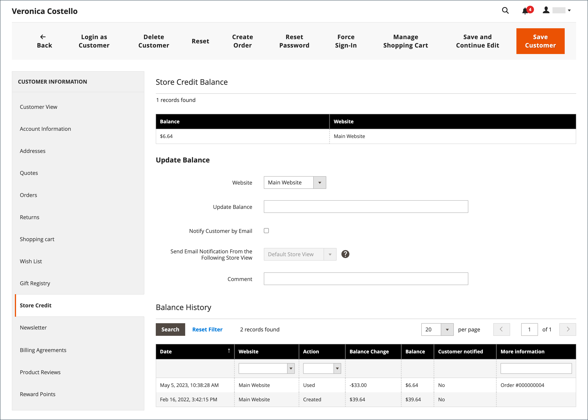
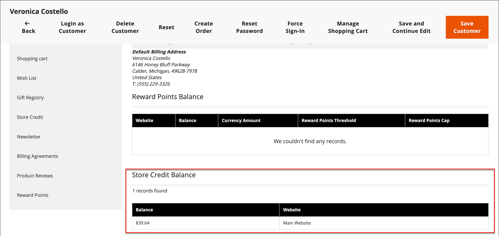

# 套用商店點數

{{ee-feature}}

商店管理員可以檢視客戶帳戶的信用餘額和歷史記錄，也可以將商店信用套用至購買。

{width="600" zoomable="yes"}

## 檢視貸方餘額

1. 在 _管理員_ 側欄，前往 **[!UICONTROL Customers]** > **[!UICONTROL All Customers]**.

1. 在格線中尋找客戶。

1. 在 _動作_ 欄，按一下 **[!UICONTROL Edit]**.

1. 捲動 _[!UICONTROL Customer View]_頁面並檢視&#x200B;**[!UICONTROL Store Credit Balance]**在底部。

{width="600" zoomable="yes"}

## 更新商店貸方餘額

1. 在 _管理員_ 側欄，前往 **[!UICONTROL Customers]** > _作業_ > **[!UICONTROL All Customers]**.

1. 在格線中尋找客戶。

1. 在 _動作_ 欄，按一下 **[!UICONTROL Edit]**.

1. 在左側面板中，選擇 **[!UICONTROL Store Credit]**.

1. 選擇要與餘額關聯的網站（店面）。

1. 的 **[!UICONTROL Update Balance]**，輸入新值。

1. 若要通知客戶餘額更新，請選取 **[!UICONTROL Notify Customer by Email]** 核取方塊，然後選擇商店檢視 **[!UICONTROL Send Email Notification From the Following Store View]**.

1. 輸入 **[!UICONTROL Comment]** 關於變更。

1. 更新完成後，按一下 **[!UICONTROL Save and Continue Edit]** 或 **[!UICONTROL Save Customer]**.

更新的餘額應顯示於 **[!UICONTROL Balance History]**.

## 以商店管理員的身分，將信用餘額沖銷至訂單

身為商店管理員，您可以代表客戶執行各種作業，包括提交訂單。 當您 [建立訂單](../stores-purchase/customer-account-create-order.md)，您可以套用應付客戶款項的商店貸方餘額。 可用餘額會顯示在 _付款與送貨資訊_ 區段。 選取 **[!UICONTROL Use Store Credit]** 核取方塊以套用餘額，或如果訂單總計較小時，則套用餘額的一部分。

{width="500" zoomable="yes"}

## 結帳時套用商店評價

如果地點有貸方餘額，客戶可以在將訂單放在店面之前，將商店貸方沖銷至訂單餘額。

1. 客戶檢視可用的商店信用金額。

   期間 _稽核與付款_ 步驟，可用的數量會顯示在下方 _[!UICONTROL Store Credit]_.

1. 若要將金額套用至訂單，請按一下 **[!UICONTROL Use Store Credit]**.

   >[!INFO]
   >
   >系統會重新計算訂單總計，且套用的商店貸方金額會顯示在 _[!UICONTROL Order Summary]_.

   {width="700" zoomable="yes"}

1. 準備就緒後，按一下 **[!UICONTROL Place Order]**.
