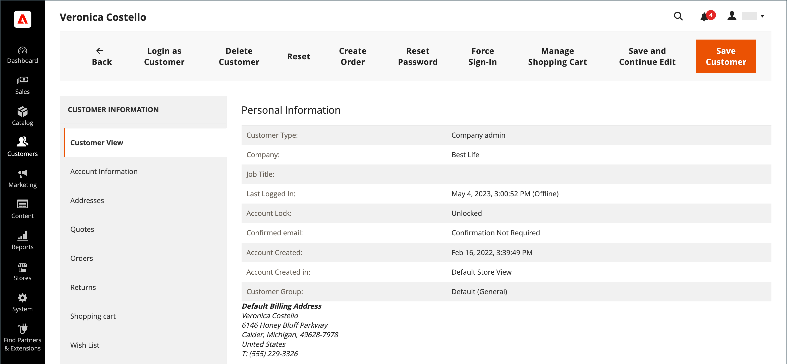

# 更新客戶設定檔

的左側面板 _[!UICONTROL Customer Information]_頁面包含客戶活動、地址、訂單統計資料、最近訂單、購物車內容、產品評論和電子報訂閱的相關資訊。

{width="700" zoomable="yes"}

## 編輯客戶帳戶

方法1： **_快速編輯_**

1. 在第一欄中，選取要編輯之客戶帳戶的核取方塊。

1. 設定 **[!UICONTROL Actions]** 欄至 `Edit`.

   >[!INFO]
   >
   >每個可以更新的值都會顯示在文字方塊中。 從網格中只能編輯所選客戶記錄的某些值。

   {width="700" zoomable="yes"}

1. 視需要更新下列任一值：

   * **[!UICONTROL Email]**
   * **[!UICONTROL Web Site]**
   * **[!UICONTROL Tax/VAT Number]**
   * **[!UICONTROL Gender]**

1. 按一下 **[!UICONTROL Save]**.

方法2： **_完整編輯_**

1. 在網格中，尋找要編輯的客戶記錄。

1. 在 _動作_ 欄，按一下 **[!UICONTROL Edit]**.

1. 對公司資訊進行必要的變更。

   >[!INFO]
   >
   >若要深入瞭解，請參閱 [更新客戶設定檔](../customers/update-account.md).

1. 完成後，按一下 **[!UICONTROL Save Customer]**.

>[!INFO]
>
>如果您要在儲存前復原所有編輯，請按一下 **[!UICONTROL Reset]** ，以傳回對上次儲存版本所做的所有變更。

## 客戶資訊

### [!UICONTROL Customer View]

此 _客戶檢視_ 索引標籤會列出有關客戶的資訊，包括 **[!UICONTROL Personal Information]**， **[!UICONTROL Reward Points Balance]**、和 **[!UICONTROL Store Credit Balance]**.

### [!UICONTROL Account Information]

此 [帳戶資訊](../customers/account-dashboard-account-information.md) 標籤提供有關客戶的詳細資訊，管理員使用者可以在其中編輯個人資訊、電子郵件、遠端購物協助、出生日期，以及將客戶附加至網站或公司。

### [!UICONTROL Addresses]

此 [地址](../customers/account-dashboard-address-book.md) 索引標籤包含客戶的預設帳單和送貨地址，以及他們經常使用的任何其他地址。

### [!UICONTROL Orders]

此 [訂購](../stores-purchase/orders.md) 網格包含所有目前客戶訂單的清單，管理員可追蹤其進度。

### [!UICONTROL Returns]

{{ee-feature}}

此 [傳回](../stores-purchase/returns.md) 索引標籤會列出目前傳回的客戶請求。

### [!UICONTROL Shopping cart]

此 [購物車](../stores-purchase/cart.md) 索引標籤會顯示購物車中目前的產品，但由於某種原因，購買尚未完成。

### [!UICONTROL Wish List]

A [希望清單](../stores-purchase/wishlists.md) 顯示客戶稍後可傳送至購物車的產品清單。

### [!UICONTROL Gift Registry]

{{ee-feature}}

此 [贈品登入](../merchandising-promotions/gift-registry-storefront.md) 區段列出客戶目前的禮品註冊及相關事件。

### [!UICONTROL Store Credit]

{{ee-feature}}

此 [商店點數](../customers/store-credit.md) 索引標籤會顯示還原至客戶帳戶的金額，管理員可以管理此值。

### [!UICONTROL Newsletter]

此 [電子報](../merchandising-promotions/newsletters.md) 標籤會顯示傳送給目前客戶的所有電子郵件。

### [!UICONTROL Billing Agreements]

此 [帳單協定](../stores-purchase/paypal-billing-agreements.md) 索引標籤會列出商店和客戶之間的所有PayPal帳單協定。

### [!UICONTROL Product Reviews]

此 [產品評論](../catalog/settings-advanced-product-reviews.md) 頁簽會顯示此客戶提交的所有稽核。

### [!UICONTROL Reward Points]

{{ee-feature}}

此 [獎勵點數](../merchandising-promotions/rewards-loyalty.md) 區段會顯示客戶目前的獎勵點數餘額。 管理員使用者可以管理此值。

## 按鈕列

| 按鈕 | 說明 |
|----------|--------------|
| **[!UICONTROL Back]** | 返回「客戶」頁面而不儲存變更。 |
| **[!UICONTROL Login as Customer]** | 允許商家以客戶身分登入。 |
| **[!UICONTROL Delete Customer]** | 刪除客戶帳戶。 |
| **[!UICONTROL Reset]** | 將客戶表單中未儲存的變更重設為先前的值。 |
| **[!UICONTROL Create Order]** | [建立訂單](../stores-purchase/customer-account-create-order.md) 與客戶帳戶相關聯的專案。 |
| **[!UICONTROL Reset Password]** | 重設客戶的密碼。 |
| **[!UICONTROL Force Sign-In]** | 清除與客戶密碼關聯的權杖，並提供帳戶的管理員存取權。 |
| **[!UICONTROL Manage Shopping Cart]** | 提供對客戶購物車的存取。 |
| **[!UICONTROL Save and Continue Edit]** | 儲存變更並維持客戶帳戶開啟。 |
| **[!UICONTROL Save Customer]** | 儲存變更並關閉客戶帳戶。 |

{style="table-layout:auto"}
