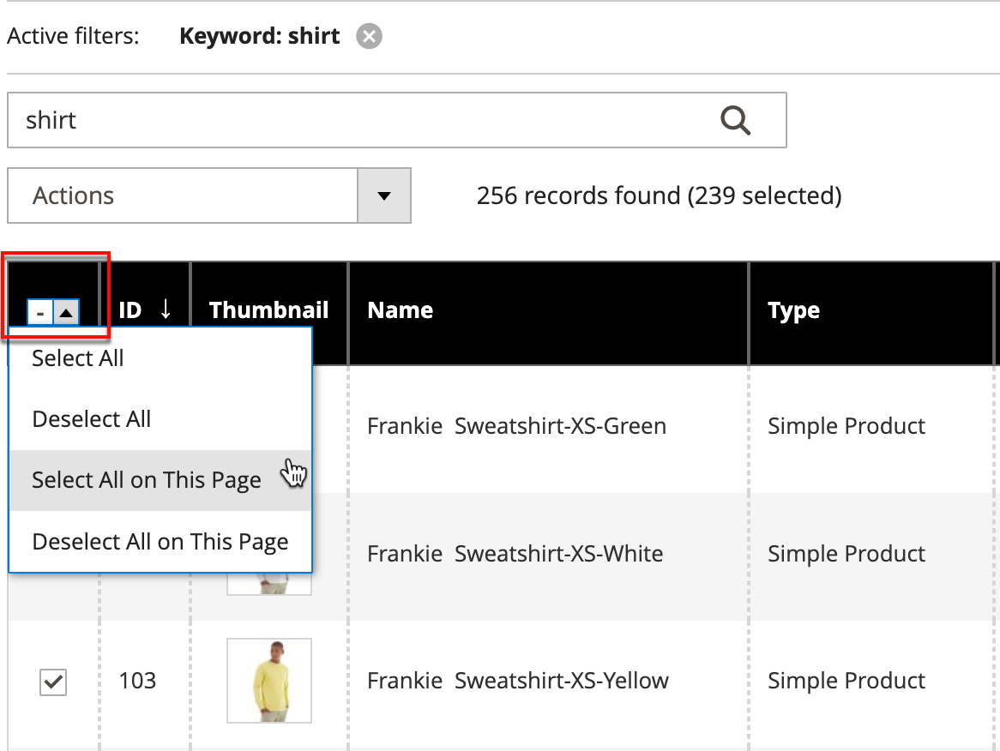
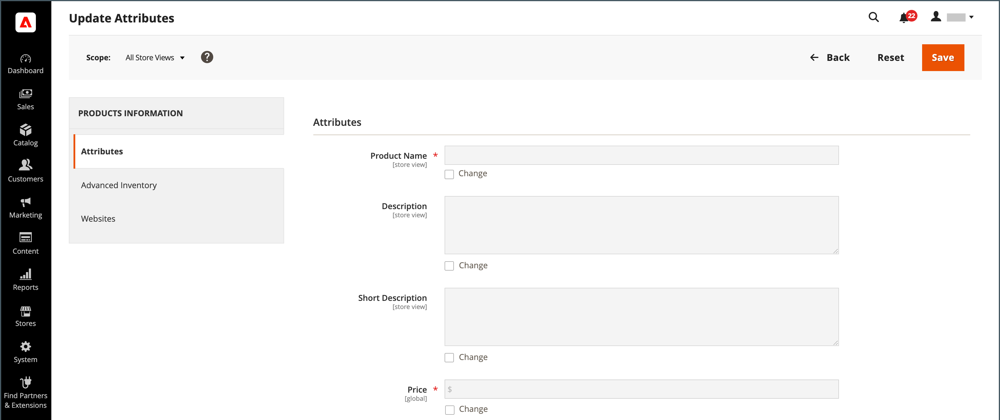

# 動作控制

使用網格中的記錄集合時，您可以使用「動作」控制項將作業套用至一或多個記錄。 Actions控制項會列出特定資料型別可用的每項作業。 例如，您可以使用Actions控制項來更新所選產品的屬性，以變更狀態 `Disabled` 至 `Enabled`，或從資料庫刪除記錄。

您可以視需要進行多次變更，然後在單一步驟中更新記錄。 這比個別變更每個產品的設定更有效率。 將編輯套用至記錄批次是一項非同步操作，會在背景執行，因此您可以繼續在Admin中工作，而不需要等候操作完成。 當工作完成時，系統會顯示訊息。

可用動作的選擇因清單而異，並且可能會顯示其他選項，具體取決於所選的動作。 例如，變更記錄群組的狀態時， _[!UICONTROL Status]_方塊會顯示在「動作」控制項旁邊，並附上其他選項。

## 步驟1：選取記錄

清單第一欄中的核取方塊會識別作為動作目標的每個記錄。 此 [篩選控制項](admin-grid-controls.md) 可用來將清單縮小至您要針對動作鎖定的記錄。

1. 如有需要，請在每欄頂端設定篩選器，以僅顯示您要包含的記錄。

1. 選取作為動作目標的每個記錄的核取方塊，或使用欄選擇器來選擇大量選取專案。

{width="500"}

## 步驟2：將動作套用至選取的記錄

1. 設定 **[!UICONTROL Actions]** 控制您要套用的作業。

   **_範例：_** 更新屬性

   - 在清單中，選取要更新之每筆記錄的核取方塊。

   - 設定 **[!UICONTROL Actions]** 控制項至 `Update Attributes`.

     {width="450"}

   - 按一下 **[!UICONTROL Submit]**.

     「更新屬性」頁面會依左側面板中的群組來列出所有可用的屬性。

     {width="700" zoomable="yes"}

   - 選取 **[!UICONTROL Change]** 勾選每個屬性旁的核取方塊，並進行必要的變更。

   - 按一下 **[!UICONTROL Save]** 更新所選記錄群組的屬性。

1. 完成後，按一下 **[!UICONTROL Submit]**.

## 核取方塊動作

| 動作 | 說明 |
|--- |--- |
| [!UICONTROL Select All] | 選取清單中所有記錄的核取方塊。 |
| [!UICONTROL Unselect All] | 清除清單中所有記錄的核取方塊。 |
| [!UICONTROL Select All on This Page] | 選取目前頁面上顯示的記錄核取方塊。 |
| [!UICONTROL Deselect All on This Page] | 清除目前頁面上顯示的記錄核取方塊。 |

{style="table-layout:auto"}
