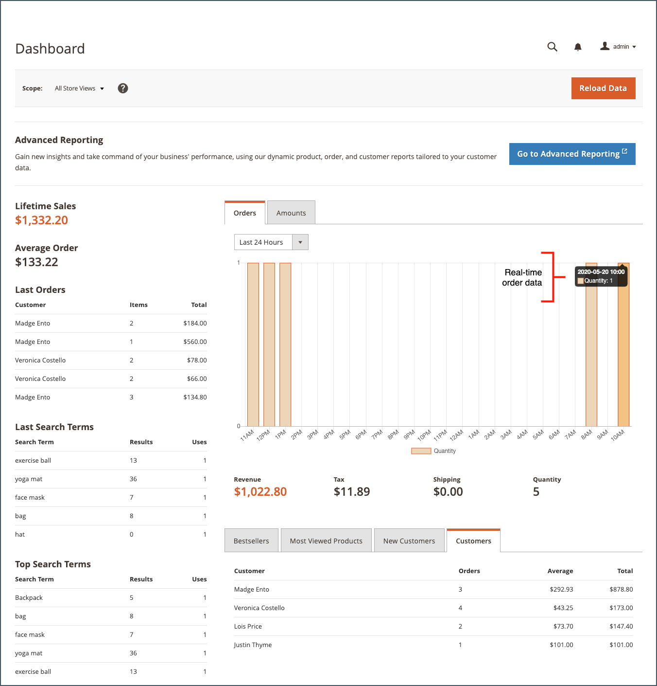
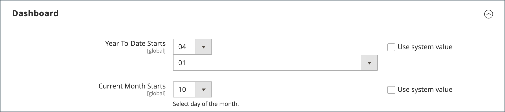

# 管理員儀表板

儀表板通常是您登入&#x200B;_管理員_&#x200B;時出現的第一個頁面，可以提供銷售和客戶活動的即時概觀。 儀表板資料提供期限銷售量、平均訂單金額、最近訂單和搜尋字詞的快照。 此圖表顯示所選日期範圍內的已完成訂單和金額，並可從動態、即時資料或歷史彙總資料產生。 底部的標籤可讓您快速報告最暢銷的產品、檢視次數最多的產品、新客戶和購買次數最多的客戶。

如果您要處理大量資料，可關閉圖表以提高效能。 下列範例中的儀表板設定為使用即時資料，並顯示過去24小時內依小時排列的已完成訂單。 圖表會針對每個完成的訂單進行更新。

{zoomable="yes"}

[進階報告](business-intelligence.md#advanced-reporting)會根據您的產品、訂單和客戶資料顯示個人化儀表板。

{zoomable="yes"}

## 設定儀表板

1. 在&#x200B;_管理員_&#x200B;側邊欄上，前往&#x200B;**[!UICONTROL Stores]** > _[!UICONTROL Settings]_>**[!UICONTROL Configuration]**&#x200B;並完成下列任何設定。

1. 組態完成時，按一下&#x200B;**[!UICONTROL Save Config]**。

1. 儲存變更後，按一下&#x200B;**[!UICONTROL Cache Management]**&#x200B;並重新整理每個無效的快取。

### 啟用圖表

如果您要處理大量資料，可以關閉圖表顯示以提高效能。 未啟用時，訊息「找不到資料」會出現在圖表的位置，儘管系統仍會產生下列摘要總計。

1. 在左側導覽面板的&#x200B;**[!UICONTROL Advanced]**&#x200B;下，選擇&#x200B;**[!UICONTROL Admin]**。

1. 如有必要，請展開&#x200B;**[!UICONTROL Dashboard]**&#x200B;區段。

   {width="600"}

1. 若要變更預設值，請清除&#x200B;**[!UICONTROL Use system value]**&#x200B;核取方塊。

1. 將&#x200B;**啟用圖表**&#x200B;設定為`Yes`。

如需有關管理員組態選項的詳細資訊，請參閱[組態參考指南](../configuration-reference/advanced/admin.md)。

### 變更啟動頁面

儀表板是Admin的預設[啟動頁面](../configuration-reference/advanced/admin.md)，不過您可以設定不同的啟動頁面。

1. 如果您尚未開啟管理員組態選項，請在左側導覽面板中選擇「_[!UICONTROL Advanced]_」下的「**[!UICONTROL Admin]**」。

1. 按一下以展開&#x200B;**啟動頁面**&#x200B;區段。

   {width="600"}

1. 清除「**[!UICONTROL Use system value]**」核取方塊，並選擇您登入Admin時想要顯示的&#x200B;**啟動頁面**。

### 選擇開始日期

1. 在左側導覽面板中的&#x200B;**[!UICONTROL General]**&#x200B;下方，選擇&#x200B;**報表**。

1. 在頁面上，展開&#x200B;**[!UICONTROL Dashboard]**&#x200B;區段。

1. 清除日期設定的&#x200B;**[!UICONTROL Use system value]**&#x200B;核取方塊，並執行下列動作：

   - 將&#x200B;**年初至今的開始時間**&#x200B;設定為&#x200B;**月**&#x200B;和&#x200B;**日**。

   - 將&#x200B;**目前月份開始**&#x200B;設定為&#x200B;**天**。

   {width="600"}

如需[!UICONTROL Reports]組態選項的詳細資訊，請參閱&#x200B;[_組態參考指南_](../configuration-reference/general/reports.md)。

### 設定資料來源

儀表板圖表可以即時產生，也可以使用歷史彙總資料來產生。 如果效能有問題，您可以使用彙總資料來加速進度。

1. 在左側導覽面板中，按一下以展開&#x200B;**Sales**，然後選擇下方的&#x200B;**Sales**。

1. 在頁面上，展開&#x200B;**[!UICONTROL Dashboard]**&#x200B;區段。

   {width="600"}

1. 清除&#x200B;**[!UICONTROL Use system value]**&#x200B;核取方塊並將&#x200B;**[!UICONTROL Use Aggregated Data]**&#x200B;設定為下列其中一項：

   - 若為歷史彙總資料，請選擇`Yes`。
   - 如需即時資料，請選擇`No`。

## 圖表區段

| 章節 | 說明 |
|--- |--- |
| [!UICONTROL Orders] | 此索引標籤會顯示目前商店檢視及指定時段內所有已完成訂單的即時圖表。 |
| [!UICONTROL Amounts] | 此索引標籤會顯示目前商店檢視與指定時段內所有已完成訂單金額的即時圖表。 |
| [!UICONTROL Time Range] | 決定圖表所呈現的資料及下列摘要總計。 選項： `Last 7 Days` / `Current Month` / `YTD` / `2YTD` |
| [!UICONTROL Summary Totals] | 圖表下方的收入、稅捐、運費和數量總計是以圖表資料和目前時間範圍設定為基礎。 |

{style="table-layout:auto"}

## 快照集資料

| 章節 | 說明 |
|--- |--- |
| [!UICONTROL Lifetime Sales] | 商店存留期內的彙總總銷售額。 |
| [!UICONTROL Average Order] | 存放區存留期內的平均訂購量。 |
| [!UICONTROL Last Orders] | 最近五筆訂購的摘要。 |
| [!UICONTROL Last Search Terms] | 最後五個搜尋字詞。 |
| [!UICONTROL Top Search Terms] | 最常使用的五個搜尋字詞。 |

{style="table-layout:auto"}

## 報告標籤

| 章節 | 說明 |
|--- |--- |
| [!UICONTROL Bestsellers] | 指定時段內最暢銷的五款產品。 |
| [!UICONTROL Most Viewed Products] | 這五個產品在指定的時段內檢視次數最多。 |
| [!UICONTROL New Customers] | 在指定時段內註冊帳戶的最近五名客戶。 |
| [!UICONTROL Customers] | 訂單在指定時段內完成處理的最近五個客戶。 |

{style="table-layout:auto"}

## 儀表板按鈕

| 按鈕 | 說明 |
|--- |--- |
| [!UICONTROL Reload Data] | 重新整理儀表板資料。 |
| [!UICONTROL Go to Advanced Reporting] | 根據您的產品、訂單和客戶資料，顯示動態圖表和報表的個人化儀表板。 如需更詳盡的分析，請參閱[進階報告](business-intelligence.md#advanced-reporting)。 |

{style="table-layout:auto"}
