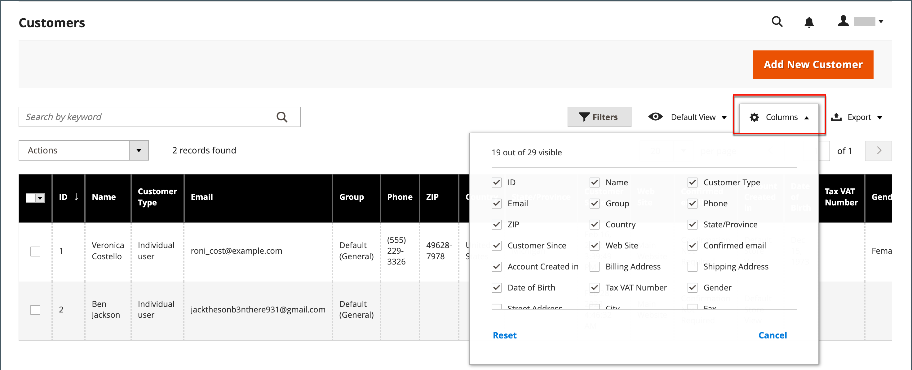

# 管理方格控制項

管理資料的管理頁面會在格線中顯示記錄集合。 每欄頂端的控制項可用來排序資料。 目前的排序順序在欄標題中以遞增或遞減箭頭表示。 您可以指定哪些欄會出現在格線中，並將它們拖曳到不同的位置。 您也可以將不同的欄排列儲存為可供稍後使用的檢視。 此 **[!UICONTROL Action]** 欄列出可套用至個別記錄的作業。 此外，大多數格點的目前檢視中的日期可以匯出至 [CSV](../systems/data-csv.md) 或XML檔案。

{width="700" zoomable="yes"}

## 排序清單

1. 按一下任何欄標題。

   箭頭會以遞增或遞減方式表示目前的順序。

1. 使用分頁控制項來檢視集合中的其他頁面。

   {width="300"}

## 將清單分頁

1. 設定 **[!UICONTROL Pagination]** 控制每頁要檢視的記錄數。

1. 按一下 **[!UICONTROL Next]** 和 **[!UICONTROL Previous]** 翻閱清單，或輸入特定的 **[!UICONTROL Page Number]**.

## 篩選清單

1. 按一下 **[!UICONTROL Filters]**.

1. 請視需要填寫許多篩選器，以說明您要尋找的記錄。

1. 按一下 **[!UICONTROL Apply Filters]**.

   {width="700" zoomable="yes"}

## 匯出資料

1. 選取要匯出的記錄。

   >[!NOTE]
   >
   >無法從格線匯出產品資料。 若要深入瞭解，請參閱 [匯出](../systems/data-export.md).

1. 在 _匯出_ ()功能表右上角，選擇下列其中一種檔案格式：

   - `CSV`
   - `Excel XML`

   {width="700" zoomable="yes"}

1. 按一下 **[!UICONTROL Export]**.

1. 在瀏覽器用於下載的位置尋找已匯出資料的下載檔案。

## 格線配置

欄的選取範圍及其在格線中的順序可根據您的偏好變更，並儲存為 _檢視_. 您可以控制哪些屬性顯示在個別屬性組態下的格線中。 產品格線中顯示許多屬性，可能會影響管理員載入時間和效能。

{width="700" zoomable="yes"}

### 變更欄的選擇

1. 在右上角，按一下 _欄_ ()控制項。

1. 變更欄選擇：

   - 選取您要新增至格線之任何欄的核取方塊。
   - 清除您要從格線移除之任何欄的核取方塊。
   - 若要傳回預設格點檢視，請按一下 **[!UICONTROL Reset]**.

請務必向下捲動以檢視所有可用欄。

### 移動欄

1. 按一下欄標題並按住。

1. 將欄拖曳到新位置並釋放。

### 儲存格點檢視

1. 按一下 _檢視_ ()控制項。

1. 按一下 **[!UICONTROL Save Current View]**.

1. 輸入 **[!UICONTROL name]** 以檢視。

1. 若要儲存所有變更，請按一下 _箭頭_ ()。

   檢視的名稱現在會顯示為目前的檢視。

### 變更格點檢視

1. 按一下 _檢視_ ()控制項。

1. 執行下列任一項作業：

   - 若要使用不同的檢視，請按一下檢視的名稱。
   - 若要變更檢視的名稱，請按一下 _編輯_ ()圖示並更新名稱。
   - 若要刪除檢視，請按一下 _編輯_ ()，然後按一下 _刪除_ ()圖示。
