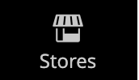

# 管理員側欄

左側邊欄是商店的主功能表 _管理員_ 專為桌上型電腦和行動裝置設計。 彈出式選單可讓您存取每天用來管理商店的所有工具。

| 功能表圖示 | 連結 | 說明 |
| --------- | ---- | ----------- |
|  | **[管理啟動頁面](../configuration-reference/advanced/admin.md)** | 顯示「管理員啟動」頁面，預設為「控制面板」。 |
|  | **[[!UICONTROL Dashboard]](admin-dashboard.md)** | 「控制面板」會提供您商店中銷售和客戶活動的快速概覽，通常是您登入Admin時顯示的第一個頁面。 |
|  | **[[!UICONTROL Sales]](../stores-purchase/sales-menu.md)** | 此 [!UICONTROL Sales] 功能表可讓您找到與處理訂單、商業發票、出貨、銷退折讓單及異動等作業相關的所有專案。 |
|  | **[[!UICONTROL Catalog]](../catalog/catalog-menu.md)** | 此 [!UICONTROL Catalog] 功能表可用來建立產品和定義類別。 |
|  | **[[!UICONTROL Customers]](../customers/customers-introduction.md)** | 此 [!UICONTROL Customers] 功能表是您管理客戶帳戶的位置，並可檢視哪些客戶目前線上上。 |
|  | **[[!UICONTROL Marketing]](../merchandising-promotions/marketing-menu.md)** | 此 [!UICONTROL Marketing] 功能表是設定目錄與購物車價格規則與優惠券的位置。 價格規則會在符合一組特定條件時觸發動作。 |
|  | **[[!UICONTROL Content]](../content-design/content-menu.md)** | 此 [!UICONTROL Content] 功能表是您管理存放區內容元素和設計的位置。 瞭解如何建立頁面、區塊和前端應用程式，以及管理您商店的展示方式。 |
|  | **[[!UICONTROL Reports]](reports-menu.md)** | 此 [!UICONTROL Reports] 功能表提供多種報表，可讓您深入瞭解商店的各個層面，包括銷售、購物車、產品、客戶、標籤、評論和搜尋詞。 |
|  | **[[!UICONTROL Stores]](../stores-purchase/stores-menu.md)** | 此 [!UICONTROL Stores] 功能表包含設定和維護商店各個方面的工具，包括多站台安裝設定、稅捐、貨幣、產品屬性和客戶群組。 |
|  | **[[!UICONTROL System]](../systems/system-menu.md)** | 此 [!UICONTROL System] 功能表包含用於管理系統操作、安裝擴充功能及管理Web服務，以便與其他應用程式整合的工具。 |
|  | **[[!UICONTROL Find Partners & Extensions]](commerce-marketplace.md)** | 此 [!DNL Commerce Marketplace] 您可在此找到商店的Adobe Commerce和Magento Open Source解決方案。 |

{style="table-layout:auto"}
