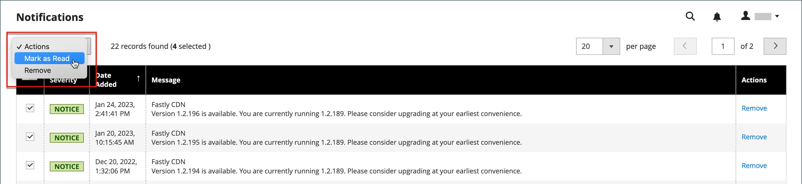

# 管理員訊息收件匣

您的商店會定期接收來自Adobe的訊息。 這些訊息依重要性分級，可能指涉系統更新、修補程式、新版本、排程維護或即將到來的事件。 標題中的鈴鐺圖示表示收件匣中未讀取的訊息數。

{width="700" zoomable="yes"}

此 _[!UICONTROL Notifications]_頁面會依日期列出所有排名訊息。 此_[!UICONTROL Action]_ 命令可用來將個別郵件標示為已讀取、檢視更多詳細資訊，或從收件匣移除郵件。

此設定會決定收件匣更新的頻率，以及傳遞訊息的方式。 如果您的商店管理員有安全URL，則必須透過HTTPS傳送通知。

## 檢視新的傳入訊息

1. 按一下 **[!UICONTROL Notification]** 圖示並讀取摘要。

1. 執行下列任一項作業：

   - 如有必要，請按一下訊息以顯示全文。
   - 若要刪除訊息，請按一下訊息右側的刪除圖示。
   - 若要顯示完整通知清單，請按一下 **[!UICONTROL See All]**.

## 處理重要訊息

對於重要訊息，請執行下列任一項作業：

- 按一下 **[!UICONTROL Read Details]**.
- 若要關閉警示方塊但讓訊息保持作用中，請按一下 **[!UICONTROL Close]**.

## 管理您的通知

1. 執行下列任一項作業以開啟「通知」頁面：

   - 按一下 **[!UICONTROL Notification]** 圖示來識別。 如果顯示一或多個新訊息，請按一下 **[!UICONTROL See All]**.

   - 在 _管理員_ 側欄，前往 **[!UICONTROL System]** > _[!UICONTROL Other Settings]_>**[!UICONTROL Notifications]**.

1. 在 **[!UICONTROL Action]** 欄，執行下列任一項作業：

   - 如需詳細資訊，請按一下 **[!UICONTROL Read Details]** 在新視窗中開啟連結的頁面。

   - 若要保留收件匣中的郵件，請按一下 **[!UICONTROL Mark As Read]**.

     {width="700" zoomable="yes"}

   - 若要刪除訊息，請按一下 **[!UICONTROL Remove]**.

1. 若要將動作套用至多則訊息，請執行下列任一項作業：

   - 針對要管理的每則訊息，選取第一欄的核取方塊。
   - 若要選取多則訊息，請設定 **[!UICONTROL Mass Actions]** 視需要控制。

1. 設定 **[!UICONTROL Actions]** 控制下列其中一項：

   - `Mark as Read`
   - `Remove`

1. 按一下 **[!UICONTROL Submit]** 以完成程式。

## 設定通知

1. 在 _管理員_ 側欄，前往 **[!UICONTROL Stores]** > _[!UICONTROL Settings]_>**[!UICONTROL Configuration]**.

1. 在左側導覽面板中，展開 **[!UICONTROL Advanced]** 並選擇 **[!UICONTROL System]**.

1. 展開 此 **[!UICONTROL Notifications]** 區段。

   {width="600"}

1. 如果您的商店管理員在 [安全URL](../stores-purchase/store-urls.md)，設定 **[!UICONTROL Use HTTPS to Get Feed]** 至 `Yes`.

1. 設定 **[!UICONTROL Update Frequency]** 以判斷收件匣更新的頻率。

   間隔可以是1到24小時。

1. 完成後，按一下 **[!UICONTROL Save Config]**.

如需關於的詳細資訊 [!UICONTROL System] 組態選項，請參閱 [_設定參考指南_](../configuration-reference/advanced/system.md).
