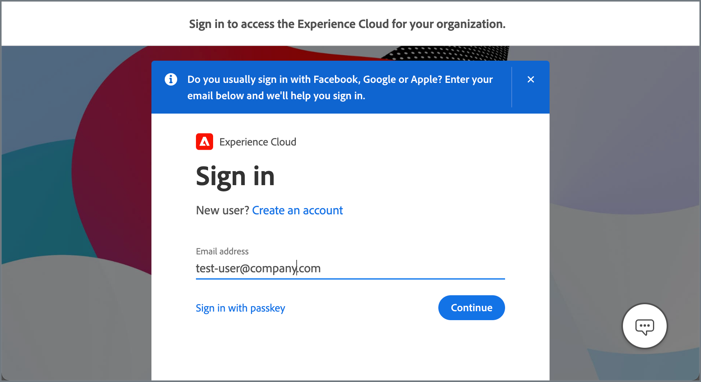
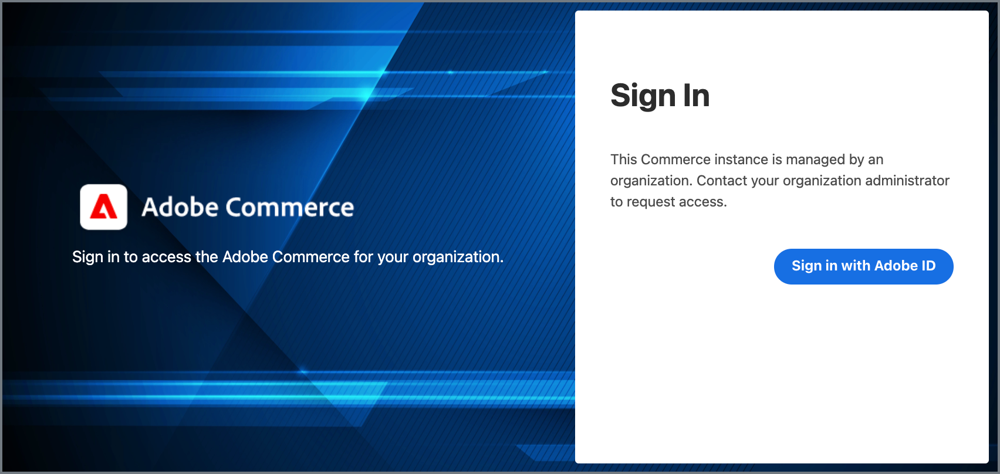

# 適用於Commerce的Adobe Experience Cloud整合

<table style="border:1px solid red">
<tr><td> 只有Adobe Commerce才有專屬功能（<a href="https://experienceleague.adobe.com/docs/commerce-admin/user-guides/home.html#product-editions">深入瞭解</a>）</td></tr>
</table>

啟用Admin Unified Experience擴充功能，將Adobe Commerce專案與Experience Cloud整合。 當整合作用中時，管理員可以從Adobe Experience Cloud存取Commerce專案。

{width="700" zoomable="yes"}存取Commerce

## 檢視可用的Commerce專案

管理員可以從Commerce首頁中選取&#x200B;**[!UICONTROL Commerce]**，檢視他們有權存取的Experience Cloud專案。

Experience Cloud上的{width="700" zoomable="yes"}

管理員可以從[!DNL Commerce Projects]工作區開啟每個專案的管理員和店面，並檢視其他資訊。

- **Commerce店面首頁的快照** — 店面首頁的快照。 如果專案有多個網站，快照會顯示預設網站的首頁。

- **[專案名稱](https://experienceleague.adobe.com/docs/commerce-cloud-service/user-guide/architecture/pro-develop-deploy-workflow.html)** — 識別執行個體的雲端專案環境。 專案名稱預設為雲端專案中的[Git分支名稱](https://experienceleague.adobe.com/docs/commerce-cloud-service/user-guide/project/console-branches.html)。 變更或更新[統一Experience存放區組態設定](admin-unified-experience-integration-manage.md#manage-the-integration-from-the-admin)中的專案名稱。

- **[店面URL](../stores-purchase/store-urls.md)** — 顯示預設網站的基底URL。

- **[環境型別](https://experienceleague.adobe.com/docs/commerce-cloud-service/user-guide/architecture/pro-develop-deploy-workflow.html)** — 部署至開發或中繼環境的Commerce執行個體會以[!UICONTROL Development]或[!UICONTROL Staging]標籤識別。 沒有標籤的執行個體會部署至生產環境。

- **Commerce管理員存取權** — 按一下&#x200B;**[!UICONTROL Open]**&#x200B;開啟管理員。

- **店面存取** — 從選項功能表中選取&#x200B;**[!UICONTROL Open storefront]**&#x200B;以開啟店面。

- **快速存取以選取專案** — 從[選項]功能表選取&#x200B;**[!UICONTROL Add to Favorites]**，以將專案新增至[!UICONTROL Favorites]索引標籤。

## 驗證流程

Experience Cloud整合啟用時，管理員會使用下列工作流程來驗證及存取Commerce專案。

1. 透過Experience Cloud登入頁面登入。

   {width="600" zoomable="yes"}

   對於與Experience Cloud執行個體相關聯的組織，管理員必須使用Adobe業務設定檔登入Commerce。 請參閱[管理Adobe設定檔](https://helpx.adobe.com/enterprise/using/manage-adobe-profiles.html)。

1. 在Experience Cloud首頁上，選取&#x200B;**[!UICONTROL Open]**&#x200B;以開啟[!UICONTROL Commerce Projects workspace]。

1. 選取&#x200B;**[!UICONTROL Open]**&#x200B;以存取專案的管理員。

1. 在Adobe Commerce登入頁面上，選取&#x200B;**[!UICONTROL Sign in with Adobe ID]**&#x200B;以完成驗證並開啟Admin。

   {width="600" zoomable="yes"}

>[!NOTE]
>
>請參閱[管理Experience Cloud整合](admin-unified-experience-integration-manage.md)，以取得啟用或停用Experience Cloud整合時驗證工作流程受到哪些影響的詳細資訊。

## 需求

- Adobe Commerce 2.4.5或更新版本
- 雲端基礎結構上的Adobe Commerce
- Adobe Commerce擴充功能

   - Commerce Admin Unified Experience擴充功能(`magento/module-unified-experience`)

     如果Commerce執行個體上沒有此模組，則可使用Composer進行安裝。

   - [Adobe I/O Events服務](https://developer.adobe.com/commerce/extensibility/events/) — 需要傳送事件資料，以管理管理員從Experience Cloud存取Commerce專案。

     Adobe I/O Events與Commerce的整合可透過Commerce Event擴充功能(`magento/commerce-eventing`)啟用，Adobe Commerce 2.4.4及更高版本可使用該擴充功能。

## 啟用整合

依照指示[使用Commerce管理員設定Experience Cloud整合](admin-unified-experience-integration-configure.md)以啟用整合。

>[!TIP]
>
>如果已在Commerce執行個體上啟用Experience Cloud整合，請參閱[管理Experience Cloud整合](admin-unified-experience-integration-manage.md)，以取得有關變更或更新組態、管理管理員存取權和疑難排解的詳細資料。
