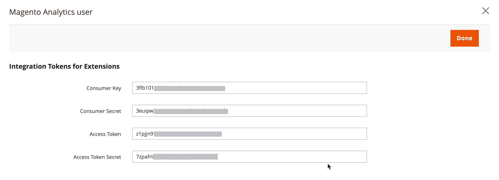

# [!DNL Commerce Intelligence]工具

使用Commerce Intelligence工具，獲得insight，用於制定良好的業務決策。

## [!DNL Commerce Intelligence]帳戶

當您透過Adobe啟用[!DNL Commerce Intelligence]帳戶時，您將可存取五個包含約70個報表的控制面板。 這些報表旨在提供有關您資料的深入分析，並回答諸如「我的訂單每月增長如何？」、「誰是我最忠實的客戶？」及「我的優惠券策略有效嗎？」等問題。 如需此工具集的詳細資訊，請參閱[Commerce Intelligence使用手冊](https://experienceleague.adobe.com/docs/commerce-business-intelligence/mbi/guide-overview.html?lang=zh-Hant)。

## [!DNL Advanced Reporting]

[!DNL Advanced Reporting]包含在Adobe Commerce和Magento Open Source中。 此功能可讓您存取一套以您的產品、訂單和客戶資料為根據的動態報表，並根據您的業務需求量身打造個人化控制面板。 當[!DNL Advanced Reporting]使用[!DNL Commerce Intelligence]進行分析時，您不需要有Commerce Intelligence帳戶即可使用[!DNL Advanced Reporting]。

如需技術資訊，請參閱開發人員檔案中的[[!DNL Advanced Reporting]](https://developer.adobe.com/commerce/php/development/advanced-reporting/){:target="_blank"}主題。

>[!NOTE]
>
>由於[!DNL Adobe Commerce Intelligence]的相容性問題，Commerce暫時無法支援使用AWS S3 Bucket做為[!DNL Commerce Intelligence]中來源資料檔案的媒體的進階報告。

{width="700"}

### 需求

* 網站必須在公用網頁伺服器上執行。

* 網域必須具備有效的安全性(SSL)憑證。

* [!DNL Commerce]必須已順利安裝或升級，且沒有錯誤。

* 在[!DNL Commerce]存放區URL[的](../stores-purchase/store-urls.md)設定中，存放區檢視的&#x200B;**[!UICONTROL Base URL (Secure)]**&#x200B;設定必須指向安全URL。 例如： `https://yourdomain.com`。

* 在存放區URL的[!DNL Commerce]設定中，**[!UICONTROL Use Secure URLs on Storefront]**&#x200B;和&#x200B;**[!UICONTROL Use Secure URLs in Admin]**&#x200B;必須設定為`Yes`。

* 已建立[[!DNL Commerce] crontab](https://experienceleague.adobe.com/docs/commerce-operations/configuration-guide/cli/configure-cron-jobs.html?lang=zh-Hant)，且已安裝伺服器上正在執行cron工作。

>[!NOTE]
>
>[!DNL Advanced Reporting]只能搭配持續使用單一[!DNL Commerce]基本貨幣[的](../stores-purchase/currency-configuration.md)個安裝使用。


### 步驟1：啟用[!DNL Advanced Reporting]

在[!DNL Commerce]設定中，[[!DNL Advanced Reporting]](../configuration-reference/general/advanced-reporting.md)預設為啟用，如果cron為[已設定](../configuration-reference/advanced/system.md)且正在執行，則會自動啟動。 每小時的開頭會在接下來的24小時內起始建立訂閱的嘗試，直到成功為止。 在成功建立訂閱之前，訂閱狀態為「擱置中」。

1. 在&#x200B;_管理員_&#x200B;側邊欄上，移至&#x200B;**[!UICONTROL Stores]** > _[!UICONTROL Settings]_>**[!UICONTROL Configuration]**。

1. 在展開&#x200B;**[!UICONTROL General]**&#x200B;的左側導覽面板中，選擇&#x200B;**[!UICONTROL Advanced Reporting]**&#x200B;並執行下列動作：

   * 確認&#x200B;**[!UICONTROL Advanced Reporting Service]**&#x200B;已設為`Enable` （預設設定）。

   * 根據24小時時鐘，將&#x200B;**[!UICONTROL Time of day to send data]**&#x200B;設定為小時、分鐘和秒，您希望服務從您的商店接收更新的資料。 依預設，資料會在凌晨2:00傳送。

   * 在&#x200B;**[!UICONTROL Industry Data]**&#x200B;底下，選擇最能描述您業務的&#x200B;**[!UICONTROL Industry]**。

   {width="400"}

1. 完成時，按一下&#x200B;**[!UICONTROL Save Config]**。

1. 出現提示時，請按一下頁面頂端訊息中的&#x200B;**[[!UICONTROL Cache Management]](../systems/cache-management.md)**，然後重新整理任何無效的快取。

1. 等待整夜，或等到下次排程更新的時間。 然後，檢查您的訂閱狀態。 如果狀態仍為&#x200B;_擱置_，請確定您的安裝符合所有需求。

### 步驟2：存取[!DNL Advanced Reporting]

1. 執行下列任一項作業：

   * 在&#x200B;_管理員_&#x200B;側邊欄上，選擇&#x200B;**[!UICONTROL Dashboard]**。 然後，按一下&#x200B;**[!UICONTROL Go to Advanced Reporting]**。
   * 在&#x200B;_管理員_&#x200B;側邊欄上，移至&#x200B;**[!UICONTROL Reports]** > _[!UICONTROL Business Intelligence]_>**[!UICONTROL Advanced Reporting]**。

   [!DNL Advanced Reporting]儀表板提供訂單、客戶和產品的快速摘要。 請務必向下捲動以檢視完整的儀表板。

1. 若要更清楚地檢視資料，請將右上角的&#x200B;**[!UICONTROL Filters]**&#x200B;設為時段並儲存您要納入報表的檢視。 接著，執行下列動作：

   * 將滑鼠指標暫留在任何資料點上，即可取得詳細資訊。
   * 若要檢視所有儀表板報表，請按一下每個標籤。

   {width="600" zoomable="yes"}

## 存取[!DNL Advanced Reporting]資料資源

在進階報告儀表板的右上角，按一下&#x200B;**[!UICONTROL Additional Resources]**。

{width="600" zoomable="yes"}

## 疑難排解

如果您收到404「找不到頁面」訊息，請確認您的商店符合[!DNL Advanced Reporting]的要求。 然後，按照指示驗證整合是否已安裝。

### 確認整合作用中

1. 在&#x200B;_管理員_&#x200B;側邊欄上，移至&#x200B;**[!UICONTROL System]** > _[!UICONTROL Extensions]_>**[!UICONTROL Integration]**。

1. 確認&#x200B;**[!UICONTROL Magento Analytics user]**&#x200B;整合出現在清單中，且&#x200B;**[!UICONTROL Status]**&#x200B;為`Active`。

1. 若要重新建立使用者，請按一下&#x200B;**[!UICONTROL Reauthorize]**&#x200B;並執行下列動作：

   {width="600"}

   * 出現提示時，按一下&#x200B;**[!UICONTROL Reauthorize]**&#x200B;以核准對API資源的存取權。

     {width="600"}

   * 確認擴充功能的整合代號清單是否完整。 然後，按一下&#x200B;**完成**。

     {width="600"}

1. 尋找指出整合`Magento Analytics user`已重新授權的訊息。

1. 請稍候一整夜，或等到下次排程更新的時間。

### 驗證單一基礎貨幣

[!DNL Advanced Reporting]只能搭配自安裝以來僅使用單一[!DNL Commerce]基礎貨幣[的](../stores-purchase/currency-configuration.md)個安裝使用。 結果是，在歷史記錄中，所有訂單都使用相同的基本貨幣。 如果您在任何時候變更了基準貨幣，且歷史記錄中有使用不同基準貨幣處理的訂單，則[!DNL Advanced Reporting]無法運作。

若要判斷您的存放區是否具有多個基本貨幣，您可以使用下列MySQL範例，從命令列查詢您的[!DNL Commerce]資料庫。 您可能需要變更表格名稱以符合您的資料結構：

```sql
select distinct base_currency_code from sales_order;
```

### 資料差異

如果您注意到`Data last updated...`註解顯示的是昨天的日期，而不是今天的日期，則進階報告更新中可能會延遲最多一天。 此延遲是由於佇列大小大於預期。

## 控制面板報表

**[!UICONTROL Orders]**

| 欄位 | 說明 |
|--- |--- |
| [!UICONTROL Revenue] | 顯示商店檢視在定義的時段內收到的所有收入。 |
| [!UICONTROL Orders] | 顯示定義時段內透過商店檢視下單的所有訂單。 |
| [!UICONTROL AOV] | 顯示定義時段內透過商店檢視下方的平均訂單值。 |
| [!UICONTROL Refunds] | 顯示定義期間透過商店檢視處理的所有退款。 |
| [!UICONTROL Tax Collected] | 顯示定義期間內透過商店檢視所收集的所有稅捐。 |
| [!UICONTROL Shipping Collected] | 顯示在定義的時段內，透過商店檢視所收取的所有運費。 |
| [!UICONTROL Orders by Status] | 針對定義時段內的商店檢視，依狀態顯示訂單數。 |
| [!UICONTROL Orders by Status] | 依狀態列出訂單數的摘要。 |
| [!UICONTROL Coupon Usage] | 列出在定義的時段內，透過商店檢視兌換的所有優惠券代碼和每個優惠券的使用者人數。 |
| [!UICONTROL Orders and Revenue by Billing Region] | 列出在定義的時段內，商店檢視的訂單數量與收入（依區域）。 |
| [!UICONTROL Tax Collected by Billing Region] | 列出在定義的時段內，依區域針對商店檢視所徵收的稅捐金額。 |
| [!UICONTROL Shipping Fees Collected by Shipping Region] | 列出在定義的時段內，依區域針對商店檢視所收取的送貨費用。 |

{style="table-layout:auto"}

**[!UICONTROL Customers]**

| 欄位 | 說明 |
|--- |--- |
| [!UICONTROL Unique Customers] | 顯示在定義的時段內與商店檢視相關聯的不重複客戶帳戶數目。 |
| [!UICONTROL New Registered Accounts] | 顯示在定義的時段內，在存放區檢視中註冊的新客戶帳戶數目。 |
| [!UICONTROL Top Coupon Users] | 依客戶ID列出排名最前的抵用券使用者，以及在定義的時段內，為商店檢視下含抵用券的訂單數。 |
| [!UICONTROL Customer KPI Table] | 列出在定義的時段內，商店檢視的訂單數、收入和平均訂單值（依客戶ID）。 |

{style="table-layout:auto"}

**[!UICONTROL Products]**

| 欄位 | 說明 |
|--- |--- |
| [!UICONTROL Quantity of Products Sold] | 顯示定義時段內透過商店檢視出售的產品數量。 |
| [!UICONTROL Products Added to Wishlists] | 列出在定義的時段內，透過商店檢視新增到願望清單的所有產品。 |
| [!UICONTROL Best Selling Products by Quantity] | 列出在定義的時段內透過商店檢視銷售的最暢銷產品和數量。 |
| [!UICONTROL Best Selling Products by Revenue] | 列出在定義的時段內，透過商店檢視銷售產品所產生的暢銷產品和收入。 |

{style="table-layout:auto"}
