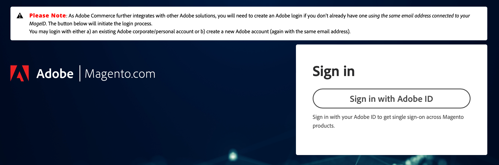
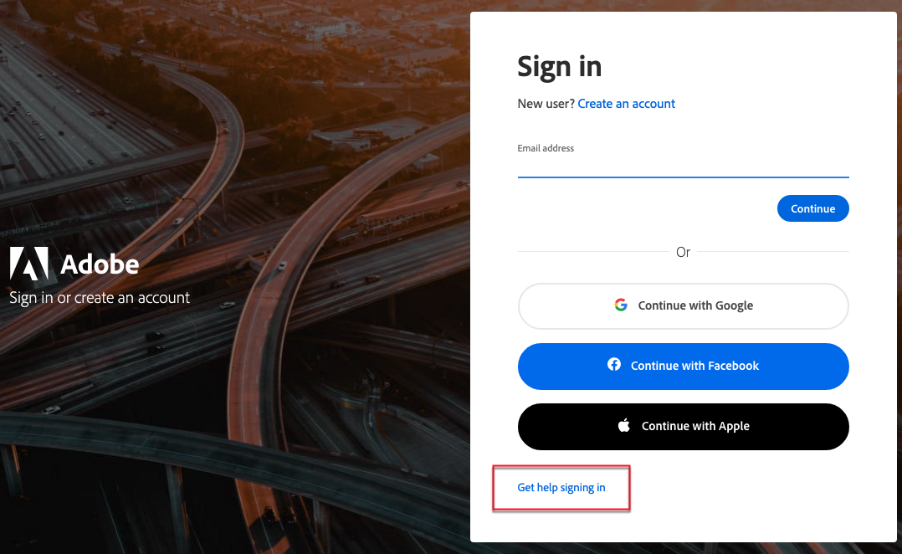
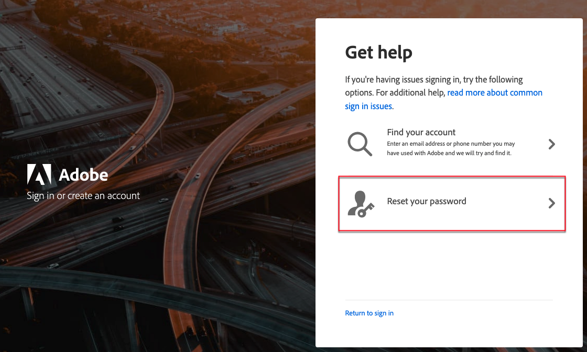

# 存取您的[!DNL Commerce]帳戶

您可以從[!DNL Commerce]網站存取您的帳戶。 從您[!DNL Commerce]帳戶的控制面板中，您可以找到與您購買的產品和服務相關的資訊，以及您的連絡人和帳單資訊。 部分資訊僅對授權擁有者可見。

您可以從[!DNL Commerce]網站存取您的帳戶。 帳戶儀表板會顯示您購買的產品、服務、連絡人或帳單詳細資料。 部分資訊僅對授權擁有者可見。

![您的[!DNL Commerce]帳戶](./assets/home-acct.png){width="700"}

您的[!DNL Commerce]帳戶登入與商店管理員登入不同。 您通常會對每個系統使用不同的認證，而且每個系統的存取許可權都是獨立管理的。

但是，想要簡化Adobe Commerce和Adobe商業產品登入流程的使用者將能夠設定其Adobe ID以登入商店管理員： [設定Commerce與Adobe ID的管理員整合](https://experienceleague.adobe.com/en/docs/commerce-admin/start/admin/ims/adobe-ims-config)

您的Commerce和商店管理員登入是分開的，具有不同的憑證和獨立管理的存取權。 不過，您可以設定Adobe ID登入商店管理員，簡化存取作業。 請參閱&#x200B;*Commerce的IMS整合指南*&#x200B;中的[設定Commerce管理與Adobe ID的整合]。

>[!NOTE]
>
>建立帳戶之後，建議您使用雙因素驗證(TFA)來[保護帳戶](commerce-account-secure.md)。

## 登入您的[!DNL Commerce]帳戶

必須有Adobe ID才能存取Commerce帳戶。 如果您已有Commerce帳戶，但沒有Adobe ID，則可以在登入過程中建立帳戶。

>[!WARNING]
>
>使用與您現有Commerce帳戶MAGEID相關聯的電子郵件地址來建立Adobe ID。 使用不同的全新電子郵件地址會建立新的MAGEID。

1. 移至[[!DNL Commerce] 網站](https://account.magento.com/customer/account/login/)。

1. 按一下&#x200B;**[!UICONTROL Sign in with Adobe ID]**。

   {width="700"}

1. 輸入您的電子郵件地址，然後按一下&#x200B;**[!UICONTROL Continue]**。

   >[!TIP]
   >
   >如果您使用的電子郵件地址與現有的Commerce帳戶MAGEID相關聯，登入程式會自動將其連結至您的Adobe ID。

## 建立[!DNL Commerce]帳戶

任何人都可以建立免費的[!DNL Commerce]帳戶。 您使用的電子郵件地址只能與一個Commerce帳戶相關聯。

>[!NOTE]
>
>使用Adobe ID建立及存取Commerce帳戶。
>- 如果您沒有Commerce帳戶，可以在註冊過程中建立帳戶。
>- 如果您已有Commerce帳戶，但沒有Adobe ID，請參閱[登入Commerce帳戶](#log-in-to-your-dnl-commerce-account)。

1. 移至[[!DNL Commerce] 網站](https://account.magento.com/customer/account/login/)。

1. 按一下&#x200B;**[!UICONTROL Sign in with Adobe ID]**。

1. 如果您沒有Adobe ID，請按一下&#x200B;**[!UICONTROL Create an account]**。 否則，請跳至步驟7。

   {width="700"}

1. 完成登錄檔單。

   {width="700"}

1. 按一下&#x200B;**[!UICONTROL Create account]**。

1. 輸入傳送至您電子郵件地址的驗證碼。

   {width="700"}

1. 建立及驗證Adobe ID後，請返回https://account.magento.com/。 系統會產生影像ID，並自動連結至您的Adobe ID。

## 重設密碼

1. 移至[[!DNL Commerce] 網站](https://account.magento.com/customer/account/login/)。

1. 按一下&#x200B;**[!UICONTROL Sign in with Adobe ID]**。

1. 按一下&#x200B;**[!UICONTROL Get help signing in]**。

   {width="700"}

1. 按一下&#x200B;**[!UICONTROL Reset your password]**。

   {width="700"}

1. 輸入您的電子郵件地址。

1. 按一下&#x200B;**[!UICONTROL Continue]**。
