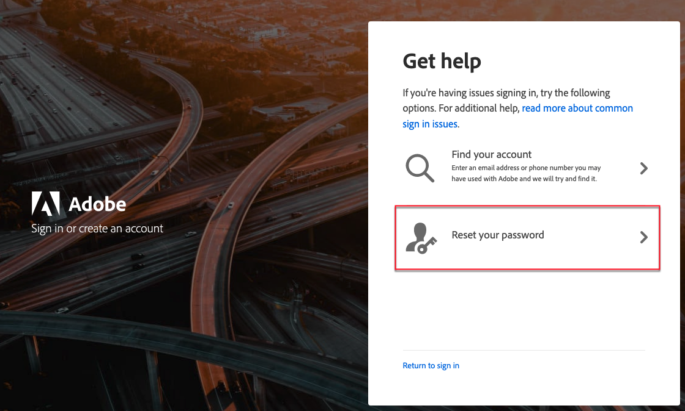

# 存取您的[!DNL Commerce]帳戶

[!DNL Commerce]帳戶是您管理部署在雲端基礎結構或內部部署之Adobe Commerce專案的Adobe Commerce服務的中央存取點。 從帳戶控制面板，您可以檢視訂閱、管理Commerce服務API金鑰、檢閱歷史帳單資訊，並與您組織中的其他使用者共同作業。

如果您需要[提交您的第一個票證](https://experienceleague.adobe.com/zh-hant/docs/commerce-knowledge-base/kb/help-center-guide/magento-help-center-user-guide#support-case)或管理您的Adobe Commerce關係（而不是在特定店面中工作），請從建立或存取您的[!DNL Commerce]帳戶開始。

如果您需要[提交您的第一個支援票證](https://experienceleague.adobe.com/zh-hant/docs/commerce-knowledge-base/kb/help-center-guide/magento-help-center-user-guide#support-case)，或在特定店面之外處理您的Adobe Commerce關係，請從建立或存取您的[!DNL Commerce]帳戶開始。

您可以從[!DNL Commerce]網站存取您的[!DNL Commerce]帳戶。 從帳戶儀表板，您可以檢視與您購買的產品和服務相關的資訊，並提供[共用存取權](https://experienceleague.adobe.com/zh-hant/docs/support-resources/adobe-support-tools-guide/adobe-commerce-support/adobe-commerce-help-center-user-guide#provide-shared-access)給其他使用者。 有些資訊(例如Commerce Services API金鑰)僅對授權擁有者可見。

>[!NOTE]
>
>**[!UICONTROL Billing History]**&#x200B;帳戶頁面上的[!DNL Commerce]區段僅顯示帳單系統更新之前建立的發票。
>
>如果未列出較新的發票，則表示它們已轉換為新系統，無法從此頁面存取。

![您的[!DNL Commerce]帳戶](./assets/home-acct.png){width="700"}

您的[!DNL Commerce]帳戶登入與商店管理員登入不同。 您通常會對每個系統使用不同的認證，而且每個系統的存取許可權都是獨立管理的。

但是，想要簡化Adobe Commerce和Adobe商業產品登入流程的使用者可以設定其Adobe ID登入商店管理員： [在](https://experienceleague.adobe.com/zh-hant/docs/commerce-admin/start/admin/ims/adobe-ims-config)Commerce的IMS整合指南&#x200B;*中設定Commerce與Adobe ID的管理員整合*。

>[!NOTE]
>
>建立帳戶之後，建議您使用雙因素驗證(TFA)來[保護帳戶](commerce-account-secure.md)。

## 登入您的[!DNL Commerce]帳戶

需要Adobe ID才能存取您的[!DNL Commerce]帳戶。 如果您有現有的[!DNL Commerce]帳戶，但自2022年8月起尚未登入，則必須在登入過程中建立Adobe ID。 您必須先完成此步驟，才能登入您的帳戶。

>[!WARNING]
>
>如果您在提交Commerce [支援案例](https://experienceleague.adobe.com/zh-hant/docs/support-resources/adobe-support-tools-guide/adobe-commerce-support/adobe-commerce-help-center-user-guide#support-case)時找不到Adobe Commerce組織，則通常表示有下列其中一種情況：帳戶擁有者尚未建立Adobe ID，或Adobe ID存在但未連結至Commerce帳戶。

1. 前往[[!DNL Commerce]](https://account.magento.com/customer/account/login/)網站。

1. 按一下&#x200B;**[!UICONTROL Sign in with Adobe ID]**。

   {width="700"}

1. 輸入您的電子郵件地址，然後按一下&#x200B;**[!UICONTROL Continue]**。

   >[!TIP]
   >
   >如果您使用的電子郵件地址與現有的Commerce帳戶MAGEID相關聯，登入程式會自動將其連結至您的Adobe ID。

## 建立[!DNL Commerce]帳戶

任何人都可以建立免費的[!DNL Commerce]帳戶。 您使用的電子郵件地址只能與一個Commerce帳戶相關聯。

>[!NOTE]
>
>使用Adobe ID建立及存取Commerce帳戶。
>- 如果您沒有Commerce帳戶，可以在註冊過程中建立帳戶。
>- 如果您已有Commerce帳戶，但沒有Adobe ID，請參閱[登入Commerce帳戶](#log-in-to-your-dnl-commerce-account)。

1. 移至[[!DNL Commerce] 網站](https://account.magento.com/customer/account/login/)。

1. 按一下&#x200B;**[!UICONTROL Sign in with Adobe ID]**。

1. 如果您沒有Adobe ID，請按一下&#x200B;**[!UICONTROL Create an account]**。 否則，請跳至步驟7。

   {width="700"}

1. 完成登錄檔單。

   {width="700"}

1. 按一下&#x200B;**[!UICONTROL Create account]**。

1. 輸入傳送至您電子郵件地址的驗證碼。

   {width="700"}

1. 建立及驗證Adobe ID後，請返回https://account.magento.com/。 系統會產生影像ID，並自動連結至您的Adobe ID。

## 重設密碼

1. 移至[[!DNL Commerce] 網站](https://account.magento.com/customer/account/login/)。

1. 按一下&#x200B;**[!UICONTROL Sign in with Adobe ID]**。

1. 按一下&#x200B;**[!UICONTROL Get help signing in]**。

   {width="700"}

1. 按一下&#x200B;**[!UICONTROL Reset your password]**。

   {width="700"}

1. 輸入您的電子郵件地址。

1. 按一下&#x200B;**[!UICONTROL Continue]**。

## 提供您Commerce帳戶的共用存取權

「共用存取權」可讓您授予受信任的使用者（例如同事、合作夥伴或管理員）許可權，以代表您管理您的Adobe Commerce關係，而不需要使用您的個人登入。 這包括允許其他人開啟及追蹤支援案例。

如需設定共用帳戶的詳細步驟，請參閱Adobe Commerce快速入門手冊的[共用Commerce帳戶](https://experienceleague.adobe.com/zh-hant/docs/commerce-admin/start/commerce-account/commerce-account-share?lang=en)一節。

如需提交Commerce支援案例的詳細說明，請參閱[Adobe Commerce說明中心使用手冊](https://experienceleague.adobe.com/zh-hant/docs/support-resources/adobe-support-tools-guide/adobe-commerce-support/adobe-commerce-help-center-user-guide#support-case)。
