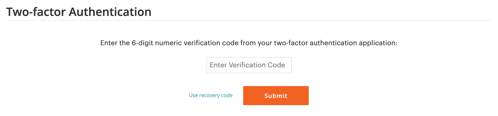
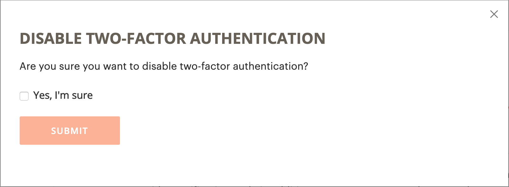

# 保護您的[!DNL Commerce]帳戶

雙因素驗證（TFA或2FA）是新增的安全性層，可更好地保護您的[!DNL Commerce]帳戶免受未經授權的存取。 若要完成登入程式，除了標準使用者名稱和密碼認證之外，TFA還需要&#x200B;_秒因數_。 這個第二個因素採用暫時性驗證碼的形式，這些驗證碼是由安裝在您的行動裝置上的TFA應用程式持續產生，並與您的[!DNL Commerce]帳戶配對。

啟用TFA後，您的帳戶就會更安全。 未經授權的使用者無法登入，除非他們同時擁有您的使用者名稱和密碼認證（第一因素），以及您個人裝置上TFA應用程式的有效驗證碼（第二因素）。

>[!NOTE]
>
>保護存放區&#x200B;_Admin_&#x200B;的雙重因素驗證有單獨的設定。 若要深入瞭解，請參閱[雙因素驗證](../systems/security-two-factor-authentication.md)。

## 開始之前

若要使用TFA，您必須在個人裝置（例如智慧型手機、平板電腦、電腦）上安裝TFA應用程式。 有多種可用選項，但部分熱門且免費的選項包括：

- Google Authenticator (iOS、Android™、BlackBerry®)

- Authy (iOS、Android™)

- Microsoft® Authenticator (iOS、Android™、Windows Phone)

## 啟用雙因素驗證

1. 登入您的[[!DNL Commerce] 帳戶](https://account.magento.com/customer/account/login){:target="_blank"}。

1. 在左側導覽窗格中，選取&#x200B;**[!UICONTROL Account Settings]**，然後選取&#x200B;**[!UICONTROL Two-factor Authentication]**。

   {width="600" zoomable="yes"}

1. 選取&#x200B;**[!UICONTROL Enable]**&#x200B;以開始雙因素驗證設定程式。

1. 輸入傳送到您電子郵件的&#x200B;**[!UICONTROL Verification Code]**，並選取&#x200B;**[!UICONTROL Verify Code]**&#x200B;以繼續。

   {width="400"}

1. 開啟您下載並安裝在個人裝置上的雙因素驗證應用程式。

1. 在[!UICONTROL SETUP TWO-FACTOR AUTHENTICATION]表單上，使用&#x200B;**[!UICONTROL Setup Code]**&#x200B;將Adobe Commerce新增至您的TFA應用程式。

   {width="400"}

   您可以使用TFA應用程式掃描QR碼或手動輸入代碼，以新增代碼。 此程式碼會將您的TFA應用程式與您的[!DNL Commerce]帳戶配對，並啟用產生TFA應用程式的許可權，以產生驗證程式碼，以安全地存取帳戶。

1. 完成設定。

   - 在[!UICONTROL SETUP TWO FACTOR-AUTHENTICATION]表單上，輸入雙因素驗證應用程式的驗證碼。

   - 選取&#x200B;**[!UICONTROL Verify Code]**。

   >[!NOTE]
   >
   >為了安全起見，您的TFA應用程式中的驗證碼會持續過期並重新產生。 **_一律_**&#x200B;使用目前顯示的程式碼。

1. 將所顯示的&#x200B;**[!UICONTROL Recovery Codes]**&#x200B;儲存在安全且可存取的位置。

   {width="400"}

   如果您在登入[!DNL Commerce]帳戶時無法提供驗證碼，則必須使用修復碼來重新取得帳戶存取權。

   每個復原始碼只能使用一次，但您可以[產生](#generate-new-recovery-codes)新代碼。 復原程式碼區分大小寫。

1. 選取確認核取方塊並選取&#x200B;**[!UICONTROL Submit]**&#x200B;以繼續。

1. 若要確保您可以復原帳戶的存取權，請輸入&#x200B;**[!UICONTROL Recovery Email]**。

   如果您無法從雙因素驗證應用程式產生驗證碼，而且您無權存取未使用的預先產生修復碼，則需要此電子郵件地址。

   每隔24小時，您就可以產生暫時復原始碼，並傳送至您指定的復原電子郵件地址。 使用此程式碼來重新取得帳戶存取權。

   >[!IMPORTANT]
   >
   >維持您的修復電子郵件帳戶的存取權。 否則，您無法使用傳送至該帳戶的暫時復原始碼。

   {width="400"}

1. 選取確認核取方塊並選取&#x200B;**[!UICONTROL Submit]**&#x200B;以完成雙因素驗證設定程式。

   - 系統會傳送通知至與您[!DNL Commerce]帳戶相關聯的電子郵件地址，以確認您已成功啟用雙因素驗證。

   - 系統會傳送通知至您的修復電子郵件帳戶以確認設定。

>[!TIP]
>
>如果您遺失或取得新的個人裝置，您可以[變更雙因素驗證應用程式](#change-your-two-factor-authentication-application)並產生新的復原始碼。

## 使用驗證碼登入

1. 移至[!DNL Commerce] [帳戶登入](https://account.magento.com/customer/account/login){:target="_blank"}。

1. 輸入您的使用者名稱和密碼認證，然後選取&#x200B;**[!UICONTROL Login]**。

1. 輸入提示時顯示在雙因素驗證應用程式中的&#x200B;**[!UICONTROL Verification Code]**。

   {width="600"}

1. 選取&#x200B;**[!UICONTROL Submit]**&#x200B;以完成登入程式。

## 使用復原始碼登入

1. 移至[!DNL Commerce] [帳戶登入](https://account.magento.com/customer/account/login){:target="_blank"}。

1. 輸入您的使用者名稱和密碼認證，然後選取&#x200B;**[!UICONTROL Login]**。

1. 選取&#x200B;**[!UICONTROL Use recovery code]**&#x200B;以略過驗證碼提示。

1. 出現提示時，請輸入未使用的&#x200B;**[!UICONTROL Recovery Code]**。

   {width="600"}

1. 選取&#x200B;**[!UICONTROL Submit]**&#x200B;以完成登入程式。

## 使用您的修復電子郵件登入

1. 登入您的[[!DNL Commerce] 帳戶](https://account.magento.com/customer/account/login){:target="_blank"}。

1. 輸入您的使用者名稱和密碼認證，然後選取&#x200B;**[!UICONTROL Login]**。

1. 選取&#x200B;**[!UICONTROL Use recovery code]**&#x200B;以略過驗證碼提示。

1. 若要透過電子郵件取得暫時復原始碼，請選取&#x200B;**[!UICONTROL recovery email]**&#x200B;連結。

   {width="600"}

1. 開啟您的修復電子郵件帳戶以取得臨時代碼，然後在指定的欄位中輸入代碼。

1. 選取&#x200B;**[!UICONTROL Submit]**&#x200B;以完成登入程式。

使用暫時復原始碼存取您的帳戶之後，[會產生新的復原始碼](#generate-new-recovery-codes)並儲存這些代碼，以避免進一步的帳戶存取問題。

## 檢視您的復原始碼

1. 移至[!DNL Commerce] [帳戶登入](https://account.magento.com/customer/account/login){:target="_blank"}。

1. 輸入您的使用者名稱和密碼認證，然後選取&#x200B;**[!UICONTROL Login]**。

1. 使用先前所述的雙因素驗證方法之一完成登入程式。

1. 在左側導覽窗格中，選取&#x200B;**[!UICONTROL Account Settings]**，然後選取&#x200B;**[!UICONTROL Two-factor Authentication]**。

   {width="600" zoomable="yes"}

1. 若要檢視預先產生的復原始碼，請選取&#x200B;**檢視復原始碼**。

1. 輸入傳送到您電子郵件的&#x200B;**[!UICONTROL Verification Code]**，並選取&#x200B;**[!UICONTROL Verify Code]**&#x200B;以繼續。

   {width="400"}

1. 將所顯示的&#x200B;**復原始碼**&#x200B;儲存在安全且可存取的位置。

   如果您無法提供驗證碼來登入[!DNL Commerce]帳戶，則使用復原碼是重新取得帳戶存取許可權的唯一方法。

   每個復原始碼僅供一次使用，但您一律可以[產生](#generate-new-recovery-codes)個新代碼。 復原程式碼區分大小寫。

   {width="400"}

1. 選取確認核取方塊，然後選取&#x200B;**[!UICONTROL Submit]**&#x200B;以關閉對話方塊。

## 產生新的復原始碼

1. 移至[!DNL Commerce] [帳戶登入](https://account.magento.com/customer/account/login){:target="_blank"}。

1. 輸入您的使用者名稱和密碼認證，然後選取&#x200B;**[!UICONTROL Login]**。

1. 使用先前所述的雙因素驗證方法之一完成登入程式。

1. 在左側導覽窗格中，選取&#x200B;**[!UICONTROL Account Settings]**，然後選取&#x200B;**[!UICONTROL Two-factor Authentication]**。

1. 若要產生新的預先產生修復碼，請選取&#x200B;**產生新的修復碼**。

1. 輸入傳送到您電子郵件的&#x200B;**[!UICONTROL Verification Code]**，並選取&#x200B;**[!UICONTROL Verify Code]**&#x200B;以繼續。

1. 將所顯示的&#x200B;**復原始碼**&#x200B;儲存在安全且可存取的位置。

   如果您在登入[!DNL Commerce]帳戶時無法提供驗證碼，則使用復原碼是重新取得帳戶存取權的唯一方法。

   所有先前產生的復原始碼現在都會變成無效，應該捨棄（只有目前這組產生的復原始碼才有作用）。 復原程式碼區分大小寫。

1. 選取確認核取方塊，然後選取&#x200B;**[!UICONTROL Submit]**&#x200B;以關閉對話方塊。

## 變更您的修復電子郵件

1. 移至[!DNL Commerce] [帳戶登入](https://account.magento.com/customer/account/login){:target="_blank"}。

1. 輸入您的使用者名稱和密碼認證，然後選取&#x200B;**[!UICONTROL Login]**。

1. 使用先前所述的雙因素驗證方法之一完成登入程式。

1. 在左側導覽窗格中，選取&#x200B;**[!UICONTROL Account Settings]**，然後選取&#x200B;**[!UICONTROL Two-factor Authentication]**。

1. 選取&#x200B;**變更復原電子郵件**&#x200B;以變更您帳戶的檔案復原電子郵件。

1. 輸入傳送到您電子郵件的&#x200B;**[!UICONTROL Verification Code]**，並選取&#x200B;**[!UICONTROL Verify Code]**&#x200B;以繼續。

1. 若要協助確保您可以復原帳戶的存取權，請輸入&#x200B;**復原電子郵件**。

   如果您無法從雙因素驗證應用程式產生驗證碼，而且您無權存取未使用的預先產生修復碼，則需要此電子郵件地址。

   每隔24小時，您就可以產生暫時復原始碼，並傳送至您指定的復原電子郵件地址。 您可以使用此程式碼來重新取得帳戶存取權。

   >[!IMPORTANT]
   >
   >維持您的修復電子郵件帳戶的存取權。 否則，您無法使用傳送至該帳戶的暫時復原始碼。

1. 選取確認核取方塊，然後選取&#x200B;**[!UICONTROL Submit]**&#x200B;以關閉對話方塊。

   系統會將電子郵件通知傳送至您指定的復原電子郵件，以確認特定電子郵件地址在檔案中，作為您用來接收暫時復原始碼的復原電子郵件。

## 變更您的雙因素驗證應用程式

1. 移至[!DNL Commerce] [帳戶登入](https://account.magento.com/customer/account/login){:target="_blank"}。

1. 輸入您的使用者名稱和密碼認證，然後選取&#x200B;**[!UICONTROL Login]**。

1. 使用先前所述的雙因素驗證方法之一完成登入程式。

1. 在左側導覽窗格中，選取&#x200B;**[!UICONTROL Account Settings]**，然後選取&#x200B;**[!UICONTROL Two-factor Authentication]**。

1. 選取&#x200B;**變更TFA應用程式**，以使用其他TFA應用程式搭配您的magento.com帳戶。

1. 輸入傳送到您電子郵件的&#x200B;**[!UICONTROL Verification Code]**，並選取&#x200B;**[!UICONTROL Verify Code]**&#x200B;以繼續。

1. 在您的個人裝置上開啟雙因素驗證應用程式。

1. 將&#x200B;**安裝程式碼**&#x200B;輸入您的雙因素驗證應用程式。

   您可以使用TFA應用程式掃描QR碼或手動輸入以新增代碼。 此程式碼會將您的TFA應用程式與您的[!DNL Commerce]帳戶配對，並啟用TFA應用程式的許可權，以產生驗證程式碼，以安全地存取帳戶。

   >[!NOTE]
   >
   >為了安全起見，您的TFA應用程式中的驗證碼會持續過期並重新產生。 **_一律_**&#x200B;使用目前顯示的程式碼。

1. 現在您的TFA應用程式已與[!DNL Commerce]帳戶配對，請輸入您的TFA應用程式中顯示的&#x200B;**[!UICONTROL Verification Code]**，並選取&#x200B;**[!UICONTROL Verify Code]**&#x200B;以繼續。

1. 將所顯示的&#x200B;**復原始碼**&#x200B;儲存在安全且可存取的位置。

   如果您在登入[!DNL Commerce]帳戶時無法提供驗證碼，則重新取得帳戶存取權的唯一方式是使用修復碼。

   每個復原始碼僅供一次使用，但您一律可以[產生](#generate-new-recovery-codes)個新代碼。 復原程式碼區分大小寫。 復原程式碼區分大小寫。

1. 選取核取方塊以確認，並選取&#x200B;**[!UICONTROL Submit]**&#x200B;以繼續。

1. 若要協助確保您可以復原帳戶的存取權，請輸入&#x200B;**復原電子郵件**。

   如果您無法從雙因素驗證應用程式產生驗證碼，而且您無權存取未使用的預先產生修復碼，則需要此電子郵件地址。

   每隔24小時，您就可以產生暫時復原始碼，並傳送至您指定的復原電子郵件地址。 使用此程式碼來重新取得帳戶存取權。

   >[!IMPORTANT]
   >
   >維持您的修復電子郵件帳戶的存取權。 否則，您無法使用傳送至該帳戶的暫時復原始碼。

1. 選取確認核取方塊並選取&#x200B;**[!UICONTROL Submit]**&#x200B;以完成雙因素驗證設定程式。

   系統會將電子郵件通知傳送至您指定的復原電子郵件，以確認特定電子郵件地址已在檔案中，作為您接收暫時復原始碼的復原電子郵件。

## 停用雙因素驗證

>[!IMPORTANT]
>
>如果您的組織安全原則需要對Adobe Commerce帳戶進行多重驗證，則您無法停用雙重驗證。

1. 移至[!DNL Commerce] [帳戶登入](https://account.magento.com/customer/account/login){:target="_blank"}。

1. 輸入您的使用者名稱和密碼認證，然後選取&#x200B;**[!UICONTROL Login]**。

1. 使用先前所述的雙因素驗證方法之一完成登入程式。

1. 在左側導覽窗格中，選取&#x200B;**[!UICONTROL Account Settings]**&#x200B;並選取下方的&#x200B;**[!UICONTROL Two-factor Authentication]**。

1. 選取&#x200B;**[!UICONTROL Disable]**&#x200B;以開始TFA停用程式。

1. 輸入傳送到您電子郵件的&#x200B;**[!UICONTROL Verification Code]**，並選取&#x200B;**[!UICONTROL Verify Code]**&#x200B;以繼續。

1. 選取確認核取方塊並選取&#x200B;**[!UICONTROL Submit]**&#x200B;以完成雙因素驗證的停用。

   系統會傳送電子郵件確認，指出您的[!DNL Commerce]帳戶已停用TFA。

   {width="400"}
