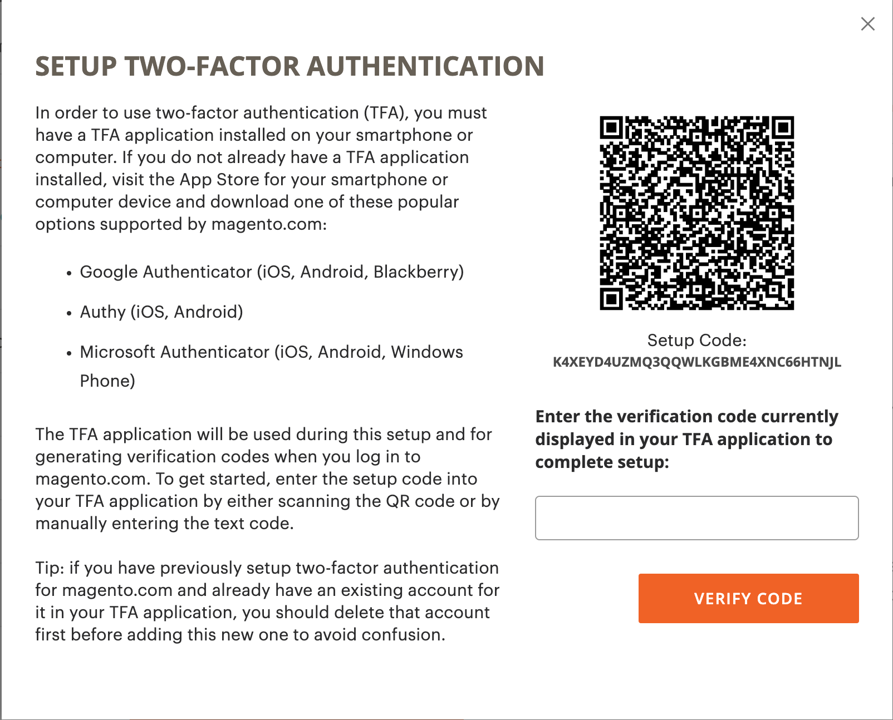

# 保護您的 [!DNL Commerce] 帳戶

雙因素驗證（TFA或2FA）是新增的安全性階層，可更有效保護您的 [!DNL Commerce] 未經授權存取的帳戶。 若要完成登入程式，TFA需要一個 _次要因數_ 除了標準使用者名稱和密碼認證之外。 第二個因素採用臨時驗證碼的形式，這些驗證碼會由安裝在您的行動裝置上並與您配對的TFA應用程式持續產生 [!DNL Commerce] 帳戶。

啟用TFA後，您的帳戶就會更安全。 未經授權的使用者無法登入，除非他們同時擁有您的使用者名稱和密碼認證（第一因素），以及您個人裝置上TFA應用程式的有效驗證碼（第二因素）。

>[!NOTE]
>
>雙因素驗證可保護 _管理員_ 有單獨的設定。 若要深入瞭解，請參閱 [雙因素驗證](../systems/security-two-factor-authentication.md).

## 開始之前

若要使用TFA，您必須在個人裝置（例如智慧型手機、平板電腦、電腦）上安裝TFA應用程式。 有多種可用選項，但部分熱門且免費的選項包括：

- Google Authenticator (iOS、Android™、BlackBerry®)

- Authy (iOS、Android™)

- Microsoft® Authenticator (iOS、Android™、Windows Phone)

## 啟用雙因素驗證

1. 登入您的 [[!DNL Commerce] 帳戶][1]{：target=&quot;_blank&quot;}。

1. 在左側導覽窗格中，選取 **[!UICONTROL Account Settings]**，然後選取 **[!UICONTROL Two-factor Authentication]**.

   {width="600" zoomable="yes"}

1. 選取 **[!UICONTROL Enable]** 以開始雙因素驗證設定程式。

1. 輸入 **[!UICONTROL Verification Code]** 已傳送至您的電子郵件並選取 **[!UICONTROL Verify Code]** 以繼續。

   {width="400"}

1. 開啟您下載並安裝在個人裝置上的雙因素驗證應用程式。

1. 在 [!UICONTROL SETUP TWO-FACTOR AUTHENTICATION] 表單，使用 **[!UICONTROL Setup Code]** 以將Adobe Commerce新增至您的TFA應用程式。

   {width="400"}

   您可以使用TFA應用程式掃描QR碼或手動輸入代碼，以新增代碼。 此程式碼會將您的TFA應用程式與您的 [!DNL Commerce] 帳戶，並啟用產生TFA應用程式的許可權，以產生驗證代碼以確保安全存取帳戶。

1. 完成設定。

   - 在 [!UICONTROL SETUP TWO FACTOR-AUTHENTICATION] 表單，輸入雙因素驗證應用程式的驗證代碼。

   - 選取 **[!UICONTROL Verify Code]**.

   >[!NOTE]
   >
   >為了安全起見，您的TFA應用程式中的驗證碼會持續過期並重新產生。 **_一直_** 使用目前顯示的程式碼。

1. 儲存 **[!UICONTROL Recovery Codes]** 在安全、容易存取的地方呈現。

   {width="400"}

   如果您在登入時無法提供驗證代碼 [!DNL Commerce] 帳戶，您必須使用修復代碼來重新取得帳戶存取權。

   每個復原程式碼只能使用一次，但您可以 [產生](#generate-new-recovery-codes) 新增。 復原程式碼區分大小寫。

1. 選取確認核取方塊並選取 **[!UICONTROL Submit]** 以繼續。

1. 為確保您可以復原帳戶的存取權，請輸入 **[!UICONTROL Recovery Email]**.

   如果您無法從雙因素驗證應用程式產生驗證碼，而且您無權存取未使用的預先產生修復碼，則需要此電子郵件地址。

   每隔24小時，您就可以產生暫時復原始碼，並傳送至您指定的復原電子郵件地址。 使用此程式碼來重新取得帳戶存取權。

   >[!IMPORTANT]
   >
   >維持您的修復電子郵件帳戶的存取權。 否則，您無法使用傳送至該帳戶的暫時復原始碼。

   {width="400"}

1. 選取確認核取方塊並選取 **[!UICONTROL Submit]** 完成雙因素驗證設定程式。

   - 系統會將通知傳送至與您的電子郵件相關聯的電子郵件地址 [!DNL Commerce] 帳戶以確認您已成功啟用雙因素驗證。

   - 系統會傳送通知至您的修復電子郵件帳戶以確認設定。

>[!TIP]
>
>如果您遺失或取得新的個人裝置，您可以 [變更您的雙因素驗證應用程式](#change-your-two-factor-authentication-application) 並產生新的復原始碼。

## 使用驗證碼登入

1. 前往 [!DNL Commerce] [帳戶登入][1]{：target=&quot;_blank&quot;}。

1. 輸入您的使用者名稱和密碼認證，然後選取 **[!UICONTROL Login]**.

1. 輸入 **[!UICONTROL Verification Code]** 提示時顯示在您的雙因素驗證應用程式中。

   {width="600"}

1. 選取 **[!UICONTROL Submit]** 以完成登入程式。

## 使用復原始碼登入

1. 前往 [!DNL Commerce] [帳戶登入][1]{：target=&quot;_blank&quot;}。

1. 輸入您的使用者名稱和密碼認證，然後選取 **[!UICONTROL Login]**.

1. 選取 **[!UICONTROL Use recovery code]** 以略過驗證碼提示。

1. 輸入未使用的 **[!UICONTROL Recovery Code]** 出現提示時。

   {width="600"}

1. 選取 **[!UICONTROL Submit]** 以完成登入程式。

## 使用您的修復電子郵件登入

1. 登入您的 [[!DNL Commerce] 帳戶][1]{：target=&quot;_blank&quot;}。

1. 輸入您的使用者名稱和密碼認證，然後選取 **[!UICONTROL Login]**.

1. 選取 **[!UICONTROL Use recovery code]** 以略過驗證碼提示。

1. 若要透過電子郵件取得暫時復原始碼，請選取 **[!UICONTROL recovery email]** 連結。

   {width="600"}

1. 開啟您的修復電子郵件帳戶以取得臨時代碼，然後在指定的欄位中輸入代碼。

1. 選取 **[!UICONTROL Submit]** 以完成登入程式。

使用暫時復原始碼存取您的帳戶之後， [產生新的復原始碼](#generate-new-recovery-codes) 並加以儲存，以防止進一步的帳戶存取問題。

## 檢視您的復原始碼

1. 前往 [!DNL Commerce] [帳戶登入][1]{：target=&quot;_blank&quot;}。

1. 輸入您的使用者名稱和密碼認證，然後選取 **[!UICONTROL Login]**.

1. 使用先前所述的雙因素驗證方法之一完成登入程式。

1. 在左側導覽窗格中，選取 **[!UICONTROL Account Settings]**，然後選取 **[!UICONTROL Two-factor Authentication]**.

   {width="600" zoomable="yes"}

1. 若要檢視預先產生的復原始碼，請選取 **檢視復原始碼**.

1. 輸入 **[!UICONTROL Verification Code]** 已傳送至您的電子郵件並選取 **[!UICONTROL Verify Code]** 以繼續。

   {width="400"}

1. 儲存 **復原始碼** 在安全、容易存取的地方呈現。

   如果您無法提供驗證碼來登入 [!DNL Commerce] 帳戶，使用復原始碼是重新取得帳戶存取許可權的唯一方法。

   每個修復程式碼僅供一次使用，但您一律可以 [產生](#generate-new-recovery-codes) 新增。 復原程式碼區分大小寫。

   {width="400"}

1. 選取確認核取方塊並選取 **[!UICONTROL Submit]** 以關閉對話方塊。

## 產生新的復原始碼

1. 前往 [!DNL Commerce] [帳戶登入][1]{：target=&quot;_blank&quot;}。

1. 輸入您的使用者名稱和密碼認證，然後選取 **[!UICONTROL Login]**.

1. 使用先前所述的雙因素驗證方法之一完成登入程式。

1. 在左側導覽窗格中，選取 **[!UICONTROL Account Settings]**，然後選取 **[!UICONTROL Two-factor Authentication]**.

1. 若要產生新的預先產生復原始碼，請選取 **產生新的復原始碼**.

1. 輸入 **[!UICONTROL Verification Code]** 已傳送至您的電子郵件並選取 **[!UICONTROL Verify Code]** 以繼續。

1. 儲存 **復原始碼** 在安全、容易存取的地方呈現。

   如果您在登入時無法提供驗證代碼 [!DNL Commerce] 帳戶，使用復原始碼是重新取得帳戶存取許可權的唯一方法。

   所有先前產生的復原始碼現在都會變成無效，應該捨棄（只有目前這組產生的復原始碼才有作用）。 復原程式碼區分大小寫。

1. 選取確認核取方塊並選取 **[!UICONTROL Submit]** 以關閉對話方塊。

## 變更您的修復電子郵件

1. 前往 [!DNL Commerce] [帳戶登入][1]{：target=&quot;_blank&quot;}。

1. 輸入您的使用者名稱和密碼認證，然後選取 **[!UICONTROL Login]**.

1. 使用先前所述的雙因素驗證方法之一完成登入程式。

1. 在左側導覽窗格中，選取 **[!UICONTROL Account Settings]**，然後選取 **[!UICONTROL Two-factor Authentication]**.

1. 選取 **變更復原電子郵件** 以變更您帳戶的檔案修復電子郵件。

1. 輸入 **[!UICONTROL Verification Code]** 已傳送至您的電子郵件並選取 **[!UICONTROL Verify Code]** 以繼續。

1. 為確保您能夠復原帳戶的存取權，請輸入 **復原電子郵件**.

   如果您無法從雙因素驗證應用程式產生驗證碼，而且您無權存取未使用的預先產生修復碼，則需要此電子郵件地址。

   每隔24小時，您就可以產生暫時復原始碼，並傳送至您指定的復原電子郵件地址。 您可以使用此程式碼來重新取得帳戶存取權。

   >[!IMPORTANT]
   >
   >維持您的修復電子郵件帳戶的存取權。 否則，您無法使用傳送至該帳戶的暫時復原始碼。

1. 選取確認核取方塊並選取 **[!UICONTROL Submit]** 以關閉對話方塊。

   系統會將電子郵件通知傳送至您指定的復原電子郵件，以確認特定電子郵件地址在檔案中，作為您用來接收暫時復原始碼的復原電子郵件。

## 變更您的雙因素驗證應用程式

1. 前往 [!DNL Commerce] [帳戶登入][1]{：target=&quot;_blank&quot;}。

1. 輸入您的使用者名稱和密碼認證，然後選取 **[!UICONTROL Login]**.

1. 使用先前所述的雙因素驗證方法之一完成登入程式。

1. 在左側導覽窗格中，選取 **[!UICONTROL Account Settings]**，然後選取 **[!UICONTROL Two-factor Authentication]**.

1. 選取 **變更TFA應用程式** 以搭配您的magento.com帳戶使用不同的TFA應用程式。

1. 輸入 **[!UICONTROL Verification Code]** 已傳送至您的電子郵件並選取 **[!UICONTROL Verify Code]** 以繼續。

1. 在您的個人裝置上開啟雙因素驗證應用程式。

1. 輸入 **設定程式碼** 放入您的雙因素驗證應用程式中。

   您可以使用TFA應用程式掃描QR碼或手動輸入以新增代碼。 此程式碼會將您的TFA應用程式與您的 [!DNL Commerce] 帳戶並啟用TFA應用程式的許可權，以產生驗證代碼以確保安全帳戶存取。

   >[!NOTE]
   >
   >為了安全起見，您的TFA應用程式中的驗證碼會持續過期並重新產生。 **_一直_** 使用目前顯示的程式碼。

1. 您的TFA應用程式現已與您的 [!DNL Commerce] 帳戶，請輸入 **[!UICONTROL Verification Code]** 顯示在您的TFA應用程式中，並選取 **[!UICONTROL Verify Code]** 以繼續。

1. 儲存 **復原始碼** 在安全、容易存取的地方呈現。

   如果您在登入時無法提供驗證代碼 [!DNL Commerce] 帳戶，重新取得帳戶存取權的唯一方式是使用復原始碼。

   每個修復程式碼僅供一次使用，但您一律可以 [產生](#generate-new-recovery-codes) 新增。 復原程式碼區分大小寫。 復原程式碼區分大小寫。

1. 選取核取方塊以確認並選取 **[!UICONTROL Submit]** 以繼續。

1. 為確保您能夠復原帳戶的存取權，請輸入 **復原電子郵件**.

   如果您無法從雙因素驗證應用程式產生驗證碼，而且您無權存取未使用的預先產生修復碼，則需要此電子郵件地址。

   每隔24小時，您就可以產生暫時復原始碼，並傳送至您指定的復原電子郵件地址。 使用此程式碼來重新取得帳戶存取權。

   >[!IMPORTANT]
   >
   >維持您的修復電子郵件帳戶的存取權。 否則，您無法使用傳送至該帳戶的暫時復原始碼。

1. 選取確認核取方塊並選取 **[!UICONTROL Submit]** 完成雙因素驗證設定程式。

   系統會將電子郵件通知傳送至您指定的復原電子郵件，以確認特定電子郵件地址已在檔案中，作為您接收暫時復原始碼的復原電子郵件。

## 停用雙因素驗證

>[!IMPORTANT]
>
>如果您的組織安全原則需要對Adobe Commerce帳戶進行多重驗證，則您無法停用雙重驗證。

1. 前往 [!DNL Commerce] [帳戶登入][1]{：target=&quot;_blank&quot;}。

1. 輸入您的使用者名稱和密碼認證，然後選取 **[!UICONTROL Login]**.

1. 使用先前所述的雙因素驗證方法之一完成登入程式。

1. 在左側導覽窗格中，選取 **[!UICONTROL Account Settings]** 並選取 **[!UICONTROL Two-factor Authentication]** 底下。

1. 選取 **[!UICONTROL Disable]** 以開始TFA停用程式。

1. 輸入 **[!UICONTROL Verification Code]** 已傳送至您的電子郵件並選取 **[!UICONTROL Verify Code]** 以繼續。

1. 選取確認核取方塊並選取 **[!UICONTROL Submit]** 以完成雙因素驗證的停用。

   系統會傳送電子郵件確認，指出TFA已在您的電腦上停用 [!DNL Commerce] 帳戶。

   {width="400"}

[1]: https://account.magento.com/customer/account/login
