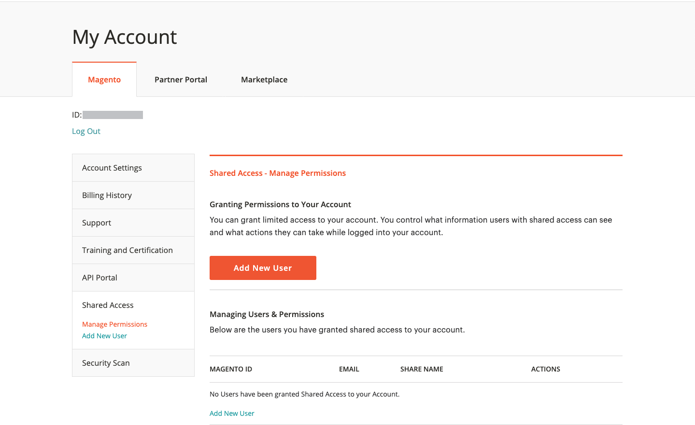
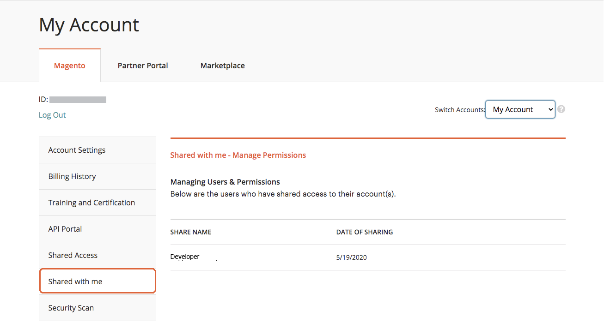
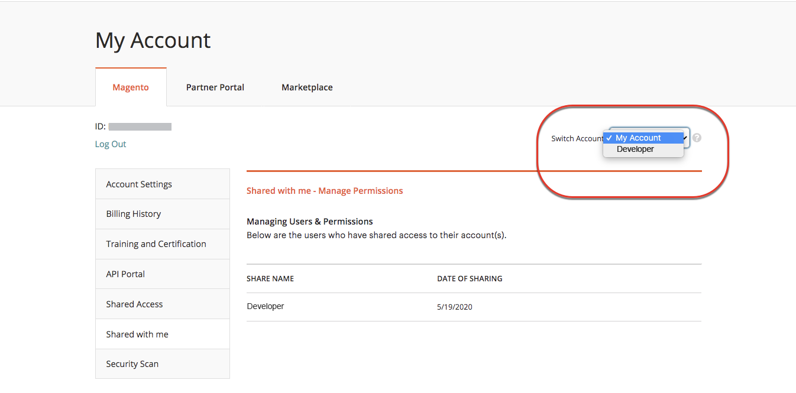
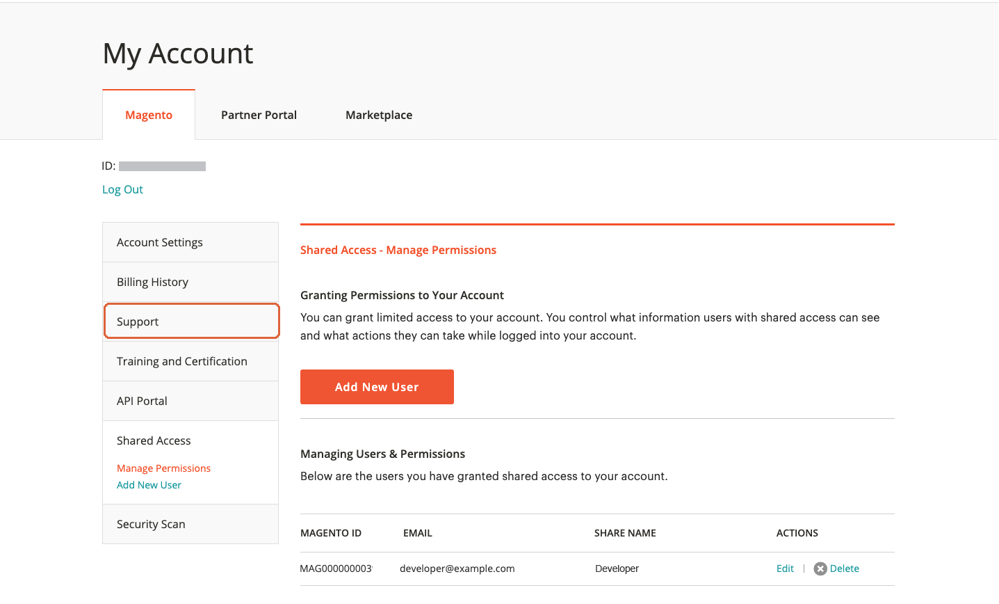

# 共用 [!DNL Commerce] 帳戶

您的 [!DNL Commerce] 帳戶包含可供受信任員工和協助管理網站的服務提供者使用的資訊。 作為主要帳戶持有人，您有權授予其他人的有限存取權 [!DNL Commerce] 帳戶持有人。 共用的存取權可以撤銷，但無法從一個使用者轉讓給另一個使用者。

此 [!DNL Commerce] 支援團隊沒有帳戶的存取權，也無法為您設定共用存取權。 只有具有適當許可權的主要帳戶持有人才能設定共用存取權。 共用您的帳戶時，所有敏感資訊（例如帳單記錄或信用卡資訊）都會受到保護，且不會隨時與其他使用者共用。

>[!NOTE]
>
>具有共用存取許可權的使用者所採取的所有動作，都是主要帳戶持有者的全權責任。 對於已共用您帳戶存取許可權的使用者所執行的任何動作，Adobe概不負責。

{width="600" zoomable="yes"}

## 設定共用帳戶

1. 開始之前，請先從 [!DNL Commerce] 的帳戶 **新的共用存取許可權受權者**：

   - 使用者必須已在account.adobe.com註冊帳戶，並透過account.magento.com登入。
   - 此 `Account ID` 顯示在左上角的 _[!UICONTROL Magento]_標籤，在正上方&#x200B;**登出**連結。
   - 此 `Email` 與帳戶相關聯的地址。

1. 登入您的 [[!DNL Commerce] 帳戶](commerce-account-create.md).

1. 在左側導覽面板中，按一下 **[!UICONTROL Shared Access]**.

1. 按一下 **[!UICONTROL Add New User]**.

   {width="600" zoomable="yes"}

1. 在 [!UICONTROL _New User Information]_，請執行下列動作：

   - 輸入 **[!UICONTROL Account ID]** 來自新使用者的 [!DNL Commerce] 帳戶。
   - 輸入 **[!UICONTROL Email]** 與新使用者的關聯位址 [!DNL Commerce] 帳戶。

   {width="600"}

1. 在 _[!UICONTROL Shared Information]_，請執行下列動作：

   - 若要識別共用帳戶，請輸入 **[!UICONTROL Share Name]**. 此名稱僅供內部參考，僅供您及共用您帳戶的人檢視。 (請勿輸入開頭為的共用名稱 `CLOUD SHARED ACCESS FROM MAG XYX`.)
   - 如果您想要與新使用者共用您的個人聯絡資訊，請輸入 **[!UICONTROL Your Email]** 和 **[!UICONTROL Your Phone]**.

1. 在 _[!UICONTROL Grant Account Permissions]_，勾選每個核取方塊 [!DNL Commerce] 您要共用的產品和服務。

   {width="600"}

1. 完成後，按一下 **[!UICONTROL Create Shared Access]**.

   新使用者資訊會出現在 _[!UICONTROL Manage Permissions]_「共用存取」頁面的區段，以及內含存取共用帳戶指示的電子郵件邀請會傳送給新使用者。

   {width="600" zoomable="yes"}

## 存取共用帳戶

下列指示是從收到共用帳戶邀請的共用使用者的角度編寫的。

1. 當您收到共用帳戶的邀請時，請依照電子郵件中的指示，登入您自己的帳戶 [!DNL Commerce] 帳戶。

   您帳戶的左側導覽面板有一個 _[!UICONTROL Shared with me]_標籤。 此_[!UICONTROL Switch Accounts]_ 右上角的控制項有 `My Account` 和共用帳戶的名稱。

   {width="600" zoomable="yes"}

1. 若要取得共用帳戶的存取權，請設定 **[!UICONTROL Switch Accounts]** 至共用帳戶的名稱。

   {width="600" zoomable="yes"}

   共用帳戶會顯示歡迎訊息和連絡資訊。 左側導覽面板僅包含您有權使用的專案。

1. 若要將共用帳戶連線至說明中心，請按一下 **[!UICONTROL Support]** 共用帳戶的左側導覽面板中。

   {width="600" zoomable="yes"}

   您可以使用 [Adobe Commerce說明中心](https://experienceleague.adobe.com/docs/commerce-knowledge-base/kb/overview.html) 從共用帳戶中搜尋文章和疑難排解資訊、尋找已知問題的修補程式，以及建立支援票證。

   >[!NOTE]
   >
   >收到共用存取許可權後，使用者必須登入其 [[!DNL Commerce] 帳戶](https://account.magento.com/customer/account/login)，導覽至 _共用存取_，然後按一下 **[!UICONTROL Support]** 標籤。 此動作僅在第一次為必要，以確保 [Adobe Commerce支援知識庫](https://experienceleague.adobe.com/docs/commerce-knowledge-base/kb/overview.html) 已透過 `SSO` 呼叫。

1. 若要返回您自己的帳戶，請按一下 **返回** 在您的瀏覽器中控制並設定 **[!UICONTROL Switch Accounts]** 至 `My Account`.

## 撤銷共用存取權

1. 登入您的Commerce帳戶。

1. 在左側導覽面板中，按一下 **[!UICONTROL Shared Access]**.

1. 尋找要撤銷的帳戶 _[!UICONTROL Managing Users & Permissions]_並按一下&#x200B;**[!UICONTROL Delete]**.

   >[!NOTE]
   >
   > 如果  **[!UICONTROL Delete]** 不會顯示，檢查是否會 **[!UICONTROL Share Name]** 開頭為 `Cloud Shared Access from MAG XYZ` - [這些帳戶](https://experienceleague.adobe.com/docs/commerce-knowledge-base/kb/help-center-guide/magento-help-center-user-guide.html?lang=en#remove-cloud-shared-access-users) 無法刪除。
   > 
   > 若是如此，請要求帳戶擁有者修改共用存取帳戶並清除帳戶許可權。 更新後，使用者將無法共用任何資源的存取權。
   >
   > 此外，請確定已將使用者從專案移除，以便他們不再收到電子郵件通知： [前團隊成員會收到Adobe Commerce雲端通知電子郵件](https://experienceleague.adobe.com/docs/commerce-knowledge-base/kb/troubleshooting/miscellaneous/former-teammembers-receive-cloud-notification-emails.html)

1. 提示確認時，按一下 **[!UICONTROL Delete User]**.

>[!NOTE]
>
>您無法刪除共用名稱為的使用者 _來自MAG的雲端共用存取[XYZ]_ 在此介面中。 如需詳細資訊，請參閱 [如何刪除透過雲端專案獲得共用存取許可權的使用者？](https://experienceleague.adobe.com/docs/commerce-knowledge-base/kb/help-center-guide/magento-help-center-user-guide.html?lang=en#remove-cloud-shared-access-users).
