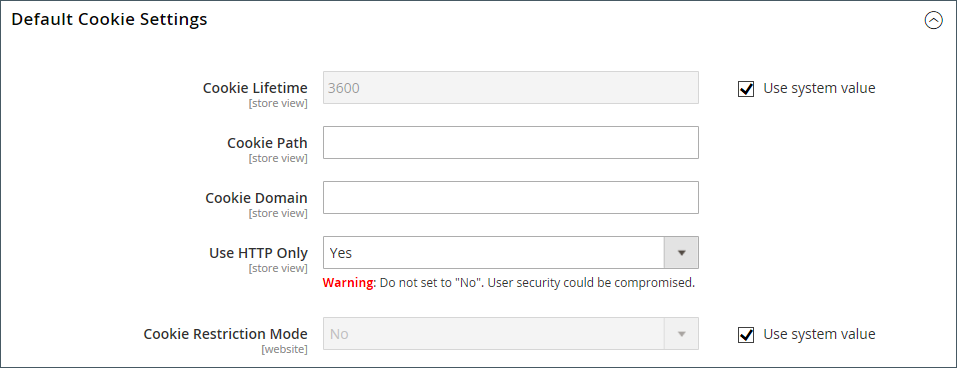

# Cookie法規遵循

Cookie是儲存在網站每位訪客的電腦中，並作為資訊的暫存地點的小檔案。 儲存在Cookie中的資訊可用來個人化購物體驗、將訪客連結至其購物車、測量流量模式，以及改善促銷活動的有效性。 為了跟上許多國家/地區有關使用Cookie的法規，Adobe Commerce和Magento Open Source為商家提供多種取得客戶同意的方法。 如需Adobe Commerce和Magento Open Source中的預設Cookie清單，[Cookie參考](#default-cookies)。

>[!NOTE]
>
>如果您修改預設的[Google隱私權設定](../merchandising-promotions/google-tools.md#google-privacy-settings)以符合[一般資料保護規範](compliance-gdpr.md)，則使用Google Analytics Cookie時不需要取得使用者同意。

## Cookie限制模式

啟用Cookie限制模式時，系統會通知您商店的訪客，要求使用Cookie才能進行完整功能的操作。 根據您的佈景主題，訊息可能會顯示在頁首上方、頁尾下方或頁面上的其他位置。 此訊息會連結至您的隱私權政策，以取得詳細資訊，並鼓勵訪客按一下「允許」按鈕來授予同意。 取得同意後，訊息會消失。

您的[隱私權原則](privacy-policy.md))應包含商店名稱和連絡資訊，並說明商店使用的每個Cookie的用途。 若要深入瞭解，請參閱[Cookie參考](#default-cookies)。

>[!NOTE]
>
>如果您變更隱私權原則的URL金鑰，您也必須建立自訂URL重寫，以將流量重新導向至新的URL金鑰。 否則，Cookie限制模式訊息中的連結會傳回`404 Page Not Found`。

{width="600"}

### 步驟1：啟用Cookie限制模式

1. 在&#x200B;_管理員_&#x200B;側邊欄上，移至&#x200B;**[!UICONTROL Stores]** > _[!UICONTROL Settings]_>**[!UICONTROL Configuration]**。

1. 在左側導覽面板的&#x200B;**[!UICONTROL General]**&#x200B;下，選擇&#x200B;**[!UICONTROL Web]**。

1. 展開&#x200B;**[!UICONTROL Default Cookie Settings]**&#x200B;區段並執行下列動作：

   {width="600"}

   - 以秒為單位輸入&#x200B;**[!UICONTROL Cookie Lifetime]**。

   - 如果您要讓Cookie可供其他資料夾使用，請輸入&#x200B;**[!UICONTROL Cookie Path]**。 若要讓Cookie在網站的任何位置都可使用，請輸入正斜線(`/`)。 此值只能包含Cookie路徑，且&#x200B;**_不能_**&#x200B;包含任何其他Cookie引數。

   - 若要讓Cookie可用於子網域，請在&#x200B;**[!UICONTROL Cookie Domain]**&#x200B;欄位(`subdomain.yourdomain.com`)中輸入子網域名稱。 若要讓Cookie可用於所有子網域，請輸入開頭為句點(`.yourdomain.com`)的網域名稱。 此值只能包含Cookie網域，且&#x200B;**_不能_**&#x200B;包含任何其他Cookie引數。

   - 若要防止指令碼語言(例如JavaScript)存取Cookie，請確定&#x200B;**僅使用HTTP**&#x200B;設定為`Yes`。

   - 將&#x200B;**[!UICONTROL Cookie Restriction Mode]**&#x200B;設為`Yes`。

     如有必要，請清除核取方塊，然後按一下&#x200B;**[!UICONTROL OK]**&#x200B;以確認範圍切換。

1. 完成時，按一下&#x200B;**[!UICONTROL Save Config]**。

1. 當系統提示您更新快取時，請按一下系統訊息中的&#x200B;**[!UICONTROL Cache Management]**&#x200B;連結，並重新整理每個無效的快取。

### 步驟2：更新您的隱私權原則

更新您的[隱私權原則](privacy-policy.md)，以反映貴公司收集的資訊及使用方式。

## 預設Cookie

Adobe Commerce和Magento Open Source中的預設Cookie會分類為「劐免/不劐免」，以協助商家符合隱私權法規（例如[GDPR](compliance-gdpr.md)）的要求。 商戶應將此資訊作為指引，並諮詢法律顧問，以更新其隱私權和Cookie政策，作為全面隱私權法規遵循策略的一部分。

[!DNL Commerce]會將下列Cookie用於內部部署和雲端安裝，且此為立即可用。 客戶明確要求的功能可能會需要這些Cookie。 若要深入瞭解工作階段Cookie的存留期，請參閱[工作階段存留期](../customers/customer-online-options.md)。

其中一些Cookie可能會視需要提供設定選項，包括啟用/停用。

### 要求的功能Cookie （免費）

#### `add_to_cart`

 (僅限Adobe Commerce)擷取從購物車移除的產品SKU、名稱、價格和數量。 讓Google Analytics知道產品已新增至購物車的時間。

#### `guest-view`

將來賓訂單連結至來賓（因為沒有來賓帳戶）。 為了維持系統穩定性，請勿停用此Cookie。

#### `login_redirect`

儲存重新導向URL，以便在成功登入及使用者註冊時路由使用者。 儲存使用者在登入前所在的頁面（以決定使用者在登入後會返回的位置）。

#### `mage-banners-cache-storage`

 (僅限Adobe Commerce)橫幅功能的本機儲存。 將橫幅內容儲存在本機以改善效能。 橫幅內容包括一般網站資產，可向購物者顯示資訊。 為了維持系統穩定性，請勿停用此Cookie。

#### `mage-messages`

追蹤顯示給使用者的錯誤訊息和其他通知，例如Cookie同意訊息和各種錯誤訊息。 訊息向購物者顯示後，就會從Cookie中刪除。 沒有選項可停用此Cookie。 這就是將一次性資訊（例如錯誤訊息）傳達給使用者的方式。 為了維持系統穩定性，請勿停用此Cookie。

#### `product_data_storage` （本機儲存體）

儲存用於使用「最近檢視」和「比較產品」功能的產品資料設定。 儲存使用者的特定設定（例如，如果他們最近檢視過產品或比較過產品）。 為了維持系統穩定性，請勿停用此Cookie。

#### `recently_compared_product` （本機儲存體）

儲存最近比較產品的產品ID。 為了維持系統穩定性，請勿停用此Cookie。

#### `recently_compared_product_previous` （本機儲存體）

儲存先前比較產品的產品ID以方便瀏覽。 為了維持系統穩定性，請勿停用此Cookie。

#### `recently_viewed_product` （本機儲存體）

儲存最近檢視之產品的產品ID以方便瀏覽。 為了維持系統穩定性，請勿停用此Cookie。

#### `recently_viewed_product_previous` （本機儲存體）

儲存最近檢視之產品的產品ID以方便瀏覽。 為了維持系統穩定性，請勿停用此Cookie。

#### `remove_from_cart`

 (僅限Adobe Commerce)允許Google Analytics知道產品已從購物車移除的時間。

#### `stf`

記錄SendFriend （[傳送電子郵件給Friend](../stores-purchase/email-a-friend.md)）模組傳送訊息的時間。 當購物者傳送連結至產品時，此Cookie會記錄時間戳記並維護計數。

#### `X-Magento-Vary`

表示需要從快取中提供新版本的頁面。 支援網站效能。 為了維持系統穩定性，請勿停用此Cookie。

#### `form_key`

一種安全性機制，可保留隨機產生的值，以協助判斷要求來自正版來源還是來自不良執行者，藉此避免跨網站要求偽造攻擊(CSRF)。 這是防止CSRF攻擊的業界標準做法。 為了維持系統穩定性，請勿停用此Cookie。

#### `mage-cache-sessid`

在判斷工作階段到期後何時清理瀏覽器中的本機存放區時，這個變數很有用。 這是用來判斷本機存放區是否必須清除。 缺少此Cookie會觸發本機儲存清理。 為了維持系統穩定性，請勿停用此Cookie。

#### `mage-cache-storage`

訪客特定內容的本機儲存，可啟用電子商務功能。 預設為未使用，但在使用時，會用於加快結帳速度，以便在有人離開並返回時可以使用基本的使用者資訊。 為了維持系統穩定性，請勿停用此Cookie。

#### `mage-cache-storage-section-invalidation`

儲存與頁面的哪些區段需要失效和移除相關的資訊。 為了維持系統穩定性，請勿停用此Cookie。

#### `persistent_shopping_cart`

儲存永久性購物車的金鑰ID，以便能夠為匿名購物者還原購物車。 為了維持系統穩定性，請勿停用此Cookie。

#### `private_content_version`

將隨機、唯一的數字和時間附加至包含客戶內容的頁面，以防止在伺服器上快取這些頁面。 它設定在多個位置：在PHP中、在JavaScript中作為Cookie，以及在JavaScript中設定為本機儲存。 為了維持系統穩定性，請勿停用此Cookie。

#### `section_data_ids`

儲存與購物者啟動動作相關的客戶特定資訊，例如願望清單顯示和結帳資訊。 為了維持系統穩定性，請勿停用此Cookie。

#### `store`

追蹤購物者選取的特定商店檢視/地區設定。 為了維持系統穩定性，請勿停用此Cookie。

#### `PHPSESSID`

追蹤店面上的使用者工作階段。 這是使用最終產品的購物者。 為了維持系統穩定性，請勿停用此Cookie。

#### `admin`

在管理員端追蹤使用者工作階段。 為了維持系統穩定性，請勿停用此Cookie。

#### `loggedOutReasonCode`

設定當管理員使用者在嘗試密碼幾次失敗後遭到鎖定時。

#### `section_data_clean`

當使用者切換儲存檢視時設定。 出現此Cookie會觸發JavaScript重新載入頁面上的某些區段，以反映正確的存放區檢視。 為了維持系統穩定性，請勿停用此Cookie。

#### `lang`

由Admin Analytics模組間接設定 僅用於商店的管理區域。 不適用於購物者。 為了維持系統穩定性，請勿停用此Cookie。

#### `s_fid`

由Admin Analytics模組間接設定 備援不重複訪客ID時間/日期戳記。 如果標準的`s_vi` Cookie因第三方Cookie限制而無法取用，此資訊可用於識別不重複訪客。 僅用於商店的管理區域。 不適用於購物者。 為了維持系統穩定性，請勿停用此Cookie。

#### `s_cc`

由Admin Analytics模組間接設定 它是由JavaScript程式碼設定和讀取，以判斷是否已啟用Cookie。 僅用於商店的管理區域。 不適用於購物者。 為了維持系統穩定性，請勿停用此Cookie。

#### `apt.sid`

由Admin Analytics模組間接使用的Gainsight PX程式庫設定。 此Cookie的目的是允許在產品的最上層網域下追蹤持續工作階段ID，並作為作用中工作階段的參考ID。 僅用於商店的管理區域。 不適用於購物者。 為了維持系統穩定性，請勿停用此Cookie。

#### `apt.uid`

由Admin Analytics模組間接使用的Gainsight PX程式庫設定。 此Cookie的目的是允許在產品的最上層網域底下進行永久性ID追蹤，並作為使用者實體的參考ID使用。 僅用於商店的管理區域。 不適用於購物者。 為了維持系統穩定性，請勿停用此Cookie。

#### `s_sq`

由Admin Analytics模組間接設定 用於ClickMap功能，可收集訪客點按位置及點按內容的資料。 儲存每次點按的資訊。 僅用於商店的管理區域。 不適用於購物者。 為了維持系統穩定性，請勿停用此Cookie。

#### `pagebuilder_modal_dismissed`

由頁面產生器模組設定。 包含旗標，可防止在管理員之前明確解除某個動作時，後續提示要求管理員確認該動作是否開啟。 僅用於商店的管理區域。 不適用於購物者。

#### `pagebuilder_template_apply_confirm`

由頁面產生器模組設定。 包含旗標，可防止在管理員之前明確解除某個動作時，後續提示要求管理員確認該動作是否開啟。 僅用於商店的管理區域。 不適用於購物者。

#### `accordion-{VARIABLE}-{VARIABLE}`

僅作為存放區管理區域中索引標籤功能實作的一部分使用。 不適用於購物者。

## 產品推薦Cookie

 (僅限Adobe Commerce)下列Cookie是由Adobe Commerce客戶的產品推薦所使用。 這些Cookie與[DataServices模組](https://experienceleague.adobe.com/en/docs/commerce/product-recommendations/getting-started/install-configure)一起安裝。

- `mg_dnt`：如果您有管理網站上之Cookie同意的自訂程式碼，可讓您[限制Adobe Commerce資料收集](https://experienceleague.adobe.com/en/docs/commerce/product-recommendations/developer/setting-cookie)。
- `user_allowed_save_cookie`：用於[Cookie限制模式](#cookie-restriction-mode)。
- `authentication_flag`：指出購物者是否已登入或登出。 此Cookie與`dataservices_customer_id` Cookie同時更新。
- `dataservices_customer_id`：指出購物者是否已登入或登出。 此Cookie包含系統中的客戶唯一ID。
- `dataservices_customer_group`：表示客戶的群組。 此Cookie儲存為客戶群組識別碼的[sha1](https://en.wikipedia.org/wiki/SHA-1)總和檢查碼。
- `dataservices_cart_id`：識別購物者的購物車動作。 此Cookie包含系統中客戶的唯一購物車ID。
- `dataservices_product_context`：識別購物者的產品互動。 此Cookie包含系統中客戶的唯一報價ID。

### 產品推薦本機儲存體資料

安裝「即時搜尋」或「產品建議」時，系統會使用Luma主題，將下列資料儲存至本機儲存空間以供存放區使用：

- `ds-cart`：儲存Luma特定功能的購物車資訊
- `ds-cart-order`：儲存購物車功能的訂單資訊
- `ds-purchase-history`：追蹤客戶購買記錄
- `ds-view-history-time-decay`：以時間型衰減儲存產品檢視記錄
- `ds-logged-in`：表示客戶登入狀態。 此資料只有在客戶登入時存在，並會在啟用Cookie限制模式時儲存。 這是啟用Cookie限制模式時，Commerce儲存在本機儲存空間中的唯一資料，無論使用者同意狀態為何。

## 其他Cookie

 (僅限Adobe Commerce)已為Adobe Commerce客戶設定下列Cookie。 這些Cookie與[DataServices模組](https://experienceleague.adobe.com/en/docs/commerce/product-recommendations/getting-started/install-configure)一起安裝。

- `mg`：由Snowplow JavaScript追蹤器設定。 如需詳細資訊，請參閱[雪犁檔案](https://docs.snowplow.io/docs/sources/trackers/javascript-trackers/web-tracker/tracker-setup/initialization-options/)。
- `com.adobe.alloy.getTld`：根據目前網頁的主機名稱，這是不是如https://publicsuffix.org中所述「公用字尾」的最上層網域。 基本上，這是可以接受Cookie的最上層網域。 此Cookie是[Alloy Web SDK](https://github.com/adobe/alloy)的一部分。

[1]: https://developers.google.com/analytics/devguides/collection/analyticsjs/cookie-usage
[2]: https://support.google.com/adwords/answer/7521212
