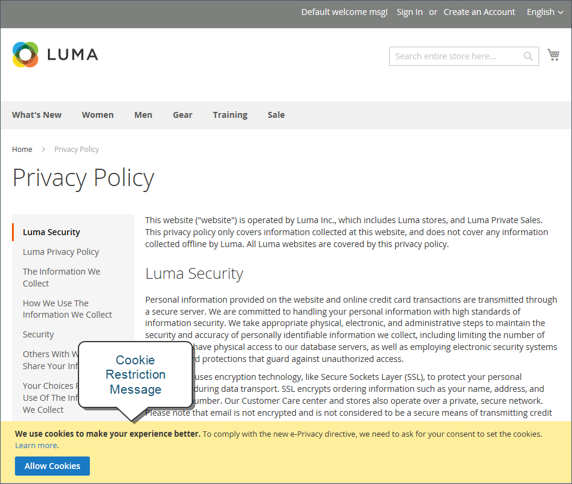

# Cookie法規遵循

Cookie是儲存在網站每位訪客的電腦中，並作為資訊的暫存地點的小檔案。 儲存在Cookie中的資訊可用來個人化購物體驗、將訪客連結至其購物車、測量流量模式，以及改善促銷活動的有效性。 為了跟上許多國家/地區有關使用Cookie的法規，Adobe Commerce和Magento Open Source為商家提供多種取得客戶同意的方法。 如需Adobe Commerce和Magento Open Source的預設Cookie清單， [Cookie參考](#default-cookies).

>[!NOTE]
>
>如果您修改預設值 [Google隱私權設定](../merchandising-promotions/google-tools.md#google-privacy-settings) 以遵守 [一般資料保護規範](compliance-gdpr.md)，就使用Google AnalyticsCookie而言，不需要取得使用者同意。

## 方法1：默示同意

默示同意表示您商店的訪客已清楚瞭解Cookie是作業的必要部分，而使用您的網站即間接授與使用這些內容的許可權。 取得隱含同意的關鍵是提供足夠的資訊讓訪客做出明智的決定。 許多商店會在所有標準頁面頂端顯示訊息，概要說明Cookie的使用方式，並附上商店隱私權政策的連結。 隱私權原則應說明您的商店收集到的資訊型別及其使用方式。

## 方法2：表示同意

營運您的商店於 _Cookie限制模式_ 訪客必須先表達同意，才能將任何Cookie儲存至其電腦。 除非獲得同意，否則您商店的許多功能都無法使用。 例如，如果Google Analytics可供您的商店使用，則只有在訪客授予使用Cookie的許可權後，才能叫用該量度。

## Cookie限制模式

啟用Cookie限制模式時，系統會通知您商店的訪客，要求使用Cookie才能進行完整功能的操作。 根據您的佈景主題，訊息可能會顯示在頁首上方、頁尾下方或頁面上的其他位置。 此訊息會連結至您的隱私權政策，以取得詳細資訊，並鼓勵訪客按一下「允許」按鈕來授予同意。 取得同意後，訊息會消失。

您的 [隱私權原則](privacy-policy.md))應包含商店名稱和聯絡資訊，並說明商店所使用的每個Cookie用途。 若要深入瞭解，請參閱 [Cookie參考](#default-cookies).

>[!NOTE]
>
>如果您變更隱私權原則的URL金鑰，您也必須建立自訂URL重寫，以將流量重新導向至新的URL金鑰。 否則，Cookie限制模式訊息中的連結會傳回 `404 Page Not Found`.

{width="600"}

### 步驟1：啟用Cookie限制模式

1. 在 _管理員_ 側欄，前往 **[!UICONTROL Stores]** > _[!UICONTROL Settings]_>**[!UICONTROL Configuration]**.

1. 在左側導覽面板中的 **[!UICONTROL General]**，選擇 **[!UICONTROL Web]**.

1. 展開 **[!UICONTROL Default Cookie Settings]** 並執行下列動作：

   {width="600"}

   - 輸入 **[!UICONTROL Cookie Lifetime]** 以秒為單位。

   - 如果您想要讓Cookie可供其他資料夾使用，請輸入 **[!UICONTROL Cookie Path]**. 若要讓Cookie在網站的任何位置都可使用，請輸入正斜線(`/`)。 此值只能包含Cookie路徑，並且 **_無法_** 包含任何其他Cookie引數。

   - 若要讓Cookie可用於子網域，請在 **[!UICONTROL Cookie Domain]** 欄位(`subdomain.yourdomain.com`)。 若要讓Cookie可用於所有子網域，請輸入前面有句號(`.yourdomain.com`)。 此值只能包含Cookie網域，且 **_無法_** 包含任何其他Cookie引數。

   - 若要防止指令碼語言（例如JavaScript）存取Cookie，請確定 **僅使用HTTP** 設為 `Yes`.

   - 設定 **[!UICONTROL Cookie Restriction Mode]** 至 `Yes`.

     如有必要，請清除核取方塊並按一下 **[!UICONTROL OK]** 以確認範圍切換。

1. 完成後，按一下 **[!UICONTROL Save Config]**.

1. 提示更新快取時，按一下 **[!UICONTROL Cache Management]** 連結。 接著，重新整理每個無效的快取。

### 步驟2：更新您的隱私權原則

更新您的 [隱私權原則](privacy-policy.md) 以便反映貴公司所收集到的資訊及其使用方式。

## 預設Cookie

Adobe Commerce和Magento Open Source中的預設Cookie會分類為劐免/不劐免，以協助商家符合隱私權法規的要求，例如 [GDPR](compliance-gdpr.md). 商戶應將此資訊作為指引，並諮詢法律顧問，以更新其隱私權和Cookie政策，作為全面隱私權法規遵循策略的一部分。

下列Cookie是由 [!DNL Commerce] 開箱即用，適用於內部部署和雲端安裝。 客戶明確要求的功能可能會需要這些Cookie。 若要瞭解工作階段Cookie的存留期，請參閱 [工作階段存留期](../customers/customer-online-options.md).

其中一些Cookie可能會視需要提供設定選項，包括啟用/停用。

### 要求的功能Cookie （免費）

#### `add_to_cart`

 (僅限Adobe Commerce)由Google Tag Manager使用。 擷取從購物車移除的產品SKU、名稱、價格和數量，並讓該資訊可供第三方指令碼未來整合。

#### `guest-view`

儲存訪客購物者用來擷取其訂單狀態的訂單ID。 訪客訂單檢視。 使用位置 _[!DNL Orders and Returns]_Widget.

- 是否安全？ 否
- 僅限HTTP：是
- 到期原則：工作階段
- 模組： `Magento_Sales`

#### `login_redirect`

保留在導向客戶登入之前載入的目的地頁面。 如果符合以下條件，則登入客戶可搭配「迷你購物車」使用登入重新導向： [顯示迷你購物車](../stores-purchase/cart-configuration.md#mini-cart) 組態選項設為 `Yes`.

- 是否安全？ 否
- 僅限HTTP：否
- 到期原則：工作階段
- 模組： `Magento_Customer`

#### `mage-banners-cache-storage`

 (僅限Adobe Commerce)將橫幅內容儲存在本機，以提升效能。

#### `mage-messages`

追蹤顯示給使用者的錯誤訊息和其他通知，例如Cookie同意訊息和各種錯誤訊息。 訊息向購物者顯示後，就會從Cookie中刪除。

沒有選項可停用此Cookie。

- 是否安全？ 否
- 僅限HTTP：否
- 到期原則：持續時間1年。 對使用者顯示訊息時，已在前端清除。
- 模組： `Magento_Theme`

#### `mage-translation-storage` （本機儲存）

當購物者要求時儲存翻譯的內容。 使用時機 [翻譯策略](../configuration-reference/advanced/developer.md) 設為「字典（店面翻譯）」。

- 是否安全？ 否
- 僅限HTTP：否
- 到期原則：每個本機儲存體規則
- 模組： `Magento_Translation`

#### `mage-translation-file-version` （本機儲存）

追蹤本機儲存體中的翻譯版本。 使用時機 [翻譯策略](../configuration-reference/advanced/developer.md) 已設定為 `Dictionary (Translation on Storefront side)`.

- 是否安全？ 否
- 僅限HTTP：否
- 到期原則：每個本機儲存體規則
- 模組： `Magento_Translation`

#### `product_data_storage` （本機儲存）

儲存與最近檢視/比較的產品相關的產品資料設定。

- 是否安全？ 否
- 僅限HTTP：否
- 到期原則：每個本機儲存體規則
- 模組： `Magento_Catalog`

#### `recently_compared_product` （本機儲存）

儲存最近比較產品的產品ID。

- 是否安全？ 否
- 僅限HTTP：否
- 到期原則：每個本機儲存體規則
- 模組： `Magento_Catalog`

#### `recently_compared_product_previous` （本機儲存）

儲存先前比較產品的產品ID以方便瀏覽。

- 是否安全？ 否
- 僅限HTTP：否
- 到期原則：每個本機儲存體規則
- 模組： `Magento_Catalog`

#### `recently_viewed_product` （本機儲存）

儲存最近檢視之產品的產品ID以方便瀏覽。

- 是否安全？ 否
- 僅限HTTP：否
- 到期原則：每個本機儲存體規則
- 模組： `Magento_Catalog`

#### `recently_viewed_product_previous` （本機儲存）

儲存最近檢視過產品的產品ID，方便瀏覽。

- 是否安全？ 否
- 僅限HTTP：否
- 到期原則：每個本機儲存體規則
- 模組： `Magento_Catalog`

#### `remove_from_cart`

 (僅限Adobe Commerce)使用者 [Google Tag Manager](../merchandising-promotions/google-tag-manager.md). 擷取新增到購物車的產品SKU、名稱、價格和數量，並讓該資訊可供第三方指令碼未來整合。

#### `stf`

記錄SendFriend傳送訊息的時間([傳送電子郵件給朋友](../stores-purchase/email-a-friend.md))模組。

- 是否安全？ 是
- 僅限HTTP：是
- 到期原則：工作階段
- 模組： `Magento_SendFriend`

#### `X-Magento-Vary`

組態設定可改善使用清漆靜態內容快取時的效能。

- 是否安全？ 是
- 僅限HTTP：是
- 到期原則：根據PHP設定session.cookie_lifetime
- 模組： `Magento_PageCache`

#### `form_key`

一種安全性措施，可在所有表單提交中附加隨機字串，以保護資料免受跨網站請求偽造(CSRF)的影響。

- 是否安全？ 否
- 僅限HTTP：否
- 到期原則：
   - PHP：根據PHP設定session.cookie_lifetime
   - JS：工作階段
- 模組：頁面快取

#### `mage-cache-sessid`

此Cookie的值會觸發本機快取存放區的清理。 當後端應用程式移除Cookie時，管理員會清理本機儲存空間，並將Cookie值設為 `true`.

- 是否安全？ 否
- 僅限HTTP：否
- 到期原則：工作階段
- 模組： `Magento_Customer`

#### `mage-cache-storage`

訪客特定內容的本機儲存，可啟用電子商務功能。

- 是否安全？ 否
- 僅限HTTP：否
- 到期原則：工作階段
- 模組： `Magento_Customer`， `Magento_Persistent`

#### `mage-cache-storage` （本機儲存）

訪客特定內容的本機儲存，可啟用電子商務功能。

- 是否安全？ 否
- 僅限HTTP：否
- 到期原則：工作階段
- 模組： `Magento_Customer`， `Magento_Persistent`， `Magento_NegotiableQuote`

#### `mage-cache-storage-section-invalidation` （本機儲存）

強制本機儲存應失效的特定內容區段。

- 是否安全？ 否
- 僅限HTTP：否
- 到期原則：每個本機儲存體
- 模組： `Magento_Customer`

#### `persistent_shopping_cart`

儲存永久性購物車的金鑰(ID)，以便能夠為匿名購物者還原購物車。

- 是否安全？ 是
- 僅限HTTP：是
- 到期原則：根據 [永久購物車](../stores-purchase/cart-persistent.md)  — 持續存在期限（秒）設定
- 模組： `Magento_Persistent`

#### `private_content_version`

將隨機、唯一的數字和時間附加至包含客戶內容的頁面，以防止在伺服器上快取這些頁面。

它設定在多個位置：在PHP中、在JavaScript中作為Cookie，以及在JavaScript中設定到本機儲存體。

僅適用於HTTP=`Yes` （根據要求），這表示Cookie在HTTPS要求期間設定時是安全的，而在HTTP要求期間設定時則是不安全的。

- 是否安全？ `Yes` （根據要求）， `No`
- 僅限HTTP： `No`
- 到期原則：根據 [永久購物車](../stores-purchase/cart-persistent.md)  — 持續存在期限（秒）設定
   - PHP： `1` 年/ `315360000s` （10年）
   - JS： `1` 天
   - JS本機儲存體：每個本機儲存體規則（永久）
- 模組： `Magento_PageCache`， `Magento_Customer`

#### `section_data_ids`

儲存與購物者啟動動作相關的客戶特定資訊，例如願望清單顯示和結帳資訊。

- 是否安全？ `No`
- 僅限HTTP： `No`
- 到期原則： `Session`
- 模組： `Magento_Customer`

#### `store`

追蹤購物者選取的特定商店檢視/地區設定。

- 是否安全？ `No`
- 僅限HTTP： `Yes`
- 到期原則： `1` 年
- 模組： `Magento_Store`

#### `mage-banners-cache-storage`  — 本機儲存

 (僅限Adobe Commerce)橫幅功能的本機儲存。

- 是否安全？ `No`
- 僅限HTTP： `No`
- 到期原則：每個本機儲存體規則
- 模組： `Magento_Banner`

## Google AnalyticsCookie

下列Cookie使用時機 [Google Analytics](../merchandising-promotions/google-analytics.md) 或您已完全啟用Google Universal Analytics來進行安裝。 若要停用這些Cookie以符合隱私權法規，請參閱 [Google隱私權設定](../merchandising-promotions/google-tools.md#google-privacy-settings). 若要深入瞭解，請參閱 [網站上的Google Analytics Cookie使用情形][1].

### Google Universal Analytics Cookie — 非劐免

 (僅限Adobe Commerce) JavaScript資料庫： `gtag.js` 和 `analytics.js`

- `_ga`：區分網站的訪客。
- `_gid`：區分網站的訪客。
- `gat`：用於節流要求速率。
- `dc_gtm_<property-id>`：使用部署Google Analytics時節流請求率 [Google Tag Manager](../merchandising-promotions/google-tag-manager.md).
- `AMP_TOKEN`：包含可用來從AMP使用者端ID服務擷取使用者端ID的權杖。 其他可能的值包括選擇退出、即時要求，或從AMP使用者端ID服務擷取使用者端ID時發生錯誤。
- `_gac_<property-id>`：包含使用者的促銷活動相關資訊。 Google如果Google Analytics連結至您的 [AdWords][2] 帳戶。

### Google AnalyticsCookie — 非劐免

 (僅限Adobe Commerce) JavaScript程式庫： `ga.js`

- `__utma`：區分購物者和工作階段。 此Cookie是在JavaScript程式庫執行時建立的，而且不存在任何 `__utma` Cookie。 每次將資料傳送至Google Analytics時，Cookie都會更新。
- `__utmt`：用於節流要求速率。
- `__utmb`：決定新的工作階段/造訪。 此Cookie是在JavaScript程式庫執行時建立的，而且不存在任何 `__utmb` Cookie。 每次將資料傳送至Google Analytics時，Cookie都會更新。
- `_utmz`：儲存流量來源或行銷活動，說明購物者如何到達您的網站。 Cookie會在JavaScript程式庫執行時建立，並會在每次將資料傳送至Google Analytics時更新。
- `__utmv`：儲存訪客層級的自訂變數資料。 此Cookie是在開發人員使用 `_setCustomVar` 具有訪客層級自訂變數的方法。 每次將資料傳送至Google Analytics時，都會更新此Cookie。

## 產品Recommendations Cookie

 (僅限Adobe Commerce)產品Recommendations會為Adobe Commerce客戶使用下列Cookie。 這些Cookie會隨 [資料服務模組](https://experienceleague.adobe.com/docs/commerce-merchant-services/product-recommendations/getting-started/install-configure.html).

- `mg_dnt`：可讓您 [限制Adobe Commerce資料收集](https://experienceleague.adobe.com/docs/commerce-merchant-services/product-recommendations/developer/setting-cookie.html) 如果您有自訂程式碼來管理網站上的Cookie同意。
- `user_allowed_save_cookie`：用於 [Cookie限制模式](#cookie-restriction-mode).
- `authentication_flag`：指出購物者是否已登入或登出。 此Cookie會在更新的 `dataservices_customer_id` Cookie。
- `dataservices_customer_id`：指出購物者是否已登入或登出。 此Cookie包含系統中的客戶唯一ID。
- `dataservices_customer_group`：指出客戶的群組。 此Cookie會儲存為 [sha1](https://en.wikipedia.org/wiki/SHA-1) 客戶群組ID的總和檢查碼。
- `dataservices_cart_id`：識別購物者的購物車動作。 此Cookie包含系統中客戶的唯一購物車ID。
- `dataservices_product_context`：識別購物者的產品互動。 此Cookie包含系統中客戶的唯一報價ID。

## 其他Cookie

 (僅限Adobe Commerce)下列Cookie是針對Adobe Commerce客戶所設定。 這些Cookie會隨 [資料服務模組](https://experienceleague.adobe.com/docs/commerce-merchant-services/product-recommendations/getting-started/install-configure.html).

- `mg`：由Snowplow JavaScript追蹤器設定。 如需詳細資訊，請參閱 [Snowplow檔案](https://docs.snowplow.io/docs/collecting-data/collecting-from-own-applications/javascript-trackers/javascript-tracker/javascript-tracker-v3/tracker-setup/initialization-options).
- `com.adobe.alloy.getTld`：根據目前網頁的主機名稱，這是並非如https://publicsuffix.org中所述「公用尾碼」的最上層網域。 基本上，這是可以接受Cookie的最上層網域。 此Cookie是 [Alloy Web SDK](https://github.com/adobe/alloy).

[1]: https://developers.google.com/analytics/devguides/collection/analyticsjs/cookie-usage
[2]: https://support.google.com/adwords/answer/7521212
