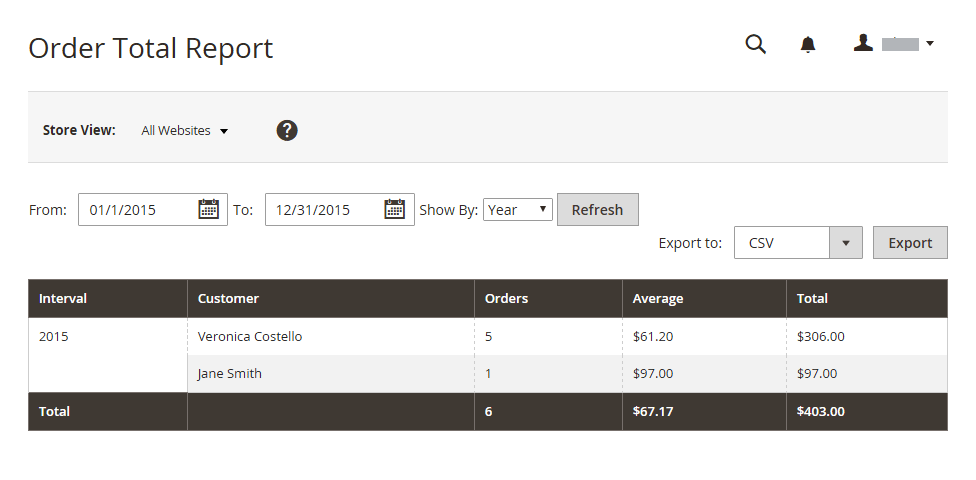
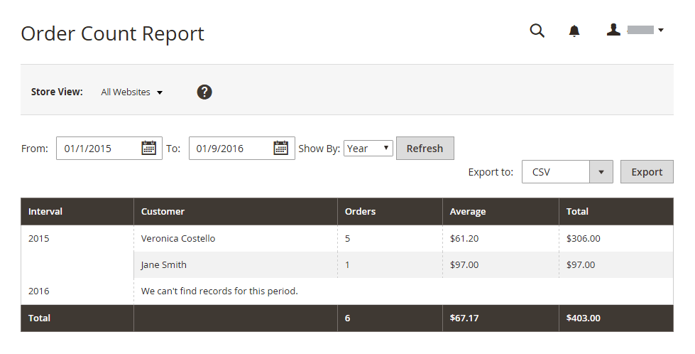

# 客戶報表

客戶報表可讓您深入瞭解指定時段或日期範圍內的客戶活動。

## [!UICONTROL Order Total Report]

此 [!UICONTROL Order Total Report] 顯示指定時間間隔或日期範圍的客戶訂單。 此報表包含每位客戶的訂單數、平均訂單金額及總金額。

在 _管理員_ 側欄，前往 **[!UICONTROL Reports]** > _[!UICONTROL Customers]_>**[!UICONTROL Order Total]**.

{width="600"}

### 工作區控制項

| 控制 | 說明 |
|--- |--- |
| [!UICONTROL From / To] | 用於根據開始與結束日期定義訂單的搜尋。 |
| [!UICONTROL Show By] | 定義訂單記錄分割的粒度。 選項： `Month` / `Day` / `Year` |
| [!UICONTROL Refresh] | 將格線更新為指定的篩選器。 |
| [!UICONTROL Export] | 將選取的記錄匯出為CSV或Excel XML檔案。 |
| [!UICONTROL Scope] | 用於設定產生報表的網站或商店。 |

{style="table-layout:auto"}

### 欄說明

| 欄 | 說明 |
|--- |--- |
| [!UICONTROL Interval] | 訂單總計間隔，依據 `Month` / `Day` / `Year`. |
| [!UICONTROL Customer] | 下訂單的客戶名稱。 |
| [!UICONTROL Orders] | 指定間隔的訂單數。 |
| [!UICONTROL Average] | 平均訂單金額。 此金額一律根據產品價格計算 **排除稅金** 即使目錄產品價格，訂單小計和訂單總計也包含稅捐。 因此，當訂單總計含稅時，報表中顯示的金額會與訂單詳細資料中顯示的金額不同。 |
| [!UICONTROL Total] | 該期間所有訂單的總和。 此金額一律根據產品價格計算 **排除稅金** 即使目錄產品價格，訂單小計和訂單總計也包含稅捐。 因此，如果訂單總計包含稅捐，報表中顯示的總計與訂單詳細資料中顯示的金額會有所不同。 |

{style="table-layout:auto"}

## [!UICONTROL Order Count Report]

此 [!UICONTROL Order Count Report] 顯示指定時間間隔或日期範圍內每位客戶的訂單數。 此報表包含每位客戶的訂單數、平均訂單金額及總金額。

在 _管理員_ 側欄，前往 **[!UICONTROL Reports]** > _[!UICONTROL Customers]_>**[!UICONTROL Order Count]**.

{width="600"}

### 工作區控制項

| 控制 | 說明 |
|--- |--- |
| [!UICONTROL From / To] | 用於根據開始與結束日期定義訂單的搜尋。 |
| [!UICONTROL Show By] | 定義訂單記錄分割的粒度。 選項： `Month` / `Day` / `Year` |
| [!UICONTROL Refresh] | 將格線更新為指定的篩選器。 |
| [!UICONTROL Export] | 將選取的記錄匯出為CSV或Excel XML檔案。 |
| [!UICONTROL Scope] | 用於設定產生報表的網站或商店。 |

{style="table-layout:auto"}

### 欄說明

| 欄 | 說明 |
|--- |--- |
| [!UICONTROL Interval] | 訂單計數間隔，依據 `Month` / `Day` / `Year`. |
| [!UICONTROL Customer] | 下訂單的客戶。 |
| [!UICONTROL Orders] | 指定間隔的訂單數。 |
| [!UICONTROL Average] | 平均訂單金額。 此金額一律根據產品價格計算 **排除稅金** 即使目錄產品價格，訂單小計和訂單總計也包含稅捐。 因此，當訂單總計含稅時，報表中顯示的金額會與訂單詳細資料中顯示的金額不同。 |
| [!UICONTROL Total] | 該期間所有訂單的總和。 此金額一律根據產品價格計算 **排除稅金** 即使目錄產品價格，訂單小計和訂單總計也包含稅捐。 因此，如果訂單總計包含總計，報表中顯示的總計與訂單詳細資料中顯示的金額會有所不同。 |

{style="table-layout:auto"}

## [!UICONTROL New Accounts Report]

此 [!UICONTROL New Accounts Report] 顯示在指定時間間隔或日期範圍內開啟的新客戶帳戶數目。

在 _管理員_ 側欄，前往 **[!UICONTROL Reports]** > _[!UICONTROL Customers]_>**[!UICONTROL New]**.

{width="600"}

### 工作區控制項

| 控制 | 說明 |
|--- |--- |
| [!UICONTROL From / To] | 用於根據開始和結束日期定義新帳戶的搜尋。 |
| [!UICONTROL Show By] | 定義訂單記錄分割的粒度。 選項：月/日/年 |
| [!UICONTROL Refresh] | 將格線更新為指定的篩選器。 |
| [!UICONTROL Export] | 將選取的記錄匯出為CSV或Excel XML檔案。 |
| [!UICONTROL Scope] | 用於設定產生報表的網站或商店。 |

{style="table-layout:auto"}

### 欄說明

| 欄 | 說明 |
|--- |--- |
| [!UICONTROL Interval] | 新帳戶建立間隔，依月/日/年。 |
| [!UICONTROL New Accounts] | 在特定間隔內建立的新帳號數目。 |

{style="table-layout:auto"}

## [!UICONTROL Customer Wish List Report]

 (僅限Adobe Commerce)

此 [!UICONTROL Customer Wish List Report] 提供有關客戶希望清單的資訊。

在 _管理員_ 側欄，前往 **[!UICONTROL Reports]** > _[!UICONTROL Customers]_>**[!UICONTROL Wish Lists]**.

{width="600"}

### 工作區控制項

| 控制 | 說明 |
|--- |--- |
| [!UICONTROL Scope] | 用於設定產生報表的網站或商店。 |
| [!UICONTROL Search] | 依指定的引數起始搜尋。 |
| [!UICONTROL Reset Filter] | 啟動所有搜尋引數的重設。 |
| [!UICONTROL Per Page] | 設定單一頁面中顯示的記錄數。 |
| [!UICONTROL Export] | 將選取的記錄匯出為CSV或Excel XML檔案。 |
| [!UICONTROL From / To] | 用於根據開始和結束日期定義願望清單的搜尋。 |
| [!UICONTROL Wishlist] | 依名稱啟動願望清單搜尋。 |
| [!UICONTROL Status] | 希望清單的狀態。 選項： `Private` / `Public` |
| [!UICONTROL Comment] | 啟動依希望清單註解中的文字搜尋。 |

{style="table-layout:auto"}

### 欄說明

| 欄 | 說明 |
|--- |--- |
| [!UICONTROL Added] | 建立希望清單的日期。 |
| [!UICONTROL Customer] | 建立希望清單之客戶的名字和姓氏。 |
| [!UICONTROL Wishlist] | 希望清單的名稱。 |
| [!UICONTROL Status] | 希望清單的狀態。 選項： `Private` / `Public` |
| [!UICONTROL Product] | 新增至希望清單的產品名稱。 |
| [!UICONTROL SKU] | 產品的SKU已新增至希望清單。 |
| [!UICONTROL Comment] | 建立希望清單時所輸入的註解文字。 |

{style="table-layout:auto"}

## [!UICONTROL Customer Segment Report]

 (僅限Adobe Commerce)

此 [!UICONTROL Customer Segment Report] 提供關於每個區段客戶人數的資訊。

在 _管理員_ 側欄，前往 **[!UICONTROL Reports]** > _[!UICONTROL Customers]_>**[!UICONTROL Segments]**.

{width="600"}

### 工作區控制項

| 控制 | 說明 |
|--- |--- |
| [!UICONTROL Search] | 依指定的引數起始搜尋。 |
| [!UICONTROL Reset Filter] | 啟動所有搜尋引數的重設。 |
| [!UICONTROL Action] | 按引數啟動區段的顯示。 選項： `Action` / `View Combined Report` |
| [!UICONTROL Per Page] | 設定單一頁面中顯示的記錄數。 |

{style="table-layout:auto"}

### 欄說明

| 欄 | 說明 |
|--- |--- |
| [!UICONTROL ID] | 指派給每個區段的唯一數值識別碼。 |
| [!UICONTROL Segment] | 區段名稱。 |
| [!UICONTROL Status] | 區段狀態。 選項： `Active` / `Inactive` |
| [!UICONTROL Website] | 區段已指派至的網站。 |
| [!UICONTROL Customers] | 指派給此區段的客戶數。 |

{style="table-layout:auto"}
