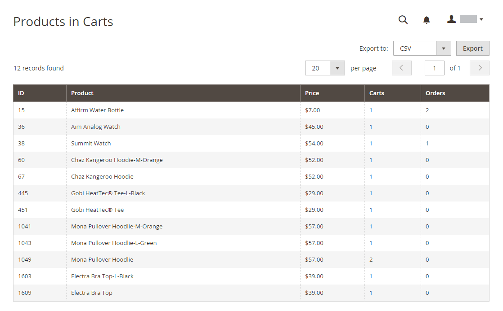

# 行銷報告

行銷報表提供有關購物車狀態、搜尋字詞的使用以及電子報傳輸的資訊。

## [!UICONTROL Products in Cart]

此 [!UICONTROL Products in Cart] 報表提供目前在購物車中的所有產品清單。 其中包括每個料號的名稱與價格、隨料號的購物車數量，以及每個料號的訂購次數。

{width="600"}

## [!UICONTROL Search Terms Report]

此 [搜尋字詞](../catalog/search-terms.md#search-terms-report) 報表會顯示您的客戶在每個商店檢視中尋找的內容。 報表包含在目錄中找到的相符專案數，以及使用搜尋字詞的次數。

{width="600"}

## [!UICONTROL Abandoned Carts]

此 [!UICONTROL Abandoned Carts] 報表會列出所有已放棄購物車，但尚未過期的註冊客戶。 此報表包括客戶名稱和電子郵件地址、購物車中的產品數量及小計、建立日期和上次更新日期。

{width="600"}

## [!UICONTROL Newsletter Problems Report]

此 [!UICONTROL Newsletter Problems Report] 包含任何無法成功傳輸的Newsletter佇列的相關資訊。 報告包含每個訂閱者的名稱、佇列日期和主旨，以及有關錯誤的資訊。

{width="600"}
