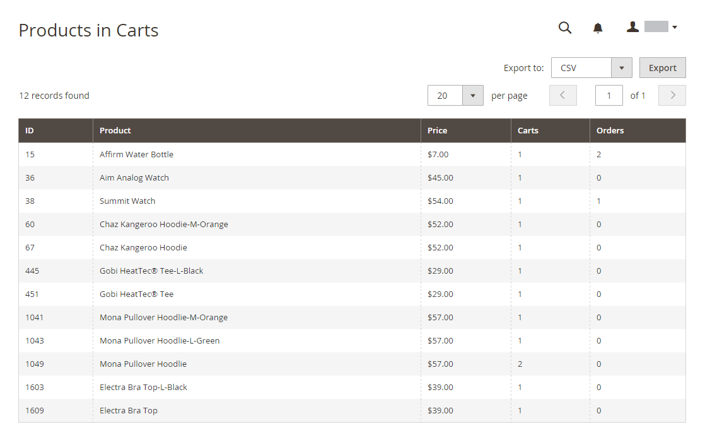
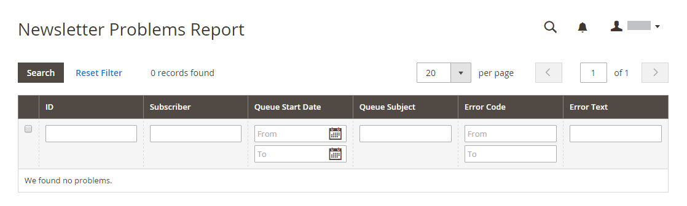

# 行銷報告

行銷報表提供有關購物車狀態、搜尋字詞的使用以及電子報傳輸的資訊。

## [!UICONTROL Products in Cart]

[!UICONTROL Products in Cart]報表提供目前在購物車中的所有產品清單。 其中包括每個料號的名稱與價格、隨料號的購物車數量，以及每個料號的訂購次數。

購物車報告中的{width="600"}

## [!UICONTROL Search Terms Report]

僅[!BADGE 個PaaS]{type=Informative url="https://experienceleague.adobe.com/zh-hant/docs/commerce/user-guides/product-solutions" tooltip="僅適用於雲端專案（Adobe管理的PaaS基礎結構）和內部部署專案的Adobe Commerce 。"}

[搜尋詞](../catalog/search-terms.md#search-terms-report)報告會顯示您的客戶在每個商店檢視中尋找的內容。 報表包含在目錄中找到的相符專案數，以及使用搜尋字詞的次數。

{width="600"}

## [!UICONTROL Abandoned Carts]

[!UICONTROL Abandoned Carts]報告列出所有已放棄購物車但尚未過期的註冊客戶。 此報表包括客戶名稱和電子郵件地址、購物車中的產品數量及小計、建立日期和上次更新日期。

{width="600"}

## [!UICONTROL Newsletter Problems Report]

僅[!BADGE 個PaaS]{type=Informative url="https://experienceleague.adobe.com/zh-hant/docs/commerce/user-guides/product-solutions" tooltip="僅適用於雲端專案（Adobe管理的PaaS基礎結構）和內部部署專案的Adobe Commerce 。"}

[!UICONTROL Newsletter Problems Report]包含任何無法成功傳輸的Newsletter佇列的相關資訊。 報告包含每個訂閱者的名稱、佇列日期和主旨，以及有關錯誤的資訊。

{width="600"}
