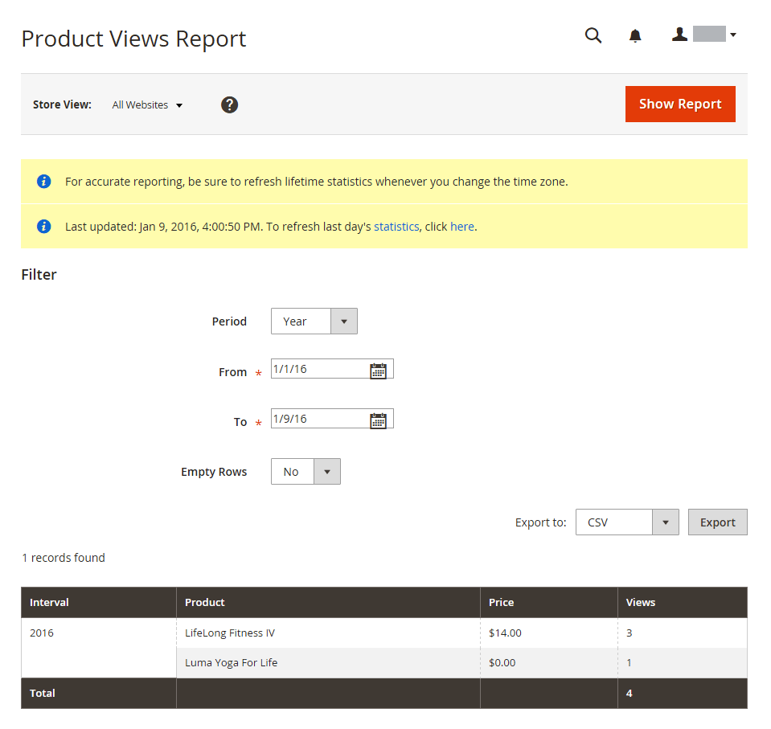
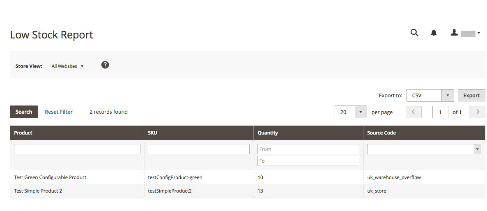
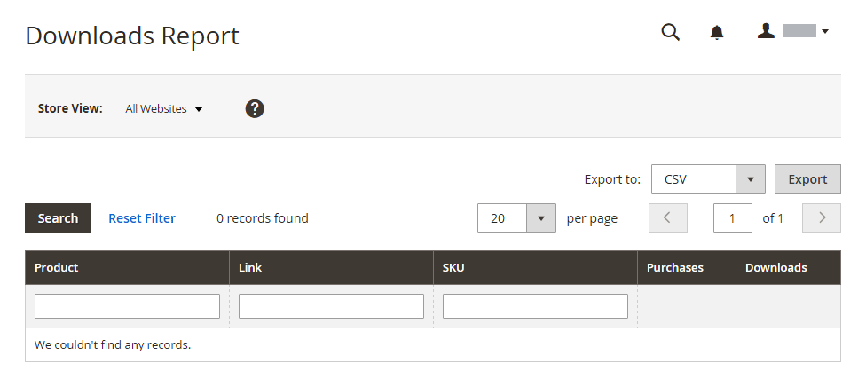

# 產品報表

產品報表可讓您深入瞭解已檢視和訂購的產品、最暢銷商品、庫存水準和下載內容。

## [!UICONTROL Product Views Report]

此 [!UICONTROL Product Views Report] 顯示在一段時間間隔或日期範圍內檢視過的產品。 此報表包含產品名稱、價格和檢視次數。

在 _管理員_ 側欄，前往 **[!UICONTROL Reports]** > _[!UICONTROL Products]_>**[!UICONTROL Views]**.

{width="600"}

## [!UICONTROL Bestsellers Report]

此 [!UICONTROL Bestsellers Report] 顯示一段間隔時間或日期範圍內最暢銷的五個。 此報表包含產品名稱、價格及訂購數量。

在 _管理員_ 側欄，前往 **[!UICONTROL Reports]** > _[!UICONTROL Products]_>**[!UICONTROL Bestsellers]**.

{width="600"}

## [!UICONTROL Low Stock Report]

此 [!UICONTROL Low Stock Report] 列出存貨層次在指定範圍內的所有產品。 替換為 [[!DNL Inventory Management]](../inventory-management/introduction.md) 啟用，報表會包含每個來源的低庫存存貨量，以及列出的來原始碼。

在 _管理員_ 側欄，前往 **[!UICONTROL Reports]** > _[!UICONTROL Products]_>**[!UICONTROL Low Stock]**.

{width="600"}

## [!UICONTROL Ordered Products Report]

此 [!UICONTROL Ordered Products Report] 列出在指定的時間間隔或日期範圍內訂購的所有產品。 報表包含產品名稱與訂購數量。

在 _管理員_ 側欄，前往 **[!UICONTROL Reports]** > _[!UICONTROL Products]_>**[!UICONTROL Ordered]**.

{width="600"}

## [!UICONTROL Downloads Report]

此 [!UICONTROL Downloads Report] 列出指定時間間隔或日期範圍內的所有下載專案。 此報表包含產品名稱、下載連結和SKU，以及購買和下載次數。

在 _管理員_ 側欄，前往 **[!UICONTROL Reports]** > _[!UICONTROL Products]_>**[!UICONTROL Downloaded]**.

{width="600"}
