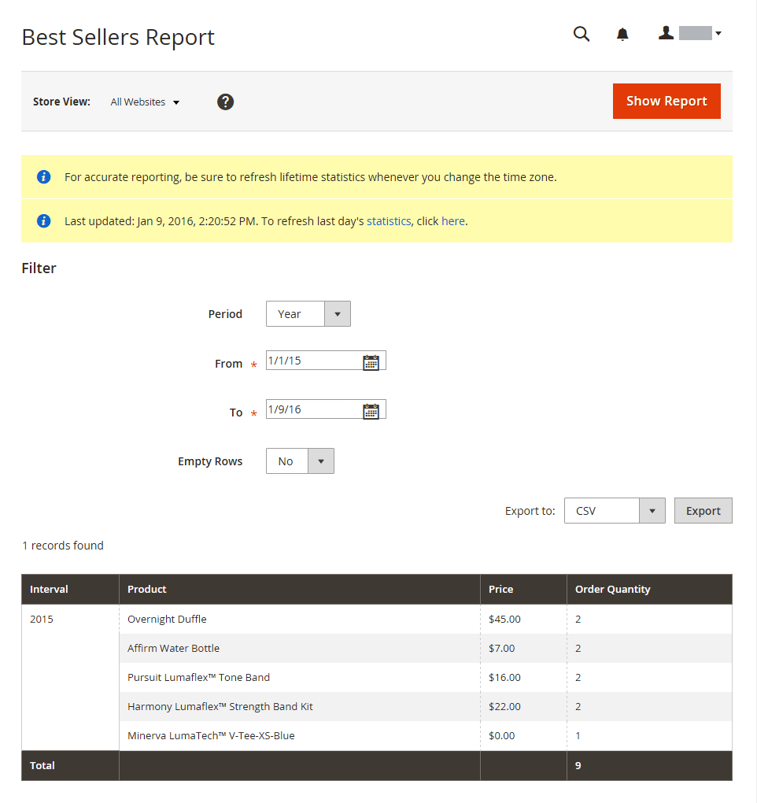
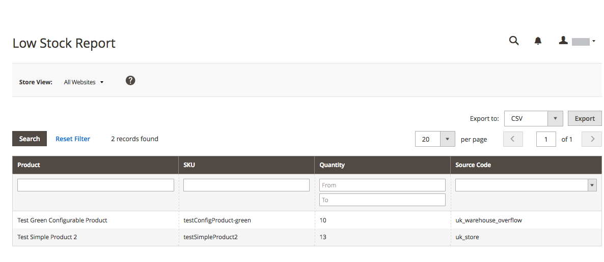
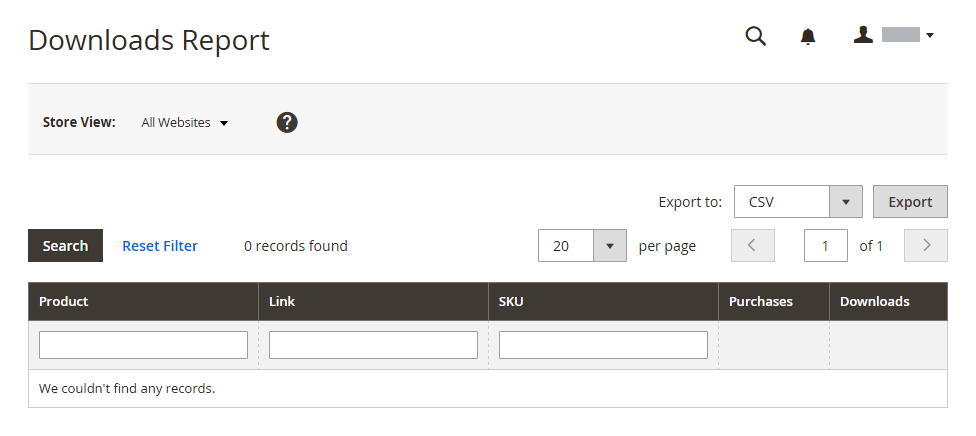

# 產品報表

產品報表可提供您關於已檢視和訂購的產品、最暢銷商品、庫存水準和下載的insight。

## [!UICONTROL Product Views Report]

僅[!BADGE 個PaaS]{type=Informative url="https://experienceleague.adobe.com/en/docs/commerce/user-guides/product-solutions" tooltip="僅適用於雲端專案（Adobe管理的PaaS基礎結構）和內部部署專案的Adobe Commerce 。"}

[!UICONTROL Product Views Report]會顯示在一段時間間隔或日期範圍內檢視過的產品。 此報表包含產品名稱、價格和檢視次數。

在&#x200B;_管理員_&#x200B;側邊欄上，移至&#x200B;**[!UICONTROL Reports]** > _[!UICONTROL Products]_>**[!UICONTROL Views]**。

{width="600"}

## [!UICONTROL Bestsellers Report]

[!UICONTROL Bestsellers Report]會顯示一段時間或日期範圍內五個最暢銷的五個。 此報表包含產品名稱、價格及訂購數量。

在&#x200B;_管理員_&#x200B;側邊欄上，移至&#x200B;**[!UICONTROL Reports]** > _[!UICONTROL Products]_>**[!UICONTROL Bestsellers]**。

{width="600"}

## [!UICONTROL Low Stock Report]

[!UICONTROL Low Stock Report]列出存貨層次在指定範圍內的所有產品。 啟用[[!DNL Inventory Management]](../inventory-management/introduction.md)後，報表會包含列出原始碼的每個來源的低庫存存貨量。

在&#x200B;_管理員_&#x200B;側邊欄上，移至&#x200B;**[!UICONTROL Reports]** > _[!UICONTROL Products]_>**[!UICONTROL Low Stock]**。

{width="600"}

## [!UICONTROL Ordered Products Report]

[!UICONTROL Ordered Products Report]列出在指定的時間間隔或日期範圍內訂購的所有產品。 報表包含產品名稱與訂購數量。

在&#x200B;_管理員_&#x200B;側邊欄上，移至&#x200B;**[!UICONTROL Reports]** > _[!UICONTROL Products]_>**[!UICONTROL Ordered]**。

{width="600"}

## [!UICONTROL Downloads Report]

僅[!BADGE 個PaaS]{type=Informative url="https://experienceleague.adobe.com/en/docs/commerce/user-guides/product-solutions" tooltip="僅適用於雲端專案（Adobe管理的PaaS基礎結構）和內部部署專案的Adobe Commerce 。"}

[!UICONTROL Downloads Report]會列出指定時間間隔或日期範圍內的所有下載專案。 此報表包含產品名稱、下載連結和SKU，以及購買和下載次數。

在&#x200B;_管理員_&#x200B;側邊欄上，移至&#x200B;**[!UICONTROL Reports]** > _[!UICONTROL Products]_>**[!UICONTROL Downloaded]**。

{width="600"}
