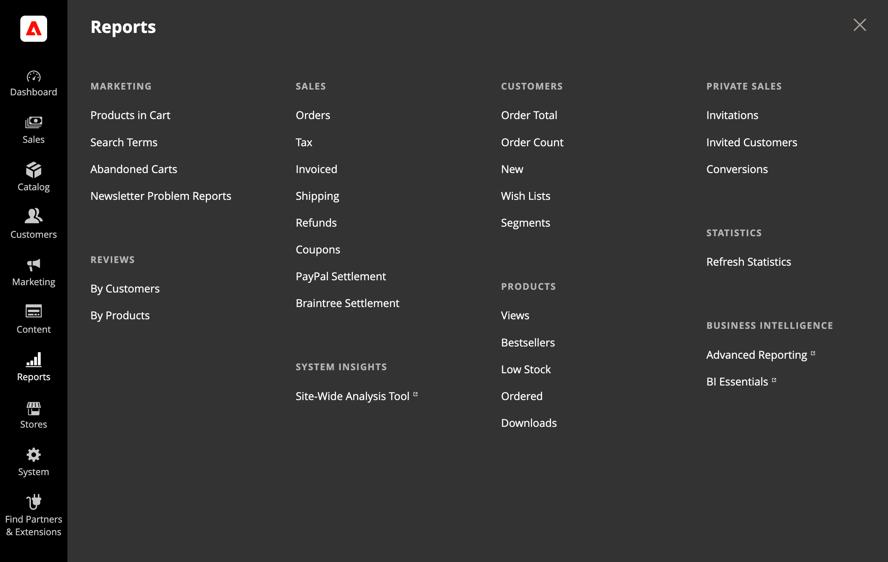

# [!UICONTROL Reports]功能表

Adobe Commerce提供多種報表，讓您掌握行銷工作、銷售產品和客戶活動的相關資訊。 「報表」功能表可讓您輕鬆存取有關銷售、產品、客戶和促銷活動的目前資訊。

{width="600"}

## 顯示[!UICONTROL Reports]功能表

在&#x200B;_管理員_&#x200B;側邊欄上，選擇&#x200B;**[!UICONTROL Reports]**。

## 功能表選項

### [!UICONTROL Marketing]

精選[行銷報告](marketing-reports.md)，包括購物車中的產品、搜尋詞、放棄的購物車，以及電子報問題報告。

### [!UICONTROL Reviews]

產品[檢閱報告](review-reports.md)的選取範圍包含依客戶和依產品。

### [!UICONTROL Sales]

[銷售報告](sales-reports.md)的選取專案包括PayPal與Braintree的訂單、稅捐、已開立商業發票、送貨、退款、優惠券與結算報告。

### [!UICONTROL System Insights]

(僅限Adobe Commerce) [[!DNL Site-Wide Analysis Tool]](https://experienceleague.adobe.com/docs/commerce-operations/tools/site-wide-analysis-tool/access.html?lang=zh-Hant)透過24/7即時效能監控、報告和建議，針對Adobe Commerce在雲端基礎結構上的安裝提供系統深入分析。

### [!UICONTROL Customers]

(僅限Adobe Commerce)所選取的[客戶報表](customer-reports.md)包含訂單總計、訂單帳戶、新增、願望清單及區段。

### [!UICONTROL Products]

選擇[產品報告](product-reports.md)包括檢視、最暢銷商品、低庫存、訂購和下載。

### [!UICONTROL Private Sales]

(僅限Adobe Commerce) [私人銷售與活動](private-sales-reports.md)的報告選取範圍包含邀請、受邀客戶和轉換。

### [!UICONTROL Statistics]

[統計資料](sales-reports.md#refresh-statistics)是一種工具，可藉由計算及儲存統計資料來降低產生報表的效能影響。 儲存的統計資料會一直使用到您重新整理統計資料為止，而不是在每次產生報表時重新計算統計資料。

### [!DNL Commerce Intelligence]

整合的[[!DNL Commerce Intelligence]](business-intelligence.md)工具可提供您進行策略性業務決策所需的insight。
