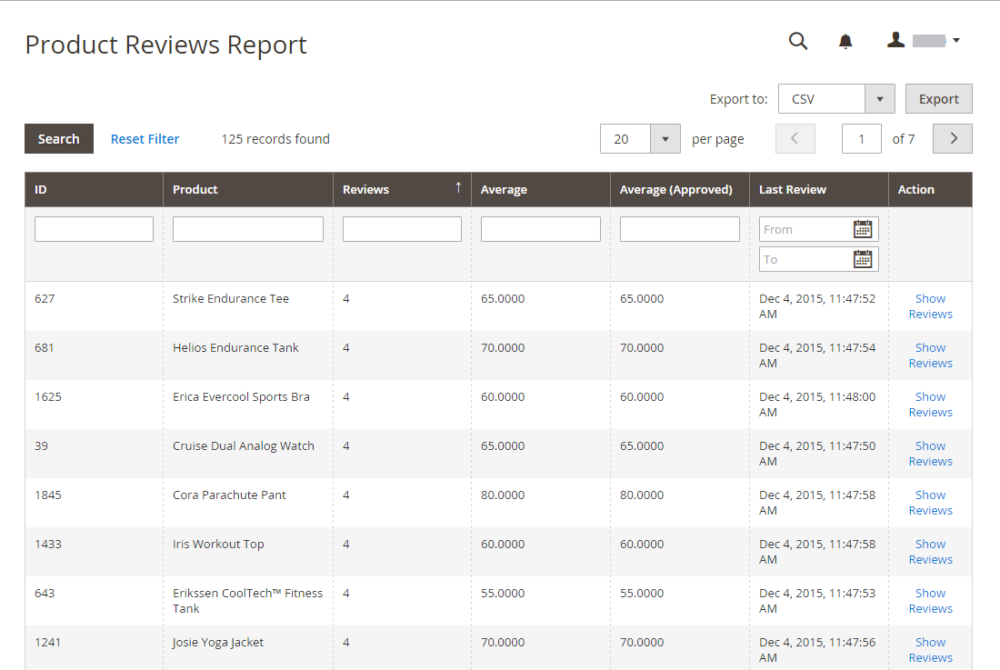

# 檢閱報告

如果您使用內建[!DNL Commerce]評論，評論報告會依客戶和產品提供產品評論的相關資訊。

## [!UICONTROL Customer Reviews Report]

[!UICONTROL Customer Reviews Report]提供已提交產品評論之所有客戶的清單。 此報表包含每位客戶提交的評論數量，以及評論清單的連結。

在&#x200B;_管理員_&#x200B;側邊欄上，移至&#x200B;**[!UICONTROL Reports]** > _[!UICONTROL Reviews]_>**[!UICONTROL By Customers]**。

{width="600"}

## [!UICONTROL Product Reviews Report]

[!UICONTROL Product Reviews Report]列出客戶已檢閱的所有產品。 此報表包含評論次數和平均評分、產品上次評論時間，以及每項產品評論清單的連結。

在&#x200B;_管理員_&#x200B;側邊欄上，移至&#x200B;**[!UICONTROL Reports]** > _[!UICONTROL Reviews]_>**[!UICONTROL By Products]**。

{width="600"}
