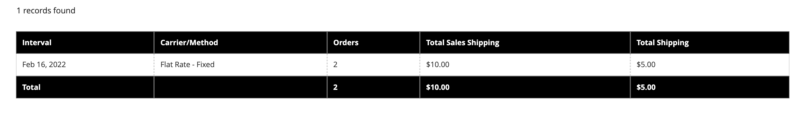

# 銷售報表

選取的銷售報表包括「訂單」、「稅捐」、「已開立商業發票」、「出貨」、「退款」、「抵用券」及「PayPal結算」。

## 報告篩選器

您可以產生整個網站或一家商店的銷售報告。 銷售報告可依時間間隔、日期和狀態篩選。

{width="600"}

若要篩選銷售報表，請設定下列選項：

| 選項 | 說明 |
|--- |--- |
| [!UICONTROL Date Used] | 設定用於報表的資料。 |
| [!UICONTROL Period] | 使用資料的期間：日/月/年。 |
| [!UICONTROL From/To] | 用來依開始和結束日期定義搜尋資料。 |
| [!UICONTROL Order Status] | 指示訂單狀態 |
| [!UICONTROL Empty Rows] | 指示是否將空白列新增至報表。 |

## [!UICONTROL Orders Report]

此 [!UICONTROL Orders Report] 包括下單與取消的訂單數，以及銷售額、開立商業發票金額、退款、收稅、運費及折扣等總計。

1. 在 _管理員_ 側欄，前往 **[!UICONTROL Reports]** > _[!UICONTROL Sales]_>**[!UICONTROL Orders]**.

1. 在 **[!UICONTROL Filter]** 區段，選取用於填入報表的報告期間選項和訂單狀態。

1. 按一下 **[!UICONTROL Show Report]**.

{width="600"}

## [!UICONTROL Tax Report]

此 [!UICONTROL Tax Report] 包含套用的稅捐規則、稅率、訂單數及已徵收的稅捐金額。

1. 在 _管理員_ 側欄，前往 **[!UICONTROL Reports]** > _[!UICONTROL Sales]_>**[!UICONTROL Tax]**.

1. 在 **[!UICONTROL Filter]** 區段，選取用於填入報表的報告期間選項和訂單狀態。

1. 按一下 **[!UICONTROL Show Report]**.

{width="600"}

## [!UICONTROL Invoice Report]

此 [!UICONTROL Invoice Report] 包括時間期間內的訂單與商業發票數，包含已開立商業發票、已付款及未付款的金額。

1. 在 _管理員_ 側欄，前往 **[!UICONTROL Reports]** > _[!UICONTROL Sales]_>**[!UICONTROL Invoiced]**.

1. 在 **[!UICONTROL Filter]** 區段，選取用於填入報表的報告期間選項和訂單狀態。

1. 按一下 **[!UICONTROL Show Report]**.

{width="600"}

## [!UICONTROL Shipping Report]

此 [!UICONTROL Shipping Report] 包括所使用的承運商或出貨方式的訂單數，包括銷售總額與出貨總額。

1. 在 _管理員_ 側欄，前往 **[!UICONTROL Reports]** > _[!UICONTROL Sales]_>**[!UICONTROL Shipping]**.

1. 在 **[!UICONTROL Filter]** 區段，選取用於填入報表的報告期間選項和訂單狀態。

1. 按一下 **[!UICONTROL Show Report]**.

{width="600"}

## [!UICONTROL Refunds Report]

此 [!UICONTROL Refunds Report] 包括已退款的訂單數，以及線上與離線退款的金額總計。

1. 在 _管理員_ 側欄，前往 **[!UICONTROL Reports]** > _[!UICONTROL Sales]_>**[!UICONTROL Refunds]**.

1. 在 **[!UICONTROL Filter]** 區段，選取用於填入報表的報告期間選項和訂單狀態。

1. 按一下 **[!UICONTROL Show Report]**.

{width="600"}

## [!UICONTROL Coupons Report]

此 [!UICONTROL Coupons Report] 包含指定時間間隔內使用的每個優惠券代碼、相關價格規則及使用的次數，以及銷售與折扣的總計與小計。

1. 在 _管理員_ 側欄，前往 **[!UICONTROL Reports]** > _[!UICONTROL Sales]_>**[!UICONTROL Coupons]**.

1. 在 **[!UICONTROL Filter]** 區段，選取用於填入報表的報告期間選項和訂單狀態。

1. 按一下 **[!UICONTROL Show Report]**.

如需關於使用的詳細資訊 [!UICONTROL Coupons Report] 若要收集促銷活動的資料，請參閱 [抵用券報告](../merchandising-promotions/price-rules-cart-coupon.md#coupons-report) 在 _Merchandising and Promotions指南_.

<!---  need coupon data  -->

## [!UICONTROL PayPal Settlement Reports]

此 [PayPal結算報表] 頁面包含事件型別，例如借記卡交易、開始與完成日期、總金額及相關費用。 報表可以自動更新為PayPal的最新資料。 日期範圍、商家帳戶、交易ID、發票ID或PayPal參考ID都有篩選選項。

在 _管理員_ 側欄，前往 **[!UICONTROL Reports]** > _[!UICONTROL Sales]_>**[!UICONTROL PayPal Settlement]**.

{width="600"}

如需關於使用的詳細資訊 [!UICONTROL PayPal Settlement Reports] 若要擷取影響資金結算的每個PayPal交易的相關資訊，請參閱 [PayPal結算報表](../stores-purchase/paypal-settlement-reports.md) 在 _商店和購買體驗指南_.

## [!UICONTROL Braintree Settlement Report]

此 [Braintree](../stores-purchase/braintree.md) 您可以根據建立日期、金額、狀態、交易型態、付款型態、交易識別碼、訂單識別碼、PayPal付款識別碼、型態、商家帳戶識別碼或結算批次識別碼，來篩選「結算報表」。 此報表包含交易識別碼、訂單識別碼、PayPal付款識別碼、型態、建立日期、金額、結算代碼、狀態、結算回應文字、補償識別碼、商家帳戶識別碼、結算批次識別碼及幣別。

在 _管理員_ 側欄，前往 **[!UICONTROL Reports]** > _[!UICONTROL Sales]_>**[!UICONTROL Braintree Settlement]**.

<!---  need a Braintree connection to update report screen -->

## 匯出報告

1. 若要匯出報表，請選取檔案型別： `Excel XML` 或 `CSV`

1. 按一下 **[!UICONTROL Export]**.

## 重新整理統計資料

若要減少產生銷售報告對效能的影響， [!DNL Commerce] 計算並儲存每個報表的必要統計資料。 除非您重新整理統計資料，否則不會每次產生報表時重新計算統計資料，而是使用儲存的統計資料。 若要包含最新的資料，必須先重新整理報表統計資料，才能產生銷售報表。

{width="700"}

1. 在 _管理員_ 側欄，前往 **[!UICONTROL Reports]** > _[!UICONTROL Statistics]_>**[!UICONTROL Refresh Statistics]**.

1. 在清單中，選取每個要重新整理報表的核取方塊。

1. 設定 **[!UICONTROL Actions]** 控制下列其中一項：

   - `Refresh Lifetime Statistics`
   - `Refresh Statistics for the Last Day`

1. 按一下 **[!UICONTROL Submit]**.
