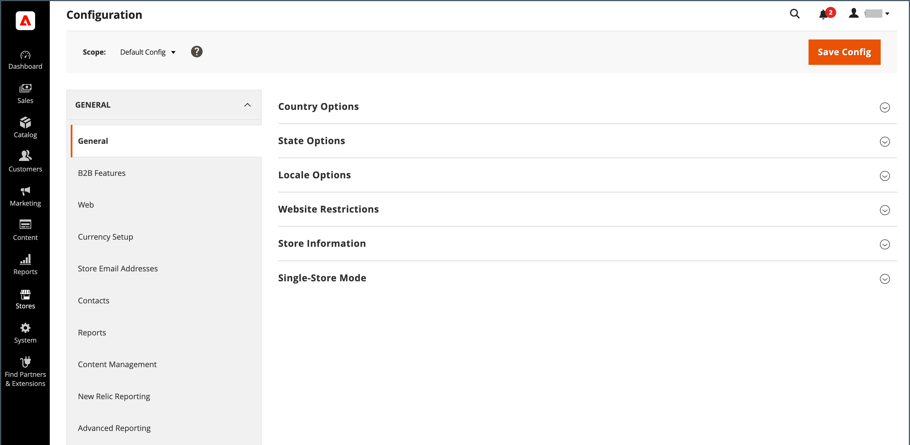
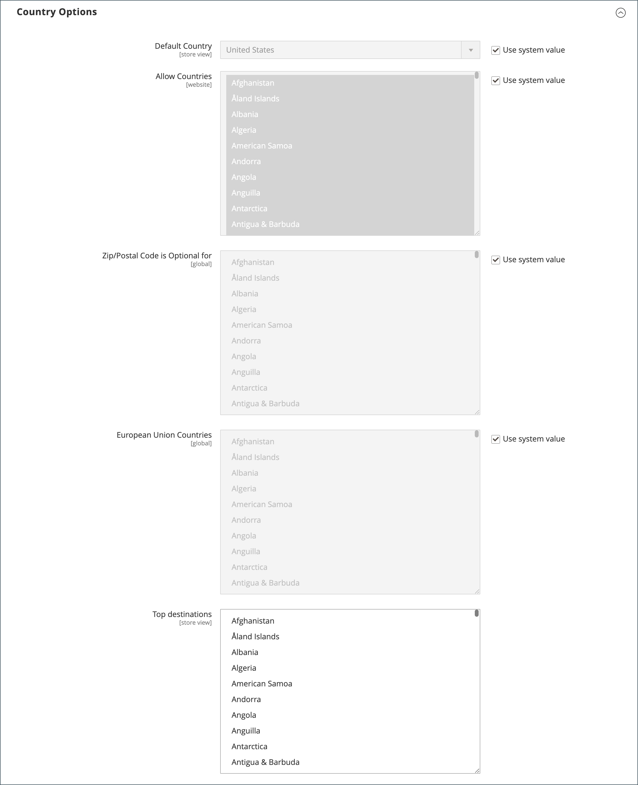
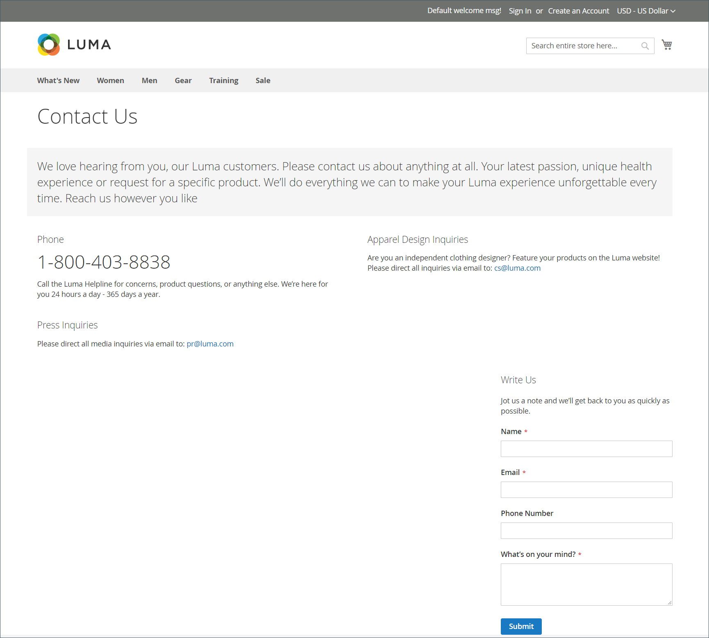
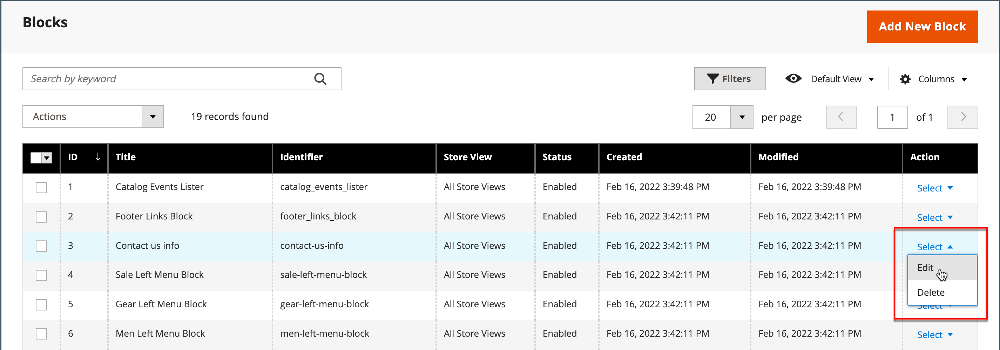

# 存放區詳細資料

商店的基本資訊包括商店名稱和地址、電話號碼和電子郵件地址，這些資訊會出現在傳送給客戶的電子郵件訊息、發票和其他通訊中。

{width="900" zoomable="yes"}

## [!UICONTROL Store Information]

_[!UICONTROL Store Information]_&#x200B;區段提供出現在銷售檔案和其他通訊中的基本資訊。

1. 在&#x200B;_管理員_&#x200B;側邊欄上，移至&#x200B;**[!UICONTROL Stores]** > _[!UICONTROL Settings]_>**[!UICONTROL Configuration]**。

1. 在左側導覽面板的&#x200B;**[!UICONTROL General]**&#x200B;下，選擇&#x200B;**[!UICONTROL General]**。

1. 展開擴充選擇器&#x200B;**[!UICONTROL Store Information]**。

   {width="700"}

1. 根據您的商店詳細資料設定選項：

   - 輸入您要在所有通訊中使用的&#x200B;**[!UICONTROL Store Name]**。

   - 輸入您要顯示的&#x200B;**[!UICONTROL Store Phone Number]**&#x200B;格式。

   - 針對&#x200B;**[!UICONTROL Store Hours of Operation]**，輸入您的商店營業時間。 例如： `Mon - Fri, 9-5, Sat 9-noon PST`。

   - 選取您的企業所在的&#x200B;**[!UICONTROL Country]**。

   - 選取國家的&#x200B;**[!UICONTROL Region/State]**。

   - 輸入&#x200B;**[!UICONTROL Store Address]**。 如果位址很長，請繼續&#x200B;**商店位址行2**&#x200B;上的位址。

   - 如果適用，請輸入您商店的&#x200B;**[!UICONTROL VAT Number]**。

     若要驗證號碼，請按一下&#x200B;**[!UICONTROL Validate VAT Number]**&#x200B;按鈕。 若要深入瞭解，請參閱[VAT ID驗證](../stores-purchase/vat.md#vat-id-validation)。

1. 完成時，按一下&#x200B;**[!UICONTROL Save Config]**。

如需存放區資訊組態選項的詳細資訊，請參閱&#x200B;[_組態參考指南_](../configuration-reference/general/general.md#store-information)。

## [!UICONTROL Locale Options]

地區設定可決定整個商店使用的許多設定。 其中一些為：

- 語言
- 國家
- 稅率
- 貨幣
- 價格
- 數字格式

地區設定會決定每個商店使用的時區與語言，並會識別該區域的工作週日期。

1. 在&#x200B;_管理員_&#x200B;側邊欄上，移至&#x200B;**[!UICONTROL Stores]** > _[!UICONTROL Settings]_>**[!UICONTROL Configuration]**。

1. 在左側導覽面板的&#x200B;**[!UICONTROL General]**&#x200B;下，選擇&#x200B;**[!UICONTROL General]**。

1. 展開擴充選擇器&#x200B;**[!UICONTROL Locale Options]**。

   {width="700"}

1. 從清單中選取您的&#x200B;**[!UICONTROL Timezone]**。

1. 將&#x200B;**[!UICONTROL Locale]**&#x200B;設為商店語言。

1. 將&#x200B;**[!UICONTROL Weight Unit]**&#x200B;設定為通常用於來自您地區設定的出貨的測量單位。

1. 將&#x200B;**[!UICONTROL First Day of the Week]**&#x200B;設為您所在區域視為一週第一天的日期。

1. 在&#x200B;**[!UICONTROL Weekend Days]**&#x200B;清單中，選取您所在地區中屬於週末的日子。

   若要選取多天，請按住Ctrl鍵(PC)或Command鍵(Mac)，然後按一下每個專案。

1. 完成時，按一下&#x200B;**[!UICONTROL Save Config]**。

如需地區設定組態選項的詳細資訊，請參閱[組態參考指南](../configuration-reference/general/general.md#locale-options)。

## [!UICONTROL State Options]

在許多國家/地區，州、省或地區是郵寄地址的必要部分。 此資訊可用於運送與帳單資訊、計算稅率等。 若為非必要國家/地區，該欄位可以從地址中完全省略，或作為選用欄位納入。

由於不同國家/地區的標準地址格式不同，因此您也可以編輯範本，以格式化發票、包裝單及出貨標籤的地址。

1. 在&#x200B;_管理員_&#x200B;側邊欄上，移至&#x200B;**[!UICONTROL Stores]** > _[!UICONTROL Settings]_>**[!UICONTROL Configuration]**。

1. 在左側導覽面板的&#x200B;**[!UICONTROL General]**&#x200B;下，選擇&#x200B;**[!UICONTROL General]**。

1. 展開擴充選擇器&#x200B;**[!UICONTROL State Options]**。

   {width="700"}

1. 使用&#x200B;**[!UICONTROL State is required for]**&#x200B;清單來選取需要地區/州別專案的每個國家/地區。

1. 將&#x200B;**[!UICONTROL Allow to Choose State if it is Optional for Country]**&#x200B;設定為下列其中一項：

   `Yes` — 在不需要狀態列位的國家/地區，包含狀態列位作為選擇性專案。

   `No` — 在不需要州欄位的國家/地區，省略「州」欄位。

1. 完成時，按一下&#x200B;**[!UICONTROL Save Config]**。

如需狀態組態選項的詳細資訊，請參閱[組態參考指南](../configuration-reference/general/general.md#state-options)。

## [!UICONTROL Country Options]

國家/地區選項可識別您的企業所在的國家/地區，以及您接受付款的國家/地區。

### 設定商店的國家/地區選項

1. 在&#x200B;_管理員_&#x200B;側邊欄上，移至&#x200B;**[!UICONTROL Stores]** > _[!UICONTROL Settings]_>**[!UICONTROL Configuration]**。

1. 在左側導覽面板的&#x200B;**[!UICONTROL General]**&#x200B;下，選擇&#x200B;**[!UICONTROL General]**。

1. 展開擴充選擇器&#x200B;**[!UICONTROL Country Options]**。

   >[!NOTE]
   >
   >如有需要，請針對您要變更的每個設定清除&#x200B;**[!UICONTROL Use system value]**&#x200B;核取方塊。

   {width="700"}

1. 選擇您的企業所在的&#x200B;**[!UICONTROL Default Country]**。

1. 在&#x200B;**[!UICONTROL Allow Countries]**&#x200B;清單中，選取您接受訂單的每個國家/地區。

   依預設，會選取清單中的所有國家/地區。 若要選取多個國家/地區，請按住Ctrl鍵(PC)或Command鍵(Mac)，然後按一下每個專案。

1. 使用&#x200B;**[!UICONTROL Zip/Postal Code is Optional for]**&#x200B;清單來選取您營業的每個國家/地區，不需要將郵遞區號或郵遞區號納入街道地址。

1. 在&#x200B;**[!UICONTROL European Union Countries]**&#x200B;清單中，選取您開展業務的歐盟國家/地區。

   依預設，會選取所有EU國家。 若要選取您需要的國家，請按住Ctrl鍵(PC)或Command鍵(Mac)並按一下每個專案。

1. 在&#x200B;**[!UICONTROL Top Destinations]**&#x200B;清單中，選取您鎖定銷售目標的主要國家/地區。

1. 完成時，按一下&#x200B;**[!UICONTROL Save Config]**。

### 設定特定傳送方法的國家/地區選項

您也可以針對每個可用的[遞送方式](../stores-purchase/delivery.md) （UPS、FedEx等），設定運送至特定國家/地區的方式。

1. 在&#x200B;_管理員_&#x200B;側邊欄上，移至&#x200B;**[!UICONTROL Stores]** > _[!UICONTROL Settings]_>**[!UICONTROL Configuration]**。

1. 在左側導覽面板中，展開&#x200B;**[!UICONTROL Sales]**&#x200B;並選擇&#x200B;**[!UICONTROL Delivery Methods]**。

1. 選取要套用至特定國家的出貨承運商。

1. 針對&#x200B;**[!UICONTROL Ship to Applicable Countries]**，取消選取&#x200B;**[!UICONTROL Use system value]**&#x200B;核取方塊並選取&#x200B;**[!UICONTROL Specific Countries]**&#x200B;選項。

1. 在&#x200B;**[!UICONTROL Top Destinations]**&#x200B;清單中，選取您預定要送貨的主要國家/地區。

   {width="700"}

1. 完成時，按一下&#x200B;**[!UICONTROL Save Config]**。

### 疑難排解資源

如需國家組態問題疑難排解的協助，請參閱下列[!DNL Commerce]支援知識庫文章：

- [如何新增國家](https://experienceleague.adobe.com/docs/commerce-knowledge-base/kb/how-to/how-to-add-a-new-country-to-magento-2.html)

## [!UICONTROL Merchant Location]

僅[!BADGE 個PaaS]{type=Informative url="https://experienceleague.adobe.com/en/docs/commerce/user-guides/product-solutions" tooltip="僅適用於雲端專案(Adobe管理的PaaS基礎結構)和內部部署專案的Adobe Commerce 。"}

「商家地點」設定是用來設定[付款方法](../stores-purchase/payments.md)。 如果此設定沒有值，則會使用[預設國家](#uicontrol-country-options)設定。

1. 在&#x200B;_管理員_&#x200B;側邊欄上，移至&#x200B;**[!UICONTROL Stores]** > _[!UICONTROL Settings]_>**[!UICONTROL Configuration]**。

1. 在左側導覽面板中，展開&#x200B;**[!UICONTROL Sales]**&#x200B;並選擇&#x200B;**[!UICONTROL Payment Methods]**。

1. 展開 **商家位置**&#x200B;區段，然後選擇您的&#x200B;**[!UICONTROL Merchant Country]**。

   {width="600"}

1. 完成時，按一下&#x200B;**[!UICONTROL Save Config]**。

如需付款方法組態選項的詳細資訊，請參閱[組態參考指南](../configuration-reference/sales/payment-methods.md)。

## 貨幣

貨幣設定 — 定義基礎[貨幣](../stores-purchase/currency-configuration.md)和任何接受為付款的其他貨幣。 同時建立匯入連線與排程，以自動更新匯率。

貨幣符號 — 定義出現在產品價格和銷售檔案（例如訂單和發票）中的[貨幣符號](../stores-purchase/currency-configuration.md#step-5-customize-currency-symbols-optional)。 [!DNL Commerce]支援來自全球200多個國家的貨幣。

更新匯率 — 匯率可以是[手動更新](../stores-purchase/currency-update.md)，或視需要或根據預先定義的排程匯入您的商店。

貨幣選擇器 — 如果有多種貨幣可供使用，則[貨幣選擇器](../stores-purchase/currency.md)可在商店標題中使用。

## [!UICONTROL Store Email Addresses]

您最多可以有五個不同的電子郵件地址，代表每個商店或檢視的不同職能或部門。 除了下列預先定義的電子郵件身分之外，您也可以根據需求設定一些自訂身分。

- 一般連絡人
- 銷售代表
- 客戶支援

每個身分及其相關電子郵件地址都可以與特定的自動化電子郵件訊息相關聯，並顯示為從您的商店傳送之電子郵件訊息的寄件者。

### 步驟1：設定您網域的電子郵件地址

您必須先將每個設定為您的網域的有效電子郵件地址，才能設定商店的電子郵件地址。 若要建立所需的每個電子郵件地址，請遵循伺服器管理員或電子郵件託管提供者的指示。

### 步驟2：設定產生之連結的基本URL

僅[!BADGE SaaS]{type=Positive url="https://experienceleague.adobe.com/en/docs/commerce/user-guides/product-solutions" tooltip="僅適用於Adobe Commerce as a Cloud Service專案(Adobe管理的SaaS基礎結構)。"}

部分面對客戶的電子郵件會包含商店連結，例如協助客戶重設密碼的連結。 為確保店面的連結正常運作，您必須定義店面的基底URL。

1. 在&#x200B;_管理員_&#x200B;側邊欄上，移至&#x200B;**[!UICONTROL Stores]** > _[!UICONTROL Settings]_>**[!UICONTROL Configuration]**。

1. 在左側導覽面板的&#x200B;**[!UICONTROL General]**&#x200B;下，選擇&#x200B;**[!UICONTROL Store Email Addresses]**。

1. 在&#x200B;**[!UICONTROL Storefront Base URL]**&#x200B;欄位&#x200B;**[!UICONTROL General]**&#x200B;區段中，輸入商店的根URL，例如`https://www.example.com/`。 URL必須以正斜線結尾。

   {width="600"}

### 步驟3：設定商店的電子郵件地址

僅[!BADGE SaaS]{type=Positive url="https://experienceleague.adobe.com/en/docs/commerce/user-guides/product-solutions" tooltip="僅適用於Adobe Commerce as a Cloud Service和Adobe Commerce Optimizer專案(Adobe管理的SaaS基礎結構)。"}布建執行個體時已設定寄件者電子郵件地址。 如果您需要變更這些地址，請建立支援票證。

1. 在&#x200B;_管理員_&#x200B;側邊欄上，移至&#x200B;**[!UICONTROL Stores]** > _[!UICONTROL Settings]_>**[!UICONTROL Configuration]**。

1. 在左側導覽面板的&#x200B;**[!UICONTROL General]**&#x200B;下，選擇&#x200B;**[!UICONTROL Store Email Addresses]**。

1. 展開 **[!UICONTROL General Contact]**&#x200B;區段，然後執行下列動作：

   {width="600"}

   - 針對&#x200B;**[!UICONTROL Sender Name]**，輸入與一般連絡人身分相關之人員的名稱，以顯示為任何電子郵件訊息的寄件者。

   - 針對&#x200B;**[!UICONTROL Sender Email]**，輸入相關的電子郵件地址。

1. 為您計畫使用的每個商店電子郵件地址重複此程式。

1. 完成時，按一下&#x200B;**[!UICONTROL Save Config]**。

### 步驟4：更新銷售電子郵件設定

如果您使用自訂電子郵件地址，請務必更新任何相關電子郵件訊息的設定，以便以寄件者身分顯示正確的身分。

1. 在左側導覽面板中，展開&#x200B;**[!UICONTROL Sales]**&#x200B;並選擇&#x200B;**[!UICONTROL Sales Emails]**。

   此頁面針對下列專案分別有一個區段：

   - 訂單與訂單註解
   - 商業發票與商業發票註解
   - 出貨與出貨備註
   - 銷退折讓單與銷退折讓單備註
   - RMA、RMA授權、RMA管理註解和RMA客戶註解 (僅限Adobe Commerce)

1. 從&#x200B;**[!UICONTROL Order]**&#x200B;開始，展開每封郵件的區段，並確定已選取正確的寄件者。

   {width="600"}

1. 完成時，按一下&#x200B;**[!UICONTROL Save Config]**。

如需有關銷售電子郵件組態選項的詳細資訊，請參閱&#x200B;[_組態參考指南_](../configuration-reference/sales/sales-emails.md)。

## 聯絡我們表單

商店頁尾的&#x200B;_聯絡我們_&#x200B;連結是客戶與您保持聯絡的簡單方式。 客戶可以填妥表單，傳送訊息至您的商店。 標準[!DNL Commerce]安裝會顯示預設的&#x200B;_聯絡我們_&#x200B;表單。 提交表單後，系統會顯示感謝訊息

請務必瞭解，預設「聯絡我們」表單是直接從程式碼轉譯，而非從CMS頁面轉譯。

{width="700"}

商店頁尾包含連至聯絡我們頁面的連結，該連結可在整個商店中使用。

{width="700"}

Luma範例資料包含「聯絡我們」頁面上的其他資訊，示範如何自訂商店的頁面。

{width="700"}

### 設定連絡人表單

1. 在&#x200B;_管理員_&#x200B;側邊欄上，移至&#x200B;**[!UICONTROL Stores]** > _[!UICONTROL Settings]_>**[!UICONTROL Configuration]**。

1. 在左側導覽面板的&#x200B;**[!UICONTROL General]**&#x200B;下，選擇&#x200B;**[!UICONTROL Contacts]**。

1. 展開 **[!UICONTROL Contact Us]**&#x200B;區段，並將&#x200B;**[!UICONTROL Enable Contact Us]**&#x200B;設為`Yes`。

   {width="600"}

1. 展開 **[!UICONTROL Email Options]**&#x200B;區段並設定電子郵件連絡人選項：

   {width="600"}

   - 針對&#x200B;**[!UICONTROL Send Emails to]**，輸入寄出[連絡我們]表單之郵件的電子郵件地址。

   - 將&#x200B;**[!UICONTROL Email Sender]**&#x200B;設為存放區識別碼，此識別碼會顯示為[連絡我們]表單的郵件寄件者。 例如：自訂電子郵件2。

   - 將&#x200B;**[!UICONTROL Email Template]**&#x200B;設為範本，此範本用於從[連絡我們]表單傳送的郵件。

1. 完成時，按一下&#x200B;**[!UICONTROL Save Config]**。

### 自訂內容

您可以自訂&#x200B;_聯絡我們_&#x200B;表單中的內容，以符合您的商店和客戶服務政策的需求。

### 方法1：使用範例資料

Luma範例資料包含可為您的商店自訂的&#x200B;_聯絡我們資訊_&#x200B;區塊。 可以輕鬆修改`contact-us-info` [區塊](../content-design/blocks.md)，將您自己的內容新增至[連絡我們]頁面。

1. 在&#x200B;_管理員_&#x200B;側邊欄上，移至&#x200B;**[!UICONTROL Content]** > _[!UICONTROL Elements]_>**[!UICONTROL Blocks]**。

1. 在清單中尋找&#x200B;**[!UICONTROL Contact Us Info]**&#x200B;區塊，並以&#x200B;**[!UICONTROL Edit]**&#x200B;模式開啟。

   {width="700"}

1. 在區塊頁面底部，按一下&#x200B;**[!UICONTROL Edit with Page Builder]**。

   {width="700"}

   >[!NOTE]
   >
   >如果您[[!DNL Page Builder] 已停用](../page-builder/setup.md#disable-dnl-page-builder)，您可以使用編輯器[工具列](../content-design/editor.md)來格式化文字，並新增[影像](../content-design/editor-insert-image.md)和[連結](../content-design/editor-insert-link.md)。

1. 將游標暫留在HTML容器上以顯示工具箱，然後選擇&#x200B;_設定_ （  ）圖示。

1. 編輯HTML程式碼，提供您商店的連絡資訊，然後按一下&#x200B;**[!UICONTROL Save]**。

   {width="700"}

1. 結束[!DNL Page Builder]階段並按一下&#x200B;**[!UICONTROL Save Block]**。

### 方法2：沒有範例資料

>[!IMPORTANT]
>
>從2.4.0版開始，連絡人表單無法在CMS區塊或CMS頁面中呼叫。 所有連絡人表單的自訂應使用版面xml或自訂主題範本完成。

依預設，購物者使用店面頁面頁尾中的&#x200B;_連絡人連結_&#x200B;來存取連絡人表單。 如需自訂連絡人頁面的詳細資訊，請參閱[前端開發人員指南](https://developer.adobe.com/commerce/frontend-core/guide/themes/)。
