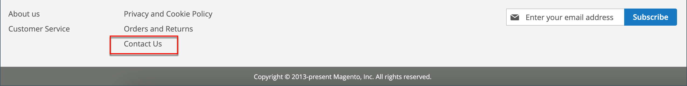

# 存放區詳細資料

商店的基本資訊包括商店名稱和地址、電話號碼和電子郵件地址，這些資訊會出現在傳送給客戶的電子郵件訊息、發票和其他通訊中。

{width="900" zoomable="yes"}

## [!UICONTROL Store Information]

此 _[!UICONTROL Store Information]_區段提供出現在銷售檔案和其他通訊中的基本資訊。

1. 在 _管理員_ 側欄，前往 **[!UICONTROL Stores]** > _[!UICONTROL Settings]_>**[!UICONTROL Configuration]**.

1. 在 **[!UICONTROL General]** 在左側導覽面板中，選擇 **[!UICONTROL General]**.

1. 展開  此 **[!UICONTROL Store Information]** 區段。

   {width="700"}

1. 根據您的商店詳細資料設定選項：

   - 輸入 **[!UICONTROL Store Name]** 您想要用於所有通訊的內容。

   - 輸入 **[!UICONTROL Store Phone Number]**，格式依您想要的顯示方式。

   - 的 **[!UICONTROL Store Hours of Operation]**，輸入您的商店營業時間。 例如： `Mon - Fri, 9-5, Sat 9-noon PST`.

   - 選取 **[!UICONTROL Country]** 您的企業所在位置。

   - 選取 **[!UICONTROL Region/State]** 和國家/地區。

   - 輸入 **[!UICONTROL Store Address]**. 如果位址很長，請繼續該位址 **商店地址行2**.

   - 如果適用，請輸入 **[!UICONTROL VAT Number]** ，屬於您的商店。

     若要驗證此號碼，請按一下 **[!UICONTROL Validate VAT Number]** 按鈕。 若要深入瞭解，請參閱 [VAT ID驗證](../stores-purchase/vat.md#vat-id-validation).

1. 完成後，按一下 **[!UICONTROL Save Config]**.

如需關於存放區資訊組態選項的詳細資訊，請參閱 [_設定參考指南_](../configuration-reference/general/general.md#store-information).

## [!UICONTROL Locale Options]

地區設定可決定整個商店使用的許多設定。 其中一些為：

- 語言
- 國家
- 稅率
- 貨幣
- 價格
- 數字格式

地區設定會決定每個商店使用的時區與語言，並會識別該區域的工作週日期。

1. 在 _管理員_ 側欄，前往 **[!UICONTROL Stores]** > _[!UICONTROL Settings]_>**[!UICONTROL Configuration]**.

1. 在左側導覽面板中的 **[!UICONTROL General]**，選擇 **[!UICONTROL General]**.

1. 展開  此 **[!UICONTROL Locale Options]** 區段。

   {width="700"}

1. 選取您的 **[!UICONTROL Timezone]** 從清單中。

1. 設定 **[!UICONTROL Locale]** 至商店語言。

1. 設定 **[!UICONTROL Weight Unit]** 至通常用於來自您地區設定的出貨的度量單位。

1. 設定 **[!UICONTROL First Day of the Week]** 到您所在區域視為一週第一天的那一天。

1. 在 **[!UICONTROL Weekend Days]** 清單中，選取您所在地區中屬於週末的日子。

   若要選取多天，請按住Ctrl鍵(PC)或Command鍵(Mac)，然後按一下每個專案。

1. 完成後，按一下 **[!UICONTROL Save Config]**.

如需有關地區設定選項的詳細資訊，請參閱 [設定參考指南](../configuration-reference/general/general.md#locale-options).

## [!UICONTROL State Options]

在許多國家/地區，州、省或地區是郵寄地址的必要部分。 此資訊可用於運送與帳單資訊、計算稅率等。 若為非必要國家/地區，該欄位可以從地址中完全省略，或作為選用欄位納入。

由於不同國家/地區的標準地址格式不同，因此您也可以編輯範本，以格式化發票、包裝單及出貨標籤的地址。

1. 在 _管理員_ 側欄，前往 **[!UICONTROL Stores]** > _[!UICONTROL Settings]_>**[!UICONTROL Configuration]**.

1. 在 **[!UICONTROL General]** 在左側導覽面板中，選擇 **[!UICONTROL General]**.

1. 展開  此 **[!UICONTROL State Options]** 區段。

   {width="700"}

1. 使用 **[!UICONTROL State is required for]** 清單以選取「地區/州」為必要專案的每個國家/地區。

1. 設定 **[!UICONTROL Allow to Choose State if it is Optional for Country]** 變更為下列其中一項：

   `Yes`  — 在非必要州別欄位的國家/地區，包含「州」欄位作為選擇性專案。

   `No`  — 在不需要州欄位的國家/地區，省略「州」欄位。

1. 完成後，按一下 **[!UICONTROL Save Config]**.

如需有關狀態組態選項的詳細資訊，請參閱 [設定參考指南](../configuration-reference/general/general.md#state-options).

## [!UICONTROL Country Options]

國家/地區選項可識別您的企業所在的國家/地區，以及您接受付款的國家/地區。

### 設定商店的國家/地區選項

1. 在 _管理員_ 側欄，前往 **[!UICONTROL Stores]** > _[!UICONTROL Settings]_>**[!UICONTROL Configuration]**.

1. 在左側導覽面板中的 **[!UICONTROL General]**，選擇 **[!UICONTROL General]**.

1. 展開  此 **[!UICONTROL Country Options]** 區段。

   >[!NOTE]
   >
   >如有需要，請清除 **[!UICONTROL Use system value]** 核取方塊。

   {width="700"}

1. 選擇 **[!UICONTROL Default Country]** 您的企業所在位置。

1. 在 **[!UICONTROL Allow Countries]** 清單中，選取您接受訂單的每個國家/地區。

   依預設，會選取清單中的所有國家/地區。 若要選取多個國家/地區，請按住Ctrl鍵(PC)或Command鍵(Mac)，然後按一下每個專案。

1. 使用 **[!UICONTROL Zip/Postal Code is Optional for]** 清單以選取您經營業務時不需要將郵遞區號納入街道地址的每個國家/地區。

1. 在 **[!UICONTROL European Union Countries]** 清單中，選取您開展業務的歐盟國家/地區。

   依預設，會選取所有EU國家。 若要選取您需要的國家，請按住Ctrl鍵(PC)或Command鍵(Mac)並按一下每個專案。

1. 在 **[!UICONTROL Top Destinations]** 清單中，選取您針對銷售所瞄準的主要國家/地區。

1. 完成後，按一下 **[!UICONTROL Save Config]**.

### 設定特定傳送方法的國家/地區選項

您也可以針對每個可用專案，設定運送至特定國家/地區的功能 [傳遞方法](../stores-purchase/delivery.md) （UPS、FedEx等）。

1. 在 _管理員_ 側欄，前往 **[!UICONTROL Stores]** > _[!UICONTROL Settings]_>**[!UICONTROL Configuration]**.

1. 在左側導覽面板中，展開 **[!UICONTROL Sales]** 並選擇 **[!UICONTROL Delivery Methods]**.

1. 選取要套用至特定國家的出貨承運商。

1. 的 **[!UICONTROL Ship to Applicable Countries]**，取消選取 **[!UICONTROL Use system value]** 核取方塊，然後選取 **[!UICONTROL Specific Countries]** 選項。

1. 在 **[!UICONTROL Top Destinations]** 清單中，選取您預定要送貨的主要國家/地區。

   {width="700"}

1. 完成後，按一下 **[!UICONTROL Save Config]**.

### 疑難排解資源

如需國家組態問題疑難排解的協助，請參閱下列內容 [!DNL Commerce] 支援知識庫文章：

- [如何新增國家/地區](https://experienceleague.adobe.com/docs/commerce-knowledge-base/kb/how-to/how-to-add-a-new-country-to-magento-2.html)
- [提供的國家/地區識別碼不存在](https://experienceleague.adobe.com/docs/commerce-knowledge-base/kb/support-tools/patches/v1-0-15/mdva-33393-magento-patch-provided-countryid-does-not-exist.html)

## [!UICONTROL Merchant Location]

「商家地點」設定是用來設定 [付款方法](../stores-purchase/payments.md). 如果此設定沒有值， [預設國家](#uicontrol-country-options) 設定會使用。

1. 在 _管理員_ 側欄，前往 **[!UICONTROL Stores]** > _[!UICONTROL Settings]_>**[!UICONTROL Configuration]**.

1. 在左側導覽面板中，展開 **[!UICONTROL Sales]** 並選擇 **[!UICONTROL Payment Methods]**.

1. 展開  此 **商家地點** 區段，然後選擇 **[!UICONTROL Merchant Country]**.

   {width="600"}

1. 完成後，按一下 **[!UICONTROL Save Config]**.

如需「付款方法」組態選項的詳細資訊，請參閱 [設定參考指南](../configuration-reference/sales/payment-methods.md).

## 貨幣

貨幣設定 — 定義基礎 [貨幣](../stores-purchase/currency-configuration.md) 以及任何接受為付款的其他貨幣。 同時建立匯入連線與排程，以自動更新匯率。

貨幣符號 — 定義 [貨幣符號](../stores-purchase/currency-configuration.md#step-5-customize-currency-symbols-optional) 出現在產品價格與銷售檔案（例如訂單與商業發票）中。 [!DNL Commerce] 支援全球200多個國家的貨幣。

更新幣別匯率 — 幣別匯率可以是 [已更新](../stores-purchase/currency-update.md) 視需要或根據預先定義的排程，手動或匯入您的存放區。

貨幣選擇器 — 如果有多種貨幣可供使用，則 [貨幣選擇器](../stores-purchase/currency.md) 可於存放區的標頭中使用。

## [!UICONTROL Store Email Addresses]

您最多可以有五個不同的電子郵件地址，代表每個商店或檢視的不同職能或部門。 除了下列預先定義的電子郵件身分之外，您也可以根據需求設定一些自訂身分。

- 一般連絡人
- 銷售代表
- 客戶支援

每個身分及其相關電子郵件地址都可以與特定的自動化電子郵件訊息相關聯，並顯示為從您的商店傳送之電子郵件訊息的寄件者。

### 步驟1：設定您網域的電子郵件地址

您必須先將每個設定為您的網域的有效電子郵件地址，才能設定商店的電子郵件地址。 若要建立所需的每個電子郵件地址，請遵循伺服器管理員或電子郵件託管提供者的指示。

### 步驟2：設定商店的電子郵件地址

1. 在 _管理員_ 側欄，前往 **[!UICONTROL Stores]** > _[!UICONTROL Settings]_>**[!UICONTROL Configuration]**.

1. 在 **[!UICONTROL General]** 在左側導覽面板中，選擇 **[!UICONTROL Store Email Addresses]**.

1. 展開  此 **[!UICONTROL General Contact]** 並執行下列動作：

   {width="600"}

   - 的 **[!UICONTROL Sender Name]**，輸入與「一般連絡人」身分相關聯之人員的名稱，以顯示為任何電子郵件訊息的寄件者。

   - 的 **[!UICONTROL Sender Email]**，輸入相關的電子郵件地址。

1. 為您計畫使用的每個商店電子郵件地址重複此程式。

1. 完成後，按一下 **[!UICONTROL Save Config]**.

### 步驟3：更新銷售電子郵件設定

如果您使用自訂電子郵件地址，請務必更新任何相關電子郵件訊息的設定，以便以寄件者身分顯示正確的身分。

1. 在左側導覽面板中，展開 **[!UICONTROL Sales]** 並選擇 **[!UICONTROL Sales Emails]**.

   此頁面針對下列專案分別有一個區段：

   - 訂單與訂單註解
   - 商業發票與商業發票註解
   - 出貨與出貨備註
   - 銷退折讓單與銷退折讓單備註
   - RMA、RMA授權、RMA管理註解及RMA客戶註解  (僅限Adobe Commerce)

1. 開始使用 **[!UICONTROL Order]**，展開每封郵件的區段，並確認選取了正確的寄件者。

   {width="600"}

1. 完成後，按一下 **[!UICONTROL Save Config]**.

如需有關銷售電子郵件設定選項的詳細資訊，請參閱 [_設定參考指南_](../configuration-reference/sales/sales-emails.md).

## 聯絡我們表單

此 _聯絡我們_ 商店頁尾的連結是客戶與您保持聯絡的簡單方式。 客戶可以填妥表單，傳送訊息至您的商店。 標準 [!DNL Commerce] 安裝會顯示預設值 _聯絡我們_ 表單。 提交表單後，系統會顯示感謝訊息

請務必瞭解，預設「聯絡我們」表單是直接從程式碼轉譯，而非從CMS頁面轉譯。

{width="700"}

商店頁尾包含連至聯絡我們頁面的連結，該連結可在整個商店中使用。

{width="700"}

Luma範例資料包含「聯絡我們」頁面上的其他資訊，示範如何自訂商店的頁面。

{width="700"}

### 設定連絡人表單

1. 在 _管理員_ 側欄，前往 **[!UICONTROL Stores]** > _[!UICONTROL Settings]_>**[!UICONTROL Configuration]**.

1. 在左側導覽面板中的 **[!UICONTROL General]**，選擇 **[!UICONTROL Contacts]**.

1. 展開  此 **[!UICONTROL Contact Us]** 部分與集合 **[!UICONTROL Enable Contact Us]** 至 `Yes`.

   {width="600"}

1. 展開  此 **[!UICONTROL Email Options]** 並設定電子郵件連絡人選項：

   {width="600"}

   - 的 **[!UICONTROL Send Emails to]**，輸入寄出「聯絡我們」表單之訊息的電子郵件地址。

   - 設定 **[!UICONTROL Email Sender]** 存放區識別碼，會從「聯絡我們」表單顯示為訊息的寄件者。 例如：自訂電子郵件2。

   - 設定 **[!UICONTROL Email Template]** 至用於從「聯絡我們」表單傳送之訊息的範本。

1. 完成時，按一下 **[!UICONTROL Save Config]**.

### 自訂內容

您可以自訂 _聯絡我們_ 表單以符合您的商店和客戶服務政策的需求。

### 方法1：使用範例資料

Luma範例資料包括 _聯絡我們資訊_ 可針對您的商店自訂的區塊。 此 `contact-us-info` [區塊](../content-design/blocks.md) 可輕鬆修改以新增您自己的內容至「聯絡我們」頁面。

1. 在 _管理員_ 側欄，前往 **[!UICONTROL Content]** > _[!UICONTROL Elements]_>**[!UICONTROL Blocks]**.

1. 尋找 **[!UICONTROL Contact Us Info]** 封鎖清單並在中開啟 **[!UICONTROL Edit]** 模式。

   {width="700"}

1. 在區塊頁面底部，按一下 **[!UICONTROL Edit with Page Builder]**.

   {width="700"}

   >[!NOTE]
   >
   >如果您有 [[!DNL Page Builder] 已停用](../page-builder/setup.md#disable-dnl-page-builder)，您可以使用編輯器 [工具列](../content-design/editor.md) 以格式化文字，並新增 [影像](../content-design/editor-insert-image.md) 和 [連結](../content-design/editor-insert-link.md).

1. 將游標停留在HTML容器上以顯示工具箱，然後選擇 _設定_ (  )圖示。

1. 根據提供商店的聯絡資訊來編輯HTML代碼，然後按一下 **[!UICONTROL Save]**.

   {width="700"}

1. 退出 [!DNL Page Builder] 階段與點按 **[!UICONTROL Save Block]**.

### 方法2：沒有範例資料

>[!IMPORTANT]
>
>從2.4.0版開始，連絡人表單無法在CMS區塊或CMS頁面中呼叫。 所有連絡人表單的自訂應使用版面xml或自訂主題範本完成。

依預設，購物者使用 _連絡人連結_ 在店面頁面的頁尾中。 如需自訂連絡人頁面的詳細資訊，請參閱 [前端開發人員指南][theme-guide].

[theme-guide]: https://developer.adobe.com/commerce/frontend-core/guide/themes/
