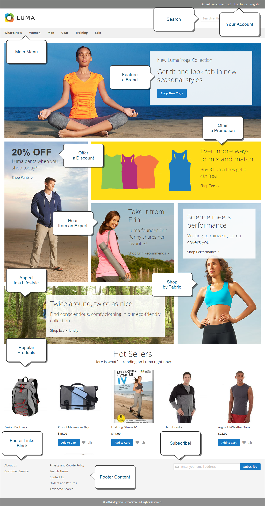

# 什麼是店面？

在您的Adobe Commerce或Magento Open Source實作中，店面是您存放區的對外公開部分。 它提供客戶用於購物和購買的內容和功能元件。

客戶進行銷售的路徑有時稱為&#x200B;_購買路徑_，您的店麵包含供客戶完成此路徑的元件。 以下章節提供提供提供策略價值的基本頁面型別概觀，即客戶在商店購物時通常會造訪的位置。 在檢閱時，請考慮可在客戶歷程的每個階段使用的不同商店功能。

## Commerce店面

透過推出由Edge Delivery Services **]支援的[!DNL ** Commerce店面，Adobe提供高效能、可擴充且可靠的店面，運用尖端技術提供卓越的速度和使用者體驗。

- **增強效能**：在Edge Delivery Services上託管店面可確保更短的載入時間並改善網站效能，進而帶來更高的轉換率和更好的SEO排名。

- **可擴充性**：架構支援順暢的擴充，可處理增加的流量和較大的產品目錄，而不會影響效能。

- **彈性**：店面可高度自訂，讓企業根據獨特的需求量身打造購物體驗。

- **改善的使用者體驗**：進階快取、即時更新和個人化內容傳送等功能，有助於提供更順暢、更吸引人的購物體驗。

### 主要功能

Commerce商店採用Edge Delivery Services技術，提供多項對商家和開發人員都有利的關鍵功能。 這些功能可讓企業建立吸引人的購物體驗，同時維持彈性，以根據需求自訂及擴充店面。

如需設定和最佳化Commerce店面的詳細資訊和指南，請參閱[Adobe Commerce店面檔案](https://experienceleague.adobe.com/en/docs/commerce)。

>[!BEGINTABS]

>[!TAB 商家]

Commerce Storefront採用Edge Delivery Services技術，提供直覺式的檔案式製作體驗，方便商家建立及管理內容。 使用熟悉的工具，例如Microsoft Word或Google Docs，商家可以建立豐富的內容，同時維持版本控制並與團隊成員合作。

- **簡化內容建立**：使用熟悉的檔案式製作工具(如Microsoft Word或Google Docs)來建立和編輯內容。
- **即時預覽**：在發佈之前，透過即時預覽功能立即檢視變更。
- **版本控制**：追蹤內容變更並輕鬆回覆至舊版。
- **合作工作流程**：多個團隊成員可以使用內建的稽核程式同時處理內容。
- **內容重複使用**：建立可跨多個頁面重複使用的內容區塊，以維持一致性。

>[!TAB 開發人員]

Headless實施可讓開發人員將前端展示層與後端商務功能分離，讓使用現代技術建置的彈性自訂店面，同時利用Commerce強大的後端服務。

- **API優先架構**：運用Commerce後端服務，同時使用現代架構建置自訂前端體驗。
- **可組合元件**：建立並部署可組合成不同版面配置的模組化、可重複使用的元件。
- **可擴充平台**：透過API和Webhook新增自訂功能，而不需修改核心程式碼。
- **現代開發工具**：使用業界標準的開發工具和工作流程，加速實作與部署。

>[!ENDTABS]

>[!NOTE]
>
>雖然Commerce店面具備眾多優點，但Adobe仍持續支援原始Luma型店面。 目前使用Luma的企業可在不中斷的情況下持續營運，並可選擇按照自己的進度轉換至新店面。 本頁的其他章節是以Luma範例為基礎。

## 首頁

您是否知道大部分人在決定留下或前往其他位置前，只會在頁面上停留幾秒鐘？ 留下印象並不久。 研究表明，人們也喜歡照片，尤其是其他人的照片。 無論您選擇何種設計，首頁上的所有內容都應推動訪客進行銷售流程的下一步。 我們的想法是從某一個興趣點到下一個興趣點，以有凝聚力的流程引導他們的注意力。

{width="700"}

## 目錄頁面

目錄頁面清單通常具有小型產品影像和簡短說明，並可格式化為清單或格線。 您可以新增區塊、影片和關鍵字豐富的說明，也能為促銷活動或季節建立特別設計。 您可以建立特殊類別，以包含由不同類別的產品所組成的精選系列的生活風格或品牌。

最初的產品說明通常能給予購物者足夠的資訊，值得仔細檢視。 知道自己想要什麼的人可以將產品新增到購物車中去。 登入帳戶期間購物的客戶可獲得個人化的購物體驗。

店面上的{width="700"}

## 搜尋結果

您知道使用搜尋的人購買的可能性幾乎是僅依賴導覽的人的兩倍？ 您可能會將這些購物者視為&#x200B;_預先合格_。

### [!DNL Live Search]

使用Adobe Commerce的[[!DNL Live Search]](https://experienceleague.adobe.com/en/docs/commerce/live-search/overview)，您的商店可提供快速、超級相關且直覺式的搜尋體驗，Adobe Commerce可免費使用。

{width="700"}

### 標準目錄搜尋

透過[標準目錄搜尋](../catalog/search.md)，您的商店在右上角包含「搜尋」方塊，並在頁尾包含「進階搜尋」連結。 系統會儲存購物者提交的所有搜尋字詞，方便您精確檢視他們想要尋找的內容。 您可以提供建議，並輸入同義字和常見拼字錯誤。 然後，在輸入搜尋字詞時顯示特定頁面。

{width="700"}

## 產品頁面

產品頁面有很多事情要做！ 在產品頁面上吸引您眼球的第一件事情，就是具有高解析度縮放與縮相簿的主要影像。 除了價格與可用性之外，還有索引標籤區段，其中包含更多資訊和相關產品的清單。

{width="700"}

## 購物車

購物車會顯示訂單總計，包括任何折扣券、預估運費和稅金。 這些功能讓您可以在這裡展示信任徽章和印章。 您也可以使用購物車頁面當作一個最終優惠方案的機會。 例如，您可以設定交叉銷售專案，當特定產品在購物車中時，這些專案會顯示為衝動購買選項。

{width="700"}

## 結帳頁面

結帳程式包含兩個步驟：

1. 送貨資訊

   結帳程式的第一個步驟是讓客戶完成送貨地址資訊，並選擇送貨方式。 如果客戶有帳戶，則系統會自動輸入送貨地址，但如有需要，也可以進行變更。
如果訪客客戶輸入的電子郵件地址被識別為先前已註冊，則當存放區組態中的[!UICONTROL Enable Guest Checkout Login]欄位設定為`Yes`時，會顯示登入提示（請參閱&#x200B;_組態參考指南_&#x200B;中的[[!UICONTROL Checkout Options]](../configuration-reference/sales/checkout.md#checkout-options)）。 不過，此設定可能會將客戶資訊公開給未經驗證的使用者。

   {width="700"}

1. 複查與付款資訊

   結帳處理的第二個步驟是讓客戶選擇付款方式，並選擇性地套用折扣代碼。

   >[!NOTE]
   >
   >雖然[!DNL Commerce]允許設定多個優惠券代碼，但客戶只能將一個優惠券代碼套用至購物車。 （如需詳細資訊，請參閱[優惠券代碼](../merchandising-promotions/price-rules-cart-coupon.md#coupon-codes)。）

   {width="700"}

頁面頂端的進度列會依循結帳程式的每個步驟，而&#x200B;_訂單摘要_&#x200B;會顯示截至目前所輸入的資訊。

>[!NOTE]
>
>兩步驟結帳的例外情況適用於虛擬及/或可下載的產品。 如果購物車中只有這些型別的產品，則結帳會自動轉換為單步驟程式，因為不需要送貨資訊。
