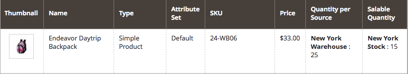

# 設定 [!DNL Inventory Management] 延期交貨

延期交貨可讓您的商店在數量達到零或實際上已無存貨後繼續銷售產品。 當客戶訂單為延期交貨訂單時，會立即授權並抓取資金，訂單的處理狀態不會變更，而且出貨會維持在保留狀態，直到存貨可供使用為止。

視您的商店與銷售而定，您可能要在下列層次啟用或停用延期交貨：

- **[!UICONTROL Global]**  — 您目錄中所有網站層級的產品

- **[!UICONTROL Product]**  — 特定產品覆寫網站、來源和庫存的設定

## 瞭解延期交貨設定

強烈建議您設定特定的臨界值和設定，以最佳方式支援延期交貨。

### 缺貨臨界值

使用此臨界值的負值，可在產品確實視為無存貨之前，設定可延期交貨的產品數量上限。 此數量會增加可銷售數量。 在產品層次設定的值會覆寫在整體層次設定的任何值。

「可銷售數量」的公式為 `(Quantity - (Out-of-Stock Threshold))`.

範例如下：

- 數量：25
- 通知以下的數量： 10
- 只有X個左臨界值：5
- 無庫存閾值：-50

此產品的「可銷售數量」為 `75 (25 - (-50))`.

{width="600" zoomable="yes"}

{width="600" zoomable="yes"}

當客戶購買可用的25種產品時，新訂單會輸入為延期交貨。 由於產品的「可銷售數量」減少至5 （已售出70個專案），因此 _產品_ 頁面顯示訊息 `Only 5 left` 在店面。 當可銷售數量達到時 `0`，則產品會顯示為 `Out of Stock` 在店面。

>[!NOTE]
>
>客戶使用下訂單時 _[!UICONTROL backorder qty]_， [!DNL Inventory Management] 自動從可銷售數量中減去數量。 如果訂單未出貨且已取消，則數量會退回至彙總的虛擬可銷售數量。 此&#x200B;**_取消的訂單數量未指定給任何來源_**，但會傳回至可供銷售的產品總數(_[!UICONTROL Salable Quantity]_ 欄)。

<!--### Notify for Quantity Below JIRA MDVA-8099 MDVA-33783

The _Notify for Quantity Below_ configuration option is configurable at the global, source, and product levels. When it is enabled, the system sends an email notification when the product quantity reaches a level at or below the configured value. For this example, a notification is triggered when the product has a quantity of 10 or less. When backorders are enabled, _Notify for Quantity Below_ is determined by the Salable Quantity (`Salable Quantity = Quantity - (Out-of-Stock Threshold)`). -->

### 庫存狀態

產品必須設定為 `In Stock` 啟用延期交貨時的狀態。 此值可設定自 _產品_ 頁面。 對於多來源商家，您必須至少有一個來源標示為 `In Stock`. 透過存取和設定狀態 _產品_ 頁面和已指派 _來源_ 格線。

## 全域設定延期交貨

這些步驟可在地點層次啟用所有產品的延期交貨。

1. 在 _管理員_ 側欄，前往 **[!UICONTROL Stores]** > _[!UICONTROL Settings]_>**[!UICONTROL Configuration]**.

1. 設定 **[!UICONTROL Store View]** 至 `Default Config`.

1. 在左側面板中，展開 **[!UICONTROL Catalog]** 並選擇 **[!UICONTROL Inventory]**.

1. 展開  **[!UICONTROL Product Stock Options]**.

1. 的 **[!UICONTROL Backorders]**，取消選取 **[!UICONTROL Use system value]** 核取方塊並選取選項：

   | 選項 | 說明 |
   | -- | -- |
   | `No Backorders` | 當產品無存貨時，不接受延期交貨。 |
   | `Allow Qty Below 0` | 若要在數量低於零時接受延期交貨，請執行下列步驟： |
   | `Allow Qty Below 0 and Notify Customer` | 若要在數量低於零時接受延期交貨，並通知客戶仍可下訂單。 |

1. 的 **[!UICONTROL Out-of-Stock Threshold]**，取消選取 **[!UICONTROL Use system value]** 核取方塊，然後輸入不同的金額。

   | 值 | 說明 |
   | -- | -- |
   | 正數 | 停用「延期交貨」時，請輸入正值。 |
   | 零 | 啟用延期交貨，輸入 `0` 允許無限延期交貨。 |
   | 負數金額 | 啟用「延期交貨」後，建議輸入負值。 此金額會新增至「可銷售數量」。 例如，輸入 `-50` 允許訂單達到此金額。 |

1. 按一下 **[!UICONTROL Save Config]**.

## 設定產品的延期交貨

產品層級設定會覆寫全域設定。 您可能會想要在產品層次設定延期交貨，以覆寫全域商店或來源層次的設定。 例如，您的商店可能全域支援延期交貨。 透過產品設定，您可以停用延期交貨或變更「無庫存」臨界值，而不會影響其他產品和來源。

1. 在 _管理員_ 側欄，前往 **[!UICONTROL Catalog]** > **[!UICONTROL Products]**.

1. 在中開啟產品 **[!UICONTROL Edit]** 模式並向下捲動頁面至 _[!UICONTROL Sources]_區域。

   針對設定不包含 [!DNL Inventory Management]，標籤未出現。 此 `Advanced Inventory` 按鈕會顯示在 _[!UICONTROL Quantity]_欄位。

1. 按一下 **[!UICONTROL Advanced Inventory]**.

   此動作會顯示產品專屬設定的頁面。 任何列出的設定 `global` 顯示存放區目前的全域設定。

1. 的 **[!UICONTROL Backorders]**，取消選取 **[!UICONTROL Use Config Setting]** 核取方塊並選取選項：

   | 選項 | 說明 |
   | -- | -- |
   | `No Backorders` | 當產品無存貨時，不接受延期交貨。 |
   | `Allow Qty Below 0` | 若要在數量低於零時接受延期交貨，請執行下列步驟： |
   | `Allow Qty Below 0 and Notify Customer` | 在數量低於零時接受延期交貨，並通知客戶仍可下訂單。 |

1. 的 **[!UICONTROL Out-of-Stock Threshold]**，取消選取 **[!UICONTROL Use Config Setting]** 核取方塊，然後輸入金額：

   | 值 | 說明 |
   | -- | -- |
   | 正數 | 停用「延期交貨」時，請輸入正值。 |
   | 零 | 啟用延期交貨，輸入 `0` 允許無限延期交貨。 |
   | 負數金額 | 啟用「延期交貨」後，建議輸入負值。 此金額會新增至「可銷售數量」。 例如，輸入 `-50` 允許訂單數量不超過該金額。 |

   {width="600" zoomable="yes"}

1. 按一下 **[!UICONTROL Done]**，然後 **[!UICONTROL Save]**.
