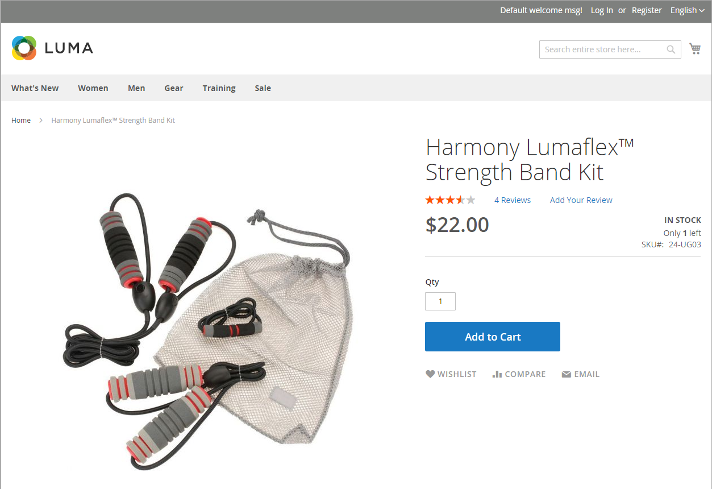

# 設定[!DNL Inventory Management]

[!DNL Inventory Management]模組支援產品和全域層級的存貨組態設定，並提供會影響來源可用性、店面產品和訂單運送的其他設定。 組態設定套用至：

- 整個目錄：移至&#x200B;**[!UICONTROL Stores]** > _[!UICONTROL Settings]_>**[!UICONTROL Configuration]**。 然後，展開左側面板中的&#x200B;**[!UICONTROL Catalog]**並選取&#x200B;**[!UICONTROL Inventory]**。

- 特定產品：移至&#x200B;**[!UICONTROL Catalog]** > **[!UICONTROL Products]**。 然後，以編輯模式開啟產品並按一下&#x200B;_[!UICONTROL Sources]_區段中的&#x200B;**[!UICONTROL Advanced Inventory]**。

您可以將目錄設定為在店面中顯示詳細目錄資料、管理使用中的購物車等。 將每個專案的可用性顯示為&#x200B;_有庫存_&#x200B;或&#x200B;_無庫存_，並在庫存不足時顯示可用庫存。

缺貨臨界值表示產品何時應重新訂購、從庫存的「可銷售數量」中減去數量，並可設定為支援啟用或停用的延期交貨。 允許您的商店延期交貨，設定所有或特定產品的訂單數量上限。

您可以使用庫存可用性臨界值的另一種方式是管理需求高的產品。 如果您想要抓取新客戶，而不是銷售給大量採購員，您可以設定最大數量，以防止單一採購員取出您的全部存貨。

## 設定選項

[!DNL Commerce]商店和產品支援下列管理產品、詳細目錄、通知等的設定。 [!DNL Commerce]為大量動作和距離優先順序演演算法提供額外的組態設定。

| 選項 | 說明 |
|--|--|
| [!UICONTROL Manage Stock] | 啟用[!DNL Commerce]以管理所有詳細目錄。 設定此產品或[!DNL Commerce]中的所有產品是否使用庫存控制。 設定為`Yes`時顯示更多選項。 |
| [!UICONTROL Only X left Threshold] | 設定特定金額可購買時通知的數量。 此金額會在庫存層級進行追蹤。 |
| [!UICONTROL Out-of-Stock Threshold] | 您的安全存量、觸發缺貨通知並減輕缺貨風險的數量。 此值會影響延期交貨。 選項：  **[!UICONTROL No Backorders]**：產品無庫存時，不接受延期交貨。 **[!UICONTROL Allow Qty Below 0]**：當數量低於零時，接受延期交貨。 **[!UICONTROL Allow Qty Below 0 and Notify Customer]**：在數量低於零時接受延期交貨，但通知客戶仍然可以下訂單。  **[!UICONTROL Backorders disabled]**：建議輸入大於0的正值，例如5或25。  **[!UICONTROL Backorders enabled]**：輸入允許延期交貨數量上限的負臨界值，例如–5或–25。 0的值會做為無限庫存。 系統會忽略正值，並將其視為0。 |
| [!UICONTROL Minimum Qty Allowed in Shopping Cart] | 設定單一訂單可購買之產品的最小數量。 |
| [!UICONTROL Maximum Qty Allowed in Shopping Cart] | 設定單一訂單可購買之產品的最大數量。 |
| [!UICONTROL Qty Uses Decimals] | 允許產品數量的小數金額，而不是整數。 此設定對依重量、體積或長度銷售的產品很有幫助。 在Source的層級指定，根據指派的來源在庫存層級計算。 |
| [!UICONTROL Allow Multiple Boxes for Shipping] | 決定產品的零件是否可以單獨出貨。 當&#x200B;**[!UICONTROL Qty Uses Decimals]** = `Yes`時，會顯示此選項。 |
| [!UICONTROL Backorders] | 顯示是否允許延期交貨。 在Source的層級指定，根據指派的來源在庫存層級計算。 如果啟用以允許延期交貨，建議為無存貨臨界值設定負值（請參閱[設定延期交貨](backorders.md)）。 選項：  **[!UICONTROL No Backorders]**：產品無庫存時，不接受延期交貨。 **[!UICONTROL Allow Qty Below 0]**：當數量低於零時，接受延期交貨。 **[!UICONTROL Allow Qty Below 0 and Notify Customer]**：在數量低於零時接受延期交貨，但通知客戶仍然可以下訂單。 |
| [!UICONTROL Notify for Quantity Below] | 設定觸發「低於數量」通知的數量，警告庫存不足。 此金額是從「可銷售數量」扣除，而非從「存貨數量」扣除。 |
| [!UICONTROL Enable Qty Increments] | 決定產品是否可以數量遞增方式銷售。 如果啟用，請輸入必須以累加步驟購買的產品數量。 增量可設定必須作為單一產品購買的產品專案數量，以及作為可配置、分組和捆綁產品的子產品的數量。 |
| [!UICONTROL Automatically Return Credit Memo Item to Stock] | [!DNL Inventory Management]未使用此值。 當您完成退貨或銷退折讓單時，產品數量會自動退回至受影響的來源數量。 請參閱[設定產品選項](product-options.md)。 |

## 設定回覆和繼承

組態覆寫或套用至下列繼承路徑：產品&#x200B;_[!UICONTROL Sources]_區段覆寫產品_[!UICONTROL Advanced Options]_&#x200B;覆寫全域&#x200B;_[!UICONTROL Inventory]_存放區組態。

當[!DNL Commerce]檢查要套用的自訂設定時，它遵循以下順序：

1. 檢查&#x200B;_[!UICONTROL Sources]_區段中產品層級的自訂設定。 有一些設定可供使用。

1. 檢查產品&#x200B;_[!UICONTROL Advanced Inventory]_設定。

1. 如果針對產品設定選取`Use Config Settings`，則會從全域&#x200B;_詳細目錄_&#x200B;存放區組態頁面檢查值。

例如，您可以使用類似下列的設定，以不同方式設定商店中的延期交貨：

- _全域：_&#x200B;啟用商店的延期交貨，將無庫存臨界值設定為`-50`

- _產品：_&#x200B;停用特定產品的延期交貨，將無庫存臨界值設定為`10`
