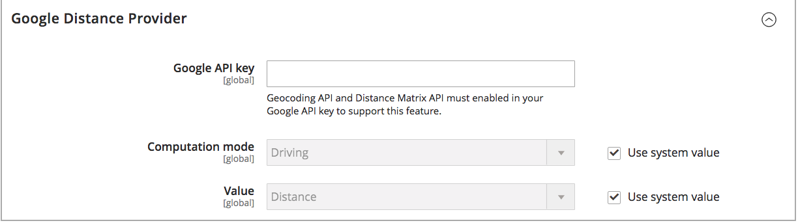
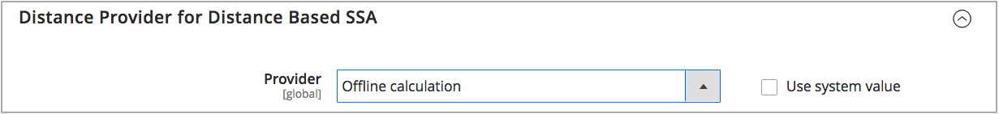

# 設定距離優先順序演演算法

「距離優先順序演演算法」會比較出貨目的地地址的地點與來源地點，以決定最接近完成出貨的來源。 這個距離可能是由實際距離或從一個位置到另一個位置旅行的時間所決定，使用資料庫資料或駕駛、步行或騎腳踏車的方向。 使用此[Source選擇演演算法](selection-reservations.md)來建議與出貨目的地地址最接近的來源。

>[!NOTE]
>
>如果您使用「距離優先順序演演算法」，建議您輸入[來源](sources-add.md)的完整街道位址和GPS座標。

您有兩個選項可以計算距離和時間，以找出最接近出貨履行情況的來源：

- **Google MAP** — 使用[Google Map Platform](https://cloud.google.com/maps-platform/)服務來計算送貨目的地位址與來源位置之間的距離和時間。 此選項會使用來源的經緯度（GPS座標），而且可能會根據計算模式使用街道地址。 必須有Google API金鑰才能啟用[地理編碼API](https://developers.google.com/maps/documentation/geocoding/start)和[Distance Matrix API](https://developers.google.com/maps/documentation/distance-matrix/start)，而且您可能會透過Google產生費用。

- **離線計算** — 使用郵遞區號和GPS座標，以下載和匯入的地理碼資料來計算距離，以判斷最接近出貨目的地地址的來源。 若要設定此選項，您可能需要開發人員協助，才能使用命令列指示先下載及匯入地理代碼。

>[!NOTE]
>
>針對具有數個國家/地區的多重商店網站，請為每個國家/地區設定[預設稅捐目的地](../stores-purchase/tax-class.md#default-tax-destination){target="_blank"}。

## 使用Google地圖

您不需要Google帳戶即可開始使用。 此程式包括視需要建立Google帳戶和專案。 此選項需要新增計費帳戶和付款方法至您的Google帳戶，以完成設定並使用演演算法。
不過，我們建議使用Google MAP距離型演演算法，此演演算法較離線計算更進階且更精確。

### 步驟1：建立Google API金鑰

金鑰來自[Google地圖平台](https://cloud.google.com/maps-platform/)，應該啟用[地理編碼API](https://developers.google.com/maps/documentation/geocoding/start)和[距離矩陣API](https://developers.google.com/maps/documentation/distance-matrix/start)。 如需詳細資訊，請參閱[設定距離優先順序演演算法](distance-priority-algorithm.md)。

1. 瀏覽[Google地圖平台](https://cloud.google.com/maps-platform/)並按一下&#x200B;**[!UICONTROL Get Started]**。

1. 若要啟用平台，請選取&#x200B;**[!UICONTROL Maps, Routes, and Places]**&#x200B;並按一下&#x200B;**[!UICONTROL Continue]**。

   {width="350" zoomable="yes"}

1. 使用Google帳戶登入或建立帳戶。

1. 設定專案：

   - 選取專案或輸入新專案名稱。

   - 若要接受條款，請選取`Yes`。

   - 按一下&#x200B;**[!UICONTROL Next]**。

1. 輸入帳單帳戶或建立帳單帳戶。 您可以略過並在稍後新增帳單帳戶。

   必須有付費帳戶才能使用此服務。

1. 若要開啟並設定您的Google Cloud Platform選項，請按一下&#x200B;**[!UICONTROL Console]**。

   - 開啟您的專案。

   - 展開功能表並按一下&#x200B;**[!UICONTROL APIs & Services]** > **[!UICONTROL Library]**。

     {width="350" zoomable="yes"}

   - 搜尋[地理編碼API](https://developers.google.com/maps/documentation/geocoding/start)和[距離矩陣API](https://developers.google.com/maps/documentation/distance-matrix/start)。 選取並啟用每個服務。

1. 展開功能表，按一下&#x200B;**[!UICONTROL APIs & Services]** > **[!UICONTROL Credentials]**，然後複製Google API金鑰。

   {width="350" zoomable="yes"}

### 步驟2：設定Google MAP提供者

1. 在&#x200B;_管理員_&#x200B;側邊欄上，移至&#x200B;**[!UICONTROL Stores]** > _[!UICONTROL Settings]_>**[!UICONTROL Configuration]**。

1. 在左側面板中，展開&#x200B;**[!UICONTROL Catalog]**&#x200B;並選擇&#x200B;**[!UICONTROL Inventory]**。

1. 展開 _[!UICONTROL Distance Provider for Distance Based SSA]_&#x200B;區段，並將&#x200B;**[!UICONTROL Provider]**&#x200B;設為`Google MAP`。

   以距離為基礎的SSA的{width="350" zoomable="yes"}

1. 展開 _[!UICONTROL Google Distance Provider]_&#x200B;區段並設定設定：

   - 針對&#x200B;**[!UICONTROL Google API Key]**，輸入從您的Google帳戶複製的金鑰。

   - 針對&#x200B;**[!UICONTROL Computation mode]**，選取設定。

     >[!NOTE]
     >
     >使用此演演算法出貨時，如果針對出貨選取的計算模式（駕駛、騎腳踏車或行走）未傳迴路線與資料，則SSA預設為使用Source優先順序。 建議為每個庫存[設定來源的](stocks-prioritize-sources.md)優先順序。

     | 選項 | 說明 |
     | ----- | ----- |
     | `Driving` | （預設）使用道路網路來要求標準行車路線。 |
     | `Walking` | 使用人行道和人行道（如果可用）來要求步行路線。 |
     | `Bicycling` | 使用腳踏車道和偏好的街道（如果有的話），要求腳踏車騎行路線。 [Distance Matrix Service](https://developers.google.com/maps/documentation/javascript/distancematrix#travel_modes)僅於美國及部分加拿大城市提供。 |

   - 針對&#x200B;**[!UICONTROL Value]**，選取值型別：

     | 選項 | 說明 |
     | ----- | ----- |
     | `Distance` | （預設）傳回以公制（公里與公尺）或英制（英里與英尺）為單位的點之間的距離。 |
     | `Time to Destination` | 傳回從來源地點前往運送地址所需的時間（小時與分鐘）。 |

   {width="350" zoomable="yes"}

1. 完成時，按一下&#x200B;**[!UICONTROL Save Config]**。

## 使用離線計算

離線計算會使用國家/地區代碼來決定出貨目的地與來源地址之間的距離。 可能需要開發人員協助才能設定此選項。 使用[!DNL Inventory Management] CLI命令從[geonames.org](https://www.geonames.org/)下載及匯入資料。

>[!NOTE]
>
>從[geonames.org](https://www.geonames.org/)匯入的地理碼對於某些國家/地區有限制，例如加拿大和愛爾蘭。 如需詳細資訊，請參閱[地名郵遞區號檔案](https://download.geonames.org/export/zip/readme.txt)。

### 步驟1：下載和匯入地理代碼

完整的命令列設定，可下載並匯入地理代碼國家/地區以送貨至並擁有來源位置。 此步驟可能需要開發人員協助以取得命令列工作的說明。 請參閱[匯入地理代碼](cli.md#import-geocodes)。

您隨時想要新增更多地理代碼時都可完成這些指令。

### 步驟2：設定計算

1. 在&#x200B;_管理員_&#x200B;側邊欄上，移至&#x200B;**[!UICONTROL Stores]** > _[!UICONTROL Settings]_>**[!UICONTROL Configuration]**。

1. 在左側面板中，展開&#x200B;**[!UICONTROL Catalog]**&#x200B;並選擇&#x200B;**[!UICONTROL Inventory]**。

1. 展開擴充選擇器&#x200B;_[!UICONTROL Distance Provider for Distance Based SSA]_。

1. 取消選取「**[!UICONTROL Use system value]**」核取方塊並將&#x200B;**[!UICONTROL Provider]**&#x200B;設為`Offline Calculation`。

   以距離為基礎的SSA的{width="350" zoomable="yes"}

1. 完成時，按一下&#x200B;**[!UICONTROL Save Config]**。
