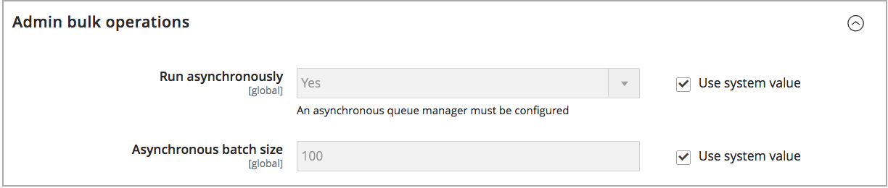

# 設定 [!DNL Inventory Management] 全域選項

設定您網站產品與庫存的預設設定選項。 您可透過依個別產品覆寫其中的部分設定 [設定產品選項](product-options.md). 若要設定「距離優先順序」設定，請參閱 [設定距離優先順序演演算法](distance-priority-algorithm.md).

## 全域設定產品和庫存選項

1. 在 _管理員_ 側欄，前往 **[!UICONTROL Stores]** > _[!UICONTROL Settings]_>**[!UICONTROL Configuration]**.

1. 在左側面板中，展開 **[!UICONTROL Catalog]** 並選擇 **[!UICONTROL Inventory]**.

1. 展開  此 **[!UICONTROL Stock Options]** 並設定選項：

   {width="600" zoomable="yes"}

   - 若要調整下單時的庫存量，請設定 **[!UICONTROL Decrease Stock When Order is Placed]** 至 `Yes`.

   - 若要在訂單取消時將料號退回存貨， **[!UICONTROL Set Items' Status to be in Stock When Order in Cancelled]** 至 `Yes`.

   - 若要繼續顯示目錄中已無庫存的產品，請設定 **[!UICONTROL Display Out of Stock Products]** 至 `Yes`.

   - 如果 [價格警示](alert-setup.md) 已啟用，客戶可以註冊，以便在產品重新補充庫存時收到通知。

   - 若要設定在產品頁面上顯示最後剩餘存貨金額的開始時間，請輸入金額 **[!UICONTROL Only X left Threshold]**.

     當庫存量達到臨界值時，訊息就會開始出現。 例如，如果設為 `3`，訊息 `Only 3 left` 當庫存量達到三時顯示。 訊息會調整以反映庫存中的數量，直到數量達到零為止。

   - 若要在產品頁面上顯示「有庫存」或「無庫存」訊息，請設定 **[!UICONTROL Display Products Availability In Stock on Storefront]** 至 `Yes`.

   - 若要在載入購物車中的產品時檢查詳細目錄，請設定 **[!UICONTROL Enable Inventory Check On Cart Load]** 至 `Yes`. 停用此選項時，會略過詳細目錄檢查。 停用此選項會加快結帳速度，尤其是當購物車中有許多專案時。 不過，如果您略過預先驗證，客戶稍後在結帳程式中可能會看到「無庫存」錯誤。

   - 若要保持詳細目錄和目錄的一致性，請設定 **[!UICONTROL Synchronize with Catalog]** 至 `Yes`. 啟用此選項後，庫存資料會根據目錄變更進行調整（例如已移除產品、已變更產品SKU以及已變更產品型別）。

1. 展開  此 **[!UICONTROL Product Stock Options]** 並設定選項：

   - 啟動 [詳細目錄控制](enable.md) 針對您的目錄，設定 **[!UICONTROL Manage Stock]** 至 `Yes`.

     {width="600" zoomable="yes"}

   - 設定 **[!UICONTROL Backorders]** 變更為下列其中一項：

     | 選項 | 說明 |
     | ----- | ----- |
     | `No Backorders` | [延期交貨](backorders.md) 產品無庫存時不被接受。 |
     | `Allow Qty Below 0` | 當數量低於零時，接受延期交貨。 |
     | `Allow Qty Below 0 and Notify Customer` | 當數量低於零時，系統會接受延期交貨，並通知客戶仍可下訂單。 |

   - 輸入 **[!UICONTROL Maximum Qty Allowed in Shopping Cart]**.

   - 輸入金額 **[!UICONTROL Out-of-Stock Threshold]**：

     | 值 | 說明 |
     | ----- |-----|
     | 正數 | 如果停用「延期交貨」，請輸入正金額。 |
     | 零 | 啟用延期交貨，輸入 `0` 允許無限延期交貨。 |
     | 負數金額 | 若已啟用「延期交貨」，則建議輸入負金額。 此金額會新增至「可銷售數量」。 例如，輸入 `-50` 允許訂單達到此金額。 |

   - 輸入 **[!UICONTROL Minimum Qty Allowed in Shopping Cart]** 適用於選取的群組和金額。

   - 的 **[!UICONTROL Notify for Quantity Below]**，輸入庫存層級，此層級會觸發專案無庫存的通知。

   - 若要啟動產品的數量增加，請設定 **[!UICONTROL Enable Qty Increments]** 至 `Yes`. 然後，針對 **[!UICONTROL Qty Increments]**，輸入為了滿足需求而必須購買的專案數。

     例如，以6為增量銷售的專案，其購買量可以為 `6`， `12`， `18`、等等。

   - 的 [!DNL Inventory Management]， **[!UICONTROL Automatically Return Credit Memo Item to Stock]** 設為 `No`. 在提交銷退折讓單時，您可以輸入並選取將存貨退回給來源。

1. 展開  此 **[!UICONTROL Admin bulk operations]** 並設定選項：

   {width="600" zoomable="yes"}

   - 設定 **[!UICONTROL Run asynchronously]** 以非同步方式執行大量產品動作的大量作業

     這些作業包括大量作業 [指派和取消指派來源](bulk-assignment.md)、和 [移轉存貨至來源](inventory-transfer.md). 它會收集大量動作，直到達到非同步批次大小為止，然後執行這些動作。 此選項預設為停用。建議您在啟用之前先透過大量動作檢閱您的效能。

     >[!NOTE]
     >
     >設定和支援 _非同步佇列管理員_，您必須使用命令列發出命令。 此步驟可能需要開發人員協助。 另請參閱 [啟動訊息佇列取用者](https://experienceleague.adobe.com/docs/commerce-operations/configuration-guide/cli/start-message-queues.html) 在 _設定指南_.

   - 如果已啟用，請設定 **[!UICONTROL Asynchronous batch size]**. 預設批次大小為100。 當大量程式達到此數量時，系統會觸發此事件。

1. 完成後，按一下 **[!UICONTROL Save Config]**.
