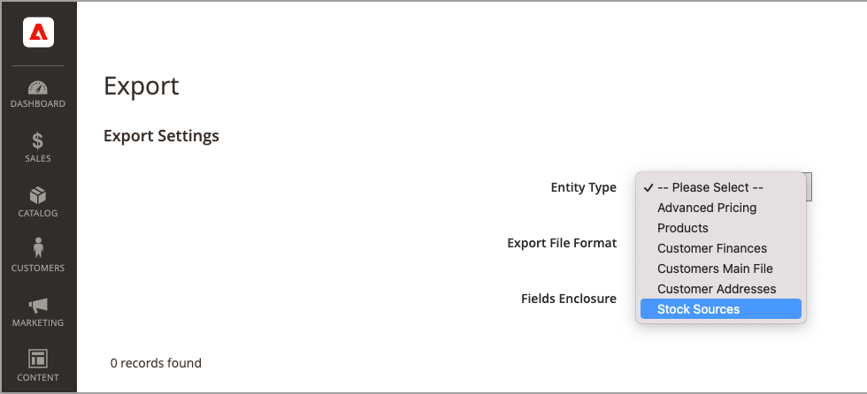
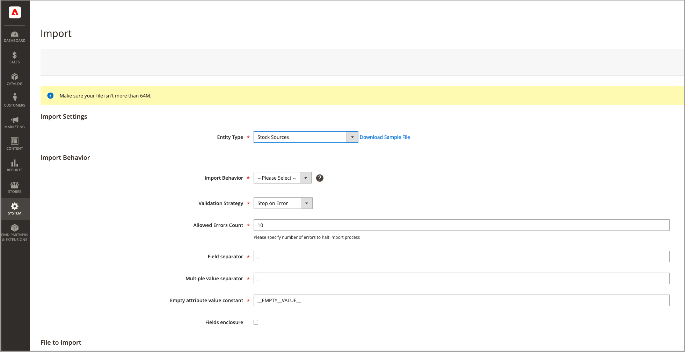

# 匯入及匯出詳細目錄

對於包含許多產品的目錄，請使用具有擴充功能的原生匯入和匯出功能 [!DNL Inventory Management] 按SKU更新來源與數量的選項。 使用這些選項，您可以新增來源並更新所有或特定來源的存貨數量。 例如，您可以匯出德國來源的產品而不影響法國、英國或美國來源的產品資訊。

- [!DNL Commerce] 升級時自動指派預設來源給您的產品 [!DNL Commerce] 或匯入新產品。 如果您匯入指定了自訂來源的產品，預設來源仍會以數量0新增。 若要更新來源與數量，請使用這些匯入指示。

- 單一來源商家使用匯入僅更新產品數量。 所有現有和新增的產品都會指派至「預設來源」。

- 多來源商家使用匯入功能，在每個SKU的每列新增多個來源和數量。

若要匯入更新，請先匯出特定或所有來源的CSV檔案。 編輯CSV檔案，並為每個來源和數量每個SKU新增一列。 新增來源及新增庫存數量時，您需要原始程式碼。 您無法使用匯入 — 匯出特徵來新增或更新庫存。

## CSV檔案內容

匯出 — 匯入檔案會根據來源包含下列資訊：

- `source_code`  — 中的來源程式碼 [!DNL Commerce]. 每個來源和SKU都有一列。
- `sku`  — 中的產品SKU [!DNL Commerce]. SKU必須符合您商店中的產品才能正確更新 [!DNL Inventory Management] 資料。
- `status` - 0表示無庫存。 1表示有庫存。 此值必須是1，才能從此來源購買存貨。
- `quantity`  — 此SKU和來源可用的存貨總金額。

使用CSV檔案來快速更新多個產品和指派的來源，以更新及更正存貨記錄中的任何不準確專案，而非一次透過應用程式介面更新及更正一個。 對於基礎檔案，請先匯出並根據需要更新。

{width="600" zoomable="yes"}

## 匯出所有來源的產品資料

1. 在 _管理員_ 側欄，前往 **[!UICONTROL System]** > _[!UICONTROL Data Transfer]_>**[!UICONTROL Export]**.

1. 的 **[!UICONTROL Entity Type]**，選擇 `Stock Sources`.

   匯出只會擷取含有SKU之產品的資料。

1. 按一下 **[!UICONTROL Continue]**.

   檔案會產生並下載以開啟和編輯。

更新庫存數量和產品資料後，將檔案匯回至 [!DNL Commerce].

{width="350" zoomable="yes"}

## 匯出特定來源的產品資料

1. 在 _管理員_ 側欄，前往 **[!UICONTROL System]** > _[!UICONTROL Data Transfer]_>**[!UICONTROL Export]**.

1. 的 **[!UICONTROL Entity Type]**，選擇 `Stock Sources`.

   匯出只會擷取含有SKU之產品的資料。

1. 使用 **[!UICONTROL Entity Attributes]** 篩選特定來源的匯出產品。

   的 `source_code`，在篩選欄位中輸入來源的程式碼。

1. 按一下 **[!UICONTROL Continue]**.

   檔案會產生並下載以開啟和編輯。

更新庫存數量和產品資料後，將檔案匯回至 [!DNL Commerce].

## 匯入產品資料

1. 在 _管理員_ 側欄，前往 **[!UICONTROL System]** > _[!UICONTROL Data Transfer]_>**[!UICONTROL Import]**.

1. 的 **[!UICONTROL Entity Type]**，選擇 `Stock Sources`.

   匯出只會擷取含有SKU之產品的資料。

1. 選取的設定 **[!UICONTROL Import Behavior]**.

1. 選取要匯入的.csv檔案。

1. 按一下 **[!UICONTROL Check Data]** 並完成匯入。

{width="600" zoomable="yes"}
