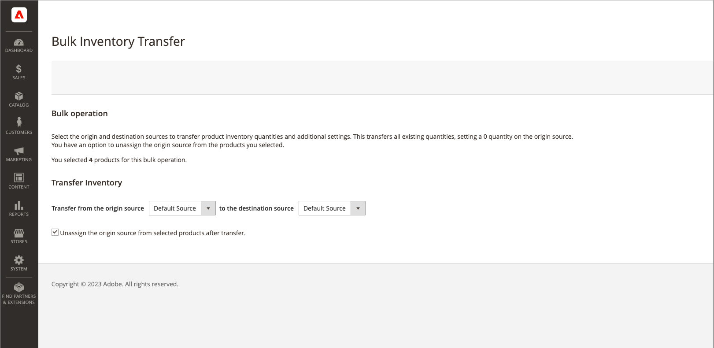

# 將存貨移轉至來源

根據業務需求與地點的狀態，多來源商戶通常會將產品存貨從一個來源地點移轉到另一個來源地點。 例如，您可能正在關閉倉儲位置，或不再從某個位置出貨特定產品，並將這些產品的所有作業移至新的位置。

此選項可讓您選取一或多個產品、要移轉存貨的原始來源，以及要接收數量的目的地來源：

- 存貨數量、Source料號狀態（有庫存/無庫存）以及所選來源的「通知數量」會依產品移動。

- 如果產品沒有該來源，則會略過。

- 來源的所有產品詳細目錄都會移動。 您無法移轉部分數量。

>[!NOTE]
>
>如果來源與目的地來源位於不同的存量，則會影響進行中訂單的彙總「可銷售數量」與預留。

您也可以在移轉存貨數量時，取消指定來源。

{{$include /help/_includes/unassign-source.md}}

1. 在&#x200B;_管理員_&#x200B;側邊欄上，移至&#x200B;**[!UICONTROL Catalog]** > **[!UICONTROL Products]**。

1. 選取您要修改來源的產品。

   瀏覽或搜尋以尋找產品，並選取要轉移的核取方塊。

1. 按一下頂端的&#x200B;**[!UICONTROL Actions]**&#x200B;功能表，然後選擇&#x200B;**[!UICONTROL Transfer Inventory to Source]**。

1. 在確認對話方塊中按一下&#x200B;**[!UICONTROL OK]**。

1. 若要將產品轉移到新的目的地，請選取來源(_[!UICONTROL from]_)來源。

1. 若要將產品轉移到新的目的地，請選取目的地(_[!UICONTROL to]_)來源。

1. 若要從產品移除來源，請選取選用的核取方塊&#x200B;**[!UICONTROL Unassign from origin source after transfer]**。

   {width="600" zoomable="yes"}

1. 按一下&#x200B;**[!UICONTROL Transfer Inventory]**。

   所有產品數量都會從來源來源扣除，並新增至目的地來源。 「數量」與「可銷售數量」會自動更新。
