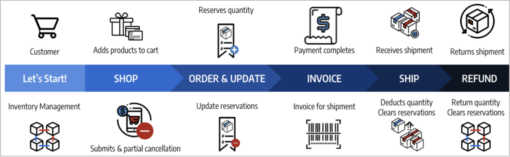
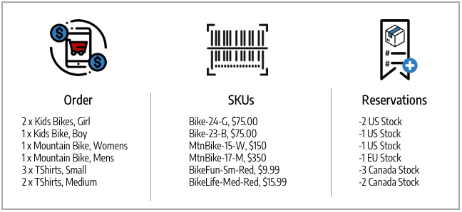

# 訂單狀態與預留

[!DNL Inventory Management]支援每個訂單的部分與完整開立發票、付款、運送與取消。 當您透過處理、開立商業發票、出貨及可能退款管理訂單時，[!DNL Commerce]會自動輸入或變更預留，以更新存貨（或銷售管道）的可銷售數量及每個來源的庫存量。 您不必主動存取或輸入預留。 完成履行、取消或退款的作業會為您完成訂單。

這些預留一律會調整您的可銷售數量，以正或負的金額來增加或減少數量。 結果會更新您的庫存量及可銷售數量，以取得最新的產品可用性。

如需訂單與出貨的詳細資訊，請參閱[管理訂單與出貨](shipments.md)。

## 訂單管理選項

根據存貨狀態與客戶請求，您可以更新含部份付款與取消的訂單、來自多重來源或延期交貨訂單的部份出貨，或退回退回退回產品的銷退折讓單。

### 出貨

開立訂單商業發票之後，請傳送部份或全部出貨，直到您履行整張訂單為止。 每次出貨都會轉換預留，從每個來源的產品數量中扣除金額。 輸入預留補償，以更新存貨的可銷售數量。 如果您傳送部分出貨，則每次出貨都會從產品數量與預留中扣除該金額。 任何未出貨的產品預留量會保留在原處，直到它們也出貨為止，因此您的可銷售金額為最新，讓您能夠控制產品存貨，並支援多重來源出貨與延期交貨。

### 取消的訂單

如果客戶在出貨前（部份或全部）取消訂單，則會輸入新的預留，以將存貨金額退回可銷售數量。 預留會有效地互相取消，而不會從任何來源扣減數量。 其他客戶可以透過相關的庫存和銷售管道，主動購買這些產品數量。

### 退款的訂單

如果客戶要求退款，請針對部份或完整產品金額簽發銷退折讓單。 當您收到退回的產品時，請輸入銷退折讓單，以提供資金並更新產品金額。 選取「退回存貨」選項時，[!DNL Commerce]會將數量新增回出貨訂單與預留補償的產品與來源，以更新相關存貨的可銷售數量。

## 訂單型別

簡單訂單從購物車開始、繼續付款，最後是滿意的傳遞。 在這些訂單中，[!DNL Inventory Management]可針對購物車與結帳中的可用性（或可銷售數量）輕鬆處理預留，並在出貨時從庫存量中扣除。

{width="600" zoomable="yes"}

較複雜的訂單可能包含部份取消、部份出貨及退款。 在這些情況下，預留會影響可用存貨，以增加取消與退款的數量，並在訂購與出貨時減少數量。

{width="600" zoomable="yes"}

可用性預留與存貨變更會根據訂單狀態而發生。

## 狀態與預訂

下清單格詳細列出訂單與銷退折讓單狀態，其中預留變更是由[!DNL Commerce]輸入，以管理您的存貨。

| 訂單狀態 | 說明 | 可銷售數量的預留 |
|--|--|--|
| [!UICONTROL Open] | 新的和最近提交的，無處理中 | 提交庫存訂單時儲存預訂。 |
| [!UICONTROL Canceled] | 付款前已部份或全部取消 | 輸入預留補償，以將部份或完整數量退回給存貨的可銷售數量。 |
| [!UICONTROL On Hold] | 未處理付款與出貨，或未開立商業發票 | 保留區會維持原狀。 |
| [!UICONTROL Suspected Fraud] | 由於欺詐而未處理 | 如果核准或正在審查，則保留不變。 如果拒絕，預訂會維持原位，直到商戶決定核准或取消為止。 如果取消，則輸入預留補償，以將全部數量退回存貨可銷售數量。 |
| [!UICONTROL Pending] | 正在等待付款 | 預訂會維持原狀。 |
| [!UICONTROL Processing] | 付款處理，未收到 | 預訂會維持原狀。 |
| [!UICONTROL Pending Payment] | 未收到付款 | 預訂會維持原狀。 |
| [!UICONTROL Payment Review] | 正在稽核付款以進行處理和完成 | 預訂會維持原狀。 |
| [!UICONTROL Complete] | 已付及全額出貨 | 部份或全額開立商業發票時，會從所選來源的產品數量中扣除預留金額。 輸入預留補償以更新總可銷售數量。 |
| [!UICONTROL Closed] | 已退款或已封存 | 若已存檔，則數量不會變更。 如果部份或全部退款，則會輸入預留補償並轉換，以新增每個來源的產品數量與每個存貨的可銷售數量。 |

| 銷退折讓單狀態 | 說明 | 可銷售數量的預留 |
|--|--|--|
| [!UICONTROL Open] | 退款已到期，尚未完成 | 預訂沒有變更。 |
| [!UICONTROL Refunded] | 已完成，資金已退回 | 如果部份或全部退款，則會輸入預留補償並加以轉換，以新增每個來源的產品數量與每個存貨的可銷售數量。 |

## 複雜訂單範例

Blake Sanders為家人度假和娛樂訂了腳踏車和衣服。 他們在您的腳踏車冒險商店看到一些絕佳銷售，其存貨和來源橫跨美國、加拿大和歐洲。

他們為自己的小孩買了兩輛很棒的公園腳踏車，為青少年買了一輛BMX腳踏車，為自己買了一輛很棒的山地腳踏車，為配偶買了一輛現代的德國越野腳踏車。 這家商店特價出售了件可愛的襯衫，因此他們買了一件全家人都要搭配的。 請參閱下列假期採購清單、相符的SKU，以及針對存貨可銷售數量輸入的預留。

{width="600" zoomable="yes"}

他們向家人展示他們找到的東西，但會進行一些變更。 在付款完成之前，他們取消兩個33-BikeFun SKU （孩子們不喜歡它們）。 這是部分取消，因為付款待定，所以不需要銷退折讓單。 若要更新，[!DNL Commerce]將新增回加拿大的可銷售數量存貨。 訂單已付清，所有產品都會及時送達，以備度假之用。 [!DNL Commerce]會更新已出貨產品之出貨倉儲的可銷售數量與來源數量。

但這件襯衫並不適合他們的配偶。 Blake要求退款，並退回他的襯衫。 建立銷退折讓單時，會將一件54-BikeLife襯衫新增回加拿大的庫存與出貨倉庫。

- **已出貨的產品** — 若已購買和出貨的產品，[!DNL Commerce]會更新庫存。 預留補償會轉換為從出貨來源扣減的庫存量數量。 庫存的可用可銷售數量會更新。

- **已取消產品** — 透過取消庫存，[!DNL Commerce]將移除該產品的預訂。 預留補償會輸入到存貨層次，以針對兩件襯衫的部分取消，新增回可銷售數量。 這不會影響來源層次的存貨數量。

- **銷退折讓單/退款產品** — 若退回存貨，則必須將其新增回數量。 發行銷退折讓單時，您可以選取退回存貨。 [!DNL Commerce]將回溯存貨數量新增至產品的出貨來源。 輸入預留補償，以清除任何剩餘的預留。 可銷售數量會根據更新數量重新計算。

{width="600" zoomable="yes"}
